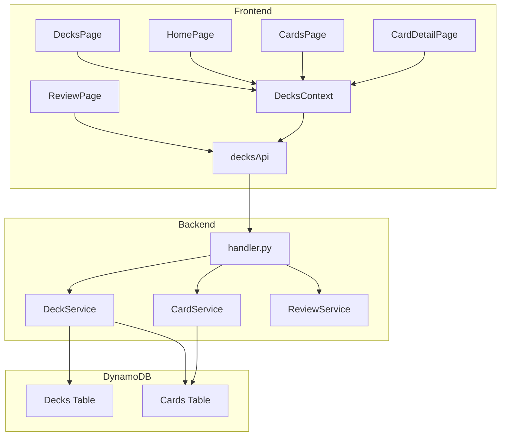
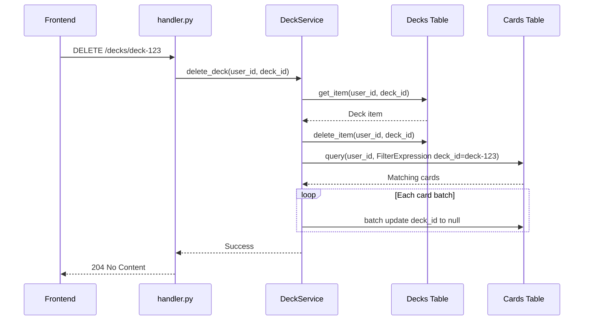
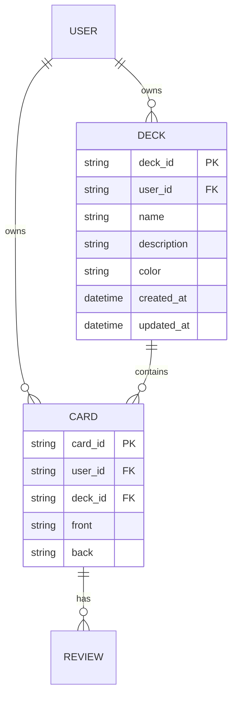

# Design Document — deck-management

## Overview

**Purpose**: デッキ（カテゴリ）管理機能を実装し、カードをデッキ単位でグループ化することで学習の整理・復習を効率化する。

**Users**: Memoru の全ユーザーがカードの分類管理、デッキ単位の復習セッション開始、学習状況の俯瞰に利用する。

**Impact**: 既存の cards テーブルの `deck_id` フィールドを活用しつつ、新規 decks テーブル・API エンドポイント・フロントエンド UI を追加する。既存のカード CRUD・復習フローへの影響は最小限。

### Goals
- デッキの CRUD 操作（作成・一覧・更新・削除）を提供する
- カードをデッキに割り当て・移動できるようにする
- デッキ単位の復習セッションを開始できるようにする
- ホーム画面でデッキごとの復習状況を一目で把握できるようにする

### Non-Goals
- デッキの共有・公開機能（マルチユーザー間でのデッキ共有）
- デッキのネスト（サブカテゴリ）
- AI によるデッキ自動提案・カード自動分類
- デッキごとの統計ダッシュボード（学習統計機能として別途検討）

## Architecture

### Existing Architecture Analysis

現在のシステムはレイヤードアーキテクチャ（handler → service → model）を採用している。

- **handler.py**: 単一ファイルに全 API エンドポイントを定義。`APIGatewayHttpResolver` でルーティング。
- **services/**: ドメインごとにサービスクラス（`CardService`, `ReviewService`, `UserService`）を配置。
- **models/**: Pydantic モデルでリクエスト/レスポンスの型定義とバリデーション。
- **DynamoDB**: Users, Cards, Reviews の 3 テーブル。Cards テーブルに `deck_id` フィールドが存在するが未活用。
- **フロントエンド**: React Context パターン（`AuthContext`, `CardsContext`）でグローバル状態管理。`api.ts` にドメイン別ファサード（`cardsApi`, `reviewsApi`, `usersApi`）。

### Architecture Pattern & Boundary Map



**Architecture Integration**:
- **Selected pattern**: 既存レイヤードアーキテクチャの踏襲（handler → DeckService → Deck model）
- **Domain boundaries**: DeckService がデッキ CRUD とデッキ削除時のカード更新を担当。CardService はカード単位の操作に専念（既存責務を維持）。
- **Existing patterns preserved**: 単一 handler.py、サービスパターン、Pydantic バリデーション、Context パターン
- **New components rationale**: DeckService（デッキドメインロジック）、DecksContext（フロントエンド状態管理）、DecksPage（デッキ管理 UI）
- **Steering compliance**: レイヤードアーキテクチャ、TypeScript strict mode、Pydantic バリデーション

### Technology Stack

| Layer | Choice / Version | Role in Feature | Notes |
|-------|------------------|-----------------|-------|
| Frontend | React 19 + TypeScript | DecksPage, DecksContext, DeckForm コンポーネント | 既存と同一 |
| Frontend | Tailwind CSS 4 | デッキ管理 UI スタイリング | 既存と同一 |
| Frontend | React Router v7 | `/decks` ルート追加 | 既存と同一 |
| Backend | Python 3.12 + Lambda Powertools | DeckService, API エンドポイント | 既存と同一 |
| Backend | Pydantic | Deck リクエスト/レスポンスモデル | 既存と同一 |
| Data | DynamoDB | Decks テーブル（新規） | PAY_PER_REQUEST |
| Infrastructure | AWS SAM | DecksTable リソース、API イベント定義 | template.yaml 拡張 |

## System Flows

### デッキ削除フロー

デッキ削除時のカード `deck_id` 一括リセットは非自明な処理のため、フローを明示する。



**Key Decisions**:
- カード更新はベストエフォート（部分失敗許容）。詳細は `research.md` の「デッキ削除時のカード更新方式」を参照。
- デッキ削除自体は先に完了し、カード更新は後続処理。

## Requirements Traceability

| Requirement | Summary | Components | Interfaces | Flows |
|-------------|---------|------------|------------|-------|
| 1.1 | デッキ作成 | DeckService, handler.py | POST /decks | — |
| 1.2 | デッキ一覧取得（カード数・due 数付き） | DeckService, handler.py | GET /decks | — |
| 1.3 | デッキ更新 | DeckService, handler.py | PUT /decks/{deckId} | — |
| 1.4 | デッキ削除（カード deck_id リセット） | DeckService, handler.py | DELETE /decks/{deckId} | デッキ削除フロー |
| 1.5 | 存在しないデッキへの 404 | DeckService | — | — |
| 1.6 | デッキ名バリデーション | Deck Pydantic モデル | — | — |
| 1.7 | デッキ数上限（50） | DeckService | — | — |
| 1.8 | バリデーションエラー 400 | handler.py | — | — |
| 2.1 | Decks テーブルキー設計 | DecksTable (SAM) | — | — |
| 2.2 | Deck モデルフィールド定義 | Deck Pydantic モデル | — | — |
| 2.3 | deck_id UUID v4 自動生成 | Deck Pydantic モデル | — | — |
| 2.4 | SAM テンプレート定義 | template.yaml | — | — |
| 2.5 | docker-compose テーブル作成 | docker-compose.yaml | — | — |
| 2.6 | Pydantic モデルファイル配置 | models/deck.py | — | — |
| 3.1 | カード作成時の deck_id 指定 | CardService (既存) | POST /cards | — |
| 3.2 | カード更新時の deck_id 変更 | CardService (既存) | PUT /cards/{cardId} | — |
| 3.3 | デッキフィルタリング | CardService (既存) | GET /cards?deck_id=xxx | — |
| 3.4 | due カードのデッキフィルタ | ReviewService, handler.py | GET /cards/due?deck_id=xxx | — |
| 3.5 | デッキ削除時のカード更新 | DeckService | — | デッキ削除フロー |
| 4.1 | デッキ一覧表示 | DecksPage | — | — |
| 4.2 | デッキ作成フォーム | DeckFormModal | — | — |
| 4.3 | デッキタップでカード一覧遷移 | DecksPage | — | — |
| 4.4 | デッキ編集フォーム | DeckFormModal | — | — |
| 4.5 | デッキ削除確認ダイアログ | DecksPage | — | — |
| 4.6 | 未分類セクション表示 | DecksPage | — | — |
| 4.7 | /decks ルート | App.tsx | — | — |
| 4.8 | ナビゲーションにデッキタブ追加 | Navigation | — | — |
| 5.1 | カード作成時のデッキ選択 | DeckSelector, GeneratePage | — | — |
| 5.2 | カード編集時のデッキ変更 | DeckSelector, CardDetailPage | — | — |
| 5.3 | デッキ選択ドロップダウン | DeckSelector | — | — |
| 5.4 | 未選択時の null 保存 | DeckSelector | — | — |
| 6.1 | デッキ復習ボタン | DecksPage | — | — |
| 6.2 | デッキ指定 due カード取得 | ReviewPage | GET /cards/due?deck_id=xxx | — |
| 6.3 | due カードなしメッセージ | ReviewPage | — | — |
| 6.4 | ReviewPage デッキパラメータ対応 | ReviewPage | — | — |
| 7.1 | ホーム画面デッキサマリー | HomePage, DeckSummary | — | — |
| 7.2 | ホーム画面デッキタップ遷移 | HomePage, DeckSummary | — | — |
| 7.3 | 最大 5 件表示 + すべて表示リンク | DeckSummary | — | — |
| 7.4 | デッキ 0 件メッセージ | DeckSummary | — | — |
| 8.1 | DecksContext 状態管理 | DecksContext | — | — |
| 8.2 | DecksProvider 配置 | App.tsx | — | — |
| 8.3 | decksApi ファサード | api.ts | — | — |
| 8.4 | Deck 型定義 | types/deck.ts | — | — |
| 8.5 | CUD 後の自動再取得 | DecksContext | — | — |

## Components and Interfaces

| Component | Domain/Layer | Intent | Req Coverage | Key Dependencies | Contracts |
|-----------|-------------|--------|--------------|------------------|-----------|
| Deck Model | Backend/Model | デッキの Pydantic モデル定義 | 2.1-2.3, 2.6 | pydantic (P0) | — |
| DeckService | Backend/Service | デッキ CRUD ビジネスロジック | 1.1-1.8, 3.5 | DynamoDB (P0), CardService (P1) | Service |
| handler.py (Deck endpoints) | Backend/Handler | デッキ API エンドポイント定義 | 1.1-1.8, 3.4 | DeckService (P0), ReviewService (P1) | API |
| DecksTable | Infrastructure | DynamoDB テーブル定義 | 2.1, 2.4, 2.5 | — | — |
| Deck 型定義 | Frontend/Types | TypeScript 型定義 | 8.4 | — | — |
| decksApi | Frontend/Service | デッキ API 通信 | 8.3 | ApiClient (P0) | API |
| DecksContext | Frontend/Context | デッキ状態管理 | 8.1, 8.2, 8.5 | decksApi (P0) | State |
| DecksPage | Frontend/Page | デッキ一覧・管理画面 | 4.1-4.8, 6.1 | DecksContext (P0) | — |
| DeckFormModal | Frontend/Component | デッキ作成・編集フォーム | 4.2, 4.4 | DecksContext (P0) | — |
| DeckSummary | Frontend/Component | ホーム画面デッキサマリー | 7.1-7.4 | DecksContext (P0) | — |
| DeckSelector | Frontend/Component | デッキ選択ドロップダウン | 5.1-5.4 | DecksContext (P0) | — |
| Navigation (拡張) | Frontend/Component | デッキタブ追加 | 4.8 | — | — |
| ReviewPage (拡張) | Frontend/Page | デッキ指定復習対応 | 6.2-6.4 | decksApi (P1) | — |
| HomePage (拡張) | Frontend/Page | デッキサマリー表示 | 7.1-7.4 | DecksContext (P0), DeckSummary (P0) | — |

### Backend / Model Layer

#### Deck Pydantic Model (`models/deck.py`)

| Field | Detail |
|-------|--------|
| Intent | デッキのドメインモデル、リクエスト/レスポンスの型定義とバリデーション |
| Requirements | 1.6, 2.2, 2.3, 2.6 |

**Responsibilities & Constraints**
- デッキのデータ構造を Pydantic モデルで定義
- `deck_id` は UUID v4 で自動生成
- デッキ名は 1〜100 文字のバリデーション
- DynamoDB アイテムとの相互変換メソッドを提供

**Dependencies**
- External: pydantic — モデル定義・バリデーション (P0)

**Contracts**: Service [x]

##### Service Interface

```python
class CreateDeckRequest(BaseModel):
    name: str = Field(..., min_length=1, max_length=100)
    description: Optional[str] = Field(None, max_length=500)
    color: Optional[str] = Field(None, max_length=7)  # hex color e.g. #FF5733

class UpdateDeckRequest(BaseModel):
    name: Optional[str] = Field(None, min_length=1, max_length=100)
    description: Optional[str] = Field(None, max_length=500)
    color: Optional[str] = Field(None, max_length=7)

class DeckResponse(BaseModel):
    deck_id: str
    user_id: str
    name: str
    description: Optional[str] = None
    color: Optional[str] = None
    card_count: int = 0
    due_count: int = 0
    created_at: datetime
    updated_at: Optional[datetime] = None

class DeckListResponse(BaseModel):
    decks: list[DeckResponse]
    total: int

class Deck(BaseModel):
    deck_id: str = Field(default_factory=lambda: str(uuid.uuid4()))
    user_id: str
    name: str
    description: Optional[str] = None
    color: Optional[str] = None
    created_at: datetime = Field(default_factory=lambda: datetime.now(timezone.utc))
    updated_at: Optional[datetime] = None

    def to_dynamodb_item(self) -> dict: ...
    def from_dynamodb_item(cls, item: dict) -> Deck: ...
    def to_response(self, card_count: int = 0, due_count: int = 0) -> DeckResponse: ...
```

**Implementation Notes**
- `color` は HEX カラーコード（`#RRGGBB`）。バリデーションは正規表現で実施。
- `to_response()` は `card_count` と `due_count` を外部から注入（Deck 自体はこれらを保持しない）。

### Backend / Service Layer

#### DeckService (`services/deck_service.py`)

| Field | Detail |
|-------|--------|
| Intent | デッキ CRUD のビジネスロジックと DynamoDB 操作 |
| Requirements | 1.1-1.8, 3.5 |

**Responsibilities & Constraints**
- デッキの作成・取得・更新・削除
- デッキ数上限（50）の制限
- デッキ削除時のカード `deck_id` 一括リセット
- デッキ一覧取得時のカード数・due 数集計

**Dependencies**
- Outbound: DynamoDB Decks Table — デッキ永続化 (P0)
- Outbound: DynamoDB Cards Table — カード数・due 数集計、デッキ削除時のカード更新 (P1)
- External: boto3 — AWS SDK (P0)

**Contracts**: Service [x]

##### Service Interface

```python
class DeckService:
    MAX_DECKS_PER_USER: int = 50

    def __init__(
        self,
        table_name: Optional[str] = None,
        cards_table_name: Optional[str] = None,
        dynamodb_resource: Optional[Any] = None,
    ) -> None: ...

    def create_deck(self, user_id: str, name: str, description: Optional[str] = None, color: Optional[str] = None) -> Deck: ...
    def get_deck(self, user_id: str, deck_id: str) -> Deck: ...
    def list_decks(self, user_id: str) -> list[Deck]: ...
    def update_deck(self, user_id: str, deck_id: str, name: Optional[str] = None, description: Optional[str] = None, color: Optional[str] = None) -> Deck: ...
    def delete_deck(self, user_id: str, deck_id: str) -> None: ...
    def get_deck_card_counts(self, user_id: str, deck_ids: list[str]) -> dict[str, int]: ...
    def get_deck_due_counts(self, user_id: str, deck_ids: list[str]) -> dict[str, int]: ...
```

- Preconditions: `user_id` は認証済みユーザー。`deck_id` は対象ユーザーに属する。
- Postconditions: 作成/更新後のデッキは DynamoDB に永続化。削除後のカード `deck_id` はベストエフォートで null 化。
- Invariants: 1 ユーザーあたり最大 50 デッキ。

**Error Types**:

```python
class DeckServiceError(Exception): ...
class DeckNotFoundError(DeckServiceError): ...
class DeckLimitExceededError(DeckServiceError): ...
```

**Implementation Notes**
- `get_deck_card_counts()` / `get_deck_due_counts()`: Cards テーブルから `FilterExpression` でデッキ別にカウント。デッキ数分のクエリが発生するが、`MAX_DECKS_PER_USER=50` のため許容範囲。
- `delete_deck()`: デッキ削除後に `list_cards(deck_id=xxx)` → `batch_writer` でカード更新。失敗時はログ記録のみ。

### Backend / Handler Layer

#### handler.py (Deck Endpoints)

| Field | Detail |
|-------|--------|
| Intent | デッキ CRUD API エンドポイントの定義、リクエスト/レスポンスの変換 |
| Requirements | 1.1-1.8, 3.4 |

**Responsibilities & Constraints**
- HTTP リクエストの解析と Pydantic バリデーション
- DeckService の呼び出しとレスポンス構築
- ドメイン例外の HTTP ステータスコードへのマッピング
- `GET /cards/due` への `deck_id` フィルタ追加

**Dependencies**
- Inbound: API Gateway HTTP API — HTTP リクエスト受信 (P0)
- Outbound: DeckService — デッキ CRUD 操作 (P0)
- Outbound: ReviewService — due カードのデッキフィルタ (P1)

**Contracts**: API [x]

##### API Contract

| Method | Endpoint | Request | Response | Errors |
|--------|----------|---------|----------|--------|
| POST | /decks | CreateDeckRequest | DeckResponse (201) | 400, 401 |
| GET | /decks | — | DeckListResponse | 401 |
| PUT | /decks/{deckId} | UpdateDeckRequest | DeckResponse | 400, 401, 404 |
| DELETE | /decks/{deckId} | — | 204 No Content | 401, 404 |
| GET | /cards/due?deck_id=xxx | — | DueCardsResponse (既存) | 401 |

**Implementation Notes**
- `deck_service = DeckService()` をモジュールスコープで初期化
- `DeckNotFoundError` → `NotFoundError` (404)、`DeckLimitExceededError` → 400
- `GET /cards/due` に `deck_id` パラメータを追加し、ReviewService / CardService の `get_due_cards` に渡す

### Infrastructure

#### DecksTable (SAM template.yaml + docker-compose.yaml)

| Field | Detail |
|-------|--------|
| Intent | Decks テーブルの CloudFormation 定義とローカル開発環境設定 |
| Requirements | 2.1, 2.4, 2.5 |

**Responsibilities & Constraints**
- DynamoDB テーブル定義（PK: `user_id`, SK: `deck_id`）
- 既存テーブルと同じセキュリティ・バックアップ設定
- Lambda 関数への IAM ポリシー追加
- 環境変数 `DECKS_TABLE` の追加

**Implementation Notes**
- template.yaml: `DecksTable` リソース追加、`ApiFunction` に `DynamoDBCrudPolicy` と環境変数追加、API イベント定義追加
- docker-compose.yaml: `dynamodb-init` サービスにテーブル作成コマンド追加
- Globals の環境変数に `DECKS_TABLE: !Ref DecksTable` 追加

### Frontend / Types

#### Deck 型定義 (`types/deck.ts`)

| Field | Detail |
|-------|--------|
| Intent | デッキの TypeScript 型定義 |
| Requirements | 8.4 |

**Contracts**: State [x]

##### State Management

```typescript
export interface Deck {
  deck_id: string;
  user_id: string;
  name: string;
  description?: string | null;
  color?: string | null;
  card_count: number;
  due_count: number;
  created_at: string;
  updated_at?: string | null;
}

export interface CreateDeckRequest {
  name: string;
  description?: string;
  color?: string;
}

export interface UpdateDeckRequest {
  name?: string;
  description?: string;
  color?: string;
}

export interface DeckListResponse {
  decks: Deck[];
  total: number;
}
```

### Frontend / Service Layer

#### decksApi (`services/api.ts` 拡張)

| Field | Detail |
|-------|--------|
| Intent | デッキ CRUD の API 通信メソッド |
| Requirements | 8.3 |

**Contracts**: API [x]

##### API Contract

```typescript
// ApiClient クラスに追加
async getDecks(): Promise<Deck[]> { ... }
async createDeck(data: CreateDeckRequest): Promise<Deck> { ... }
async updateDeck(id: string, data: UpdateDeckRequest): Promise<Deck> { ... }
async deleteDeck(id: string): Promise<void> { ... }

// ファサードオブジェクト
export const decksApi = {
  getDecks: () => apiClient.getDecks(),
  createDeck: (data: CreateDeckRequest) => apiClient.createDeck(data),
  updateDeck: (id: string, data: UpdateDeckRequest) => apiClient.updateDeck(id, data),
  deleteDeck: (id: string) => apiClient.deleteDeck(id),
};
```

### Frontend / Context Layer

#### DecksContext (`contexts/DecksContext.tsx`)

| Field | Detail |
|-------|--------|
| Intent | デッキ一覧の取得・追加・更新・削除の状態管理 |
| Requirements | 8.1, 8.2, 8.5 |

**Contracts**: State [x]

##### State Management

```typescript
interface DecksContextType {
  decks: Deck[];
  isLoading: boolean;
  error: Error | null;
  fetchDecks: () => Promise<void>;
  createDeck: (data: CreateDeckRequest) => Promise<Deck>;
  updateDeck: (id: string, data: UpdateDeckRequest) => Promise<Deck>;
  deleteDeck: (id: string) => Promise<void>;
}
```

- **State model**: `decks: Deck[]`, `isLoading: boolean`, `error: Error | null`
- **Persistence**: API 経由で DynamoDB に永続化。ローカル状態はメモリのみ。
- **Concurrency strategy**: 楽観的更新は行わず、CUD 操作後に `fetchDecks()` で再取得。

**Implementation Notes**
- `App.tsx` で `CardsProvider` と同階層にネスト: `AuthProvider` → `CardsProvider` + `DecksProvider`
- `contexts/index.ts` に `DecksProvider`, `useDecksContext` を追加

### Frontend / Page & Component Layer

以下のコンポーネントはプレゼンテーション層であり、新しい境界を導入しない。DecksContext と decksApi を消費するのみ。

#### DecksPage (`pages/DecksPage.tsx`)

| Field | Detail |
|-------|--------|
| Intent | デッキ一覧表示、作成・編集・削除操作、デッキ別カード一覧遷移、復習開始 |
| Requirements | 4.1-4.8, 6.1 |

**Implementation Notes**
- DecksContext から `decks`, `fetchDecks`, `createDeck`, `updateDeck`, `deleteDeck` を消費
- 各デッキカードに「カード数」「due 数」「復習する」ボタンを表示
- 「未分類」セクション: cards API で `deck_id` なしのカード数を取得して表示
- デッキタップで `/cards?deck_id=xxx` に遷移
- 「復習する」ボタンで `/review?deck_id=xxx` に遷移
- `App.tsx` に `<Route path="/decks" element={<ProtectedRoute><DecksPage /></ProtectedRoute>} />` 追加
- `pages/index.ts` に `DecksPage` を追加

#### DeckFormModal (`components/DeckFormModal.tsx`)

| Field | Detail |
|-------|--------|
| Intent | デッキ作成・編集のモーダルフォーム |
| Requirements | 4.2, 4.4 |

**Implementation Notes**
- Props: `mode: 'create' | 'edit'`, `deck?: Deck`, `onClose`, `onSubmit`
- フィールド: デッキ名（必須）、説明（任意）、カラー（任意、プリセットカラーから選択）
- バリデーション: デッキ名 1〜100 文字

#### DeckSummary (`components/DeckSummary.tsx`)

| Field | Detail |
|-------|--------|
| Intent | ホーム画面用のデッキサマリーカード |
| Requirements | 7.1-7.4 |

**Implementation Notes**
- DecksContext から `decks` を消費
- 最大 5 件を表示し、それ以上は「すべて表示」リンク
- 各デッキに名前・カラーバッジ・due 数を表示
- デッキ 0 件時は案内メッセージ

#### DeckSelector (`components/DeckSelector.tsx`)

| Field | Detail |
|-------|--------|
| Intent | カード作成・編集時のデッキ選択ドロップダウン |
| Requirements | 5.1-5.4 |

**Implementation Notes**
- Props: `value?: string | null`, `onChange: (deckId: string | null) => void`
- DecksContext から `decks` を消費
- 「未分類」オプションを先頭に表示
- GeneratePage（AI 生成カード保存時）と CardDetailPage（編集モード）で使用

#### Navigation 拡張

| Field | Detail |
|-------|--------|
| Intent | フッターナビゲーションにデッキタブを追加 |
| Requirements | 4.8 |

**Implementation Notes**
- `navItems` 配列に `{ path: '/decks', label: 'デッキ', icon: <FolderIcon /> }` を追加
- カードタブの前に配置（ホーム → 作成 → デッキ → カード → 設定）

#### ReviewPage 拡張

| Field | Detail |
|-------|--------|
| Intent | デッキ指定の復習セッション対応 |
| Requirements | 6.2-6.4 |

**Implementation Notes**
- `useSearchParams` で `deck_id` を取得
- `fetchCards` 内で `deck_id` がある場合は `cardsApi.getDueCards()` の呼び出しに `deck_id` パラメータを追加
- `getDueCards` API メソッドに `deckId` オプションパラメータを追加
- due カードなし時のメッセージをデッキ名付きで表示

#### HomePage 拡張

| Field | Detail |
|-------|--------|
| Intent | ホーム画面にデッキサマリーセクションを追加 |
| Requirements | 7.1-7.4 |

**Implementation Notes**
- `DeckSummary` コンポーネントを復習カード数表示の下に配置
- DecksContext の `fetchDecks` を `useEffect` で呼び出し

## Data Models

### Domain Model



**Business Rules & Invariants**:
- 1 ユーザーあたり最大 50 デッキ
- デッキ名は 1〜100 文字
- カードは 0 または 1 つのデッキに属する（`deck_id` が `null` の場合は未分類）
- デッキ削除時、属するカードの `deck_id` は `null` にリセットされる（カード自体は削除しない）

### Physical Data Model

**Decks Table (DynamoDB)**:

| Attribute | Type | Key | Description |
|-----------|------|-----|-------------|
| user_id | S | HASH (PK) | ユーザー ID |
| deck_id | S | RANGE (SK) | デッキ ID (UUID v4) |
| name | S | — | デッキ名 |
| description | S | — | 説明（任意） |
| color | S | — | HEX カラーコード（任意） |
| created_at | S | — | 作成日時 (ISO 8601) |
| updated_at | S | — | 更新日時 (ISO 8601、任意) |

**テーブル設定**:
- BillingMode: PAY_PER_REQUEST
- PointInTimeRecovery: 有効
- SSE: KMS
- DeletionProtection: prod 環境のみ有効
- GSI: なし（ユーザー単位のクエリのみ）

**Cards Table 変更**: なし（既存の `deck_id` フィールドをそのまま活用）

### Data Contracts & Integration

**API Data Transfer**

リクエスト/レスポンスのシリアライズは JSON 形式。バリデーションは Pydantic（バックエンド）と TypeScript 型（フロントエンド）で実施。

- `POST /decks` リクエスト: `{ "name": "英語", "description": "英単語カード", "color": "#3B82F6" }`
- `GET /decks` レスポンス: `{ "decks": [{ "deck_id": "...", "name": "英語", ..., "card_count": 42, "due_count": 5 }], "total": 3 }`
- `DELETE /decks/{deckId}`: レスポンスボディなし (204)

## Error Handling

### Error Categories and Responses

**User Errors (4xx)**:
- `400 Bad Request`: デッキ名が空/長すぎる、デッキ数上限超過、不正な JSON
- `401 Unauthorized`: 認証トークンなし/無効（API Gateway JWT Authorizer で処理）
- `404 Not Found`: 指定 deck_id が存在しない

**System Errors (5xx)**:
- `500 Internal Server Error`: DynamoDB 接続エラー、予期しない例外

### Error Mapping

```python
# handler.py での例外マッピング
DeckNotFoundError → NotFoundError (404)
DeckLimitExceededError → Response(400, "Deck limit exceeded. Maximum 50 decks per user.")
ValidationError → Response(400, "Invalid request")
```

## Testing Strategy

### Unit Tests (Backend)
- `test_deck_service.py`: DeckService の CRUD 操作、上限チェック、デッキ削除時のカード更新（moto で DynamoDB モック）
- `test_deck_model.py`: Pydantic モデルのバリデーション（名前長制限、カラー形式）
- `test_handler_decks.py`: デッキ API エンドポイントのリクエスト/レスポンス検証

### Unit Tests (Frontend)
- `DecksContext.test.tsx`: デッキ一覧取得・CUD 操作・エラーハンドリング
- `DecksPage.test.tsx`: デッキ表示・作成・編集・削除 UI 操作
- `DeckSelector.test.tsx`: デッキ選択・未分類オプション

### Integration Tests
- デッキ作成 → カード作成（deck_id 指定）→ デッキ一覧（card_count 確認）→ デッキ削除 → カードの deck_id が null
- デッキ指定の due カード取得（GET /cards/due?deck_id=xxx）

### E2E Tests
- デッキ作成・カード割り当て・デッキ復習セッション開始の一連フロー
- ホーム画面のデッキサマリー表示

## Optional Sections

### Performance & Scalability

- **GET /decks のカード数集計**: デッキ数（最大 50）× Cards テーブルクエリ。初期は逐次実行で問題ないが、デッキ数が増加した場合は並列クエリ or Decks テーブルへの `card_count` キャッシュを検討。
- **デッキ削除時のカード更新**: 大量カードが属するデッキの削除は BatchWriter で処理。25 アイテム/バッチの DynamoDB 制限に従い自動分割される。
