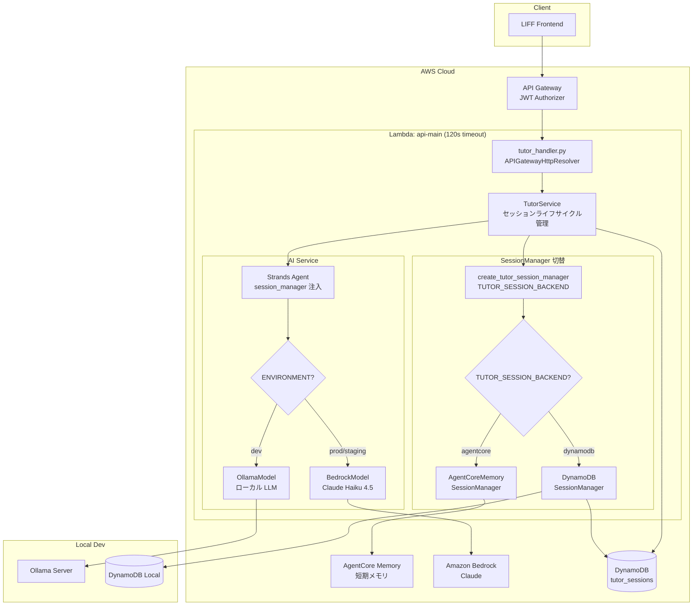

# AgentCore Memory 統合 アーキテクチャ設計

**作成日**: 2026-03-07
**関連要件定義**: [requirements.md](../../spec/agentcore-memory-integration/requirements.md)
**ヒアリング記録**: [design-interview.md](design-interview.md)

**【信頼性レベル凡例】**:
- 🔵 **青信号**: EARS要件定義書・設計文書・ユーザヒアリングを参考にした確実な設計
- 🟡 **黄信号**: EARS要件定義書・設計文書・ユーザヒアリングから妥当な推測による設計
- 🔴 **赤信号**: EARS要件定義書・設計文書・ユーザヒアリングにない推測による設計

---

## システム概要 🔵

**信頼性**: 🔵 *要件定義書・feature-backlog.md セクション4・ユーザヒアリングより*

AI チューター機能の会話履歴管理を、現在の DynamoDB 自前管理方式から Strands SDK の `SessionManager` インターフェースに移行する。本番環境では AgentCore Memory（短期メモリ）を使用し、ローカル開発・フォールバック用に DynamoDB ベースの `SessionManager` 実装を提供する。

環境変数 `TUTOR_SESSION_BACKEND` による切り替えファクトリパターンを導入し、Agent 側のコード変更なしでバックエンドを差し替え可能にする。

## アーキテクチャパターン 🔵

**信頼性**: 🔵 *既存設計・CLAUDE.md技術スタック・ai-strands-migration設計・ユーザヒアリングより*

- **パターン**: サーバーレスアーキテクチャ + ファクトリパターン + SessionManager 抽象化
- **選択理由**:
  - 既存のサーバーレスアーキテクチャ（AWS SAM / Lambda）を維持
  - Strands SDK の `SessionManager` インターフェースによる会話履歴管理の抽象化
  - `TUTOR_SESSION_BACKEND` 環境変数でバックエンド（AgentCore / DynamoDB）を動的切り替え
  - 既存の `create_tutor_ai_service()` ファクトリパターンとの一貫性

## コンポーネント構成

### SessionManager 抽象化レイヤー 🔵

**信頼性**: 🔵 *feature-backlog.md ファクトリコード例・Strands SDK SessionManager インターフェース・ユーザヒアリングより*

```
Strands SessionManager Interface
├── initialize(agent, session_id)       # セッション初期化
├── append_message(message, agent)      # メッセージ追加
├── sync_agent(agent)                   # エージェント状態の永続化
└── close()                             # バッファフラッシュ（AgentCore用）

実装クラス:
├── AgentCoreMemorySessionManager       # 本番環境（bedrock-agentcore-sdk-python）
│   └── AgentCoreMemoryConfig           # memory_id, session_id, actor_id, batch_size
├── DynamoDBSessionManager              # フォールバック・ローカル開発（自前実装）
│   └── tutor_sessions テーブル          # 既存 messages フィールドを流用
└── create_tutor_session_manager()      # ファクトリ関数
```

### 初期化戦略 🔵

**信頼性**: 🔵 *ユーザヒアリング「クライアントのみグローバル」選択・REQ-403より*

```
Lambda グローバルスコープ（コールドスタート時に1回実行）:
├── AgentCoreMemoryClient()           # 重い初期化（AWS API 接続）
├── tutor_ai_service                  # AI サービス（既存）
└── dynamodb_resource                 # DynamoDB リソース（既存）

リクエストスコープ（毎リクエスト実行）:
├── AgentCoreMemorySessionManager()   # session_id 付きで生成（軽量）
│   └── AgentCoreMemoryConfig(memory_id, session_id, actor_id)
└── Agent(session_manager=..., agent_id=...) # セッション付き Agent
```

### バックエンド 🔵

**信頼性**: 🔵 *既存実装・CLAUDE.md技術スタック・ai-strands-migration設計より*

- **フレームワーク**: AWS SAM + AWS Lambda Powertools
- **認証方式**: Keycloak OIDC JWT（API Gateway Authorizer）
- **API設計**: REST API（APIGatewayHttpResolver）
- **Lambda構成**: 既存 `api-main` 関数に統合（タイムアウト 120秒）
- **AI サービス**: `StrandsTutorAIService`（SessionManager 注入対応に改修）

### データストア 🔵

**信頼性**: 🔵 *既存実装・feature-backlog.md・ユーザヒアリングより*

- **セッションメタデータ**: DynamoDB `tutor_sessions` テーブル（status, message_count, mode, deck_id, timeout, TTL）
- **会話履歴（AgentCore バックエンド）**: AgentCore Memory（AWS マネージドサービス）
- **会話履歴（DynamoDB バックエンド）**: DynamoDB `tutor_sessions` テーブルの `messages` フィールド
- **キャッシュ**: なし（セッション単位のステートフル会話のため不要）

## システム構成図 🔵

**信頼性**: 🔵 *要件定義・既存設計・ユーザヒアリングより*



## ディレクトリ構造 🔵

**信頼性**: 🔵 *既存プロジェクト構造・設計ヒアリングより*

```
backend/src/
├── api/
│   └── handlers/
│       └── tutor_handler.py             # API ハンドラー（変更なし）
├── models/
│   └── tutor.py                         # Pydantic モデル（変更なし）
├── services/
│   ├── tutor_service.py                 # ビジネスロジック（★大幅リファクタリング）
│   │                                    #   - 会話履歴管理を SessionManager に委譲
│   │                                    #   - メタデータ管理は引き続き DynamoDB
│   ├── tutor_ai_service.py              # AI サービス（★ SessionManager 注入対応）
│   │                                    #   - _create_agent() に session_manager, agent_id 追加
│   │                                    #   - generate_response() から messages 引数削除
│   ├── tutor_session_manager.py         # ★新規: DynamoDBSessionManager 実装
│   │                                    #   - Strands SessionManager インターフェース準拠
│   │                                    #   - 既存 tutor_sessions テーブルの messages を利用
│   ├── tutor_session_factory.py         # ★新規: SessionManager ファクトリ
│   │                                    #   - create_tutor_session_manager(session_id, user_id)
│   │                                    #   - TUTOR_SESSION_BACKEND 環境変数で切り替え
│   │                                    #   - AgentCoreMemoryClient グローバル初期化
│   └── prompts/
│       └── tutor.py                     # プロンプト（変更なし）
├── tests/
│   └── unit/
│       ├── test_tutor_ai_service.py     # ★ SessionManager 注入テスト追加
│       ├── test_tutor_service.py        # ★ SessionManager 統合テスト追加
│       ├── test_tutor_session_manager.py # ★新規: DynamoDBSessionManager テスト
│       └── test_tutor_session_factory.py # ★新規: ファクトリテスト
└── requirements.txt                     # ★ bedrock-agentcore-sdk-python 追加

backend/template.yaml                    # ★ パラメータ・環境変数・IAM ポリシー追加
```

## SessionManager ファクトリ詳細設計 🔵

**信頼性**: 🔵 *feature-backlog.md ファクトリコード例・ユーザヒアリングより*

### ファクトリ関数

```python
import os
from strands.session import SessionManager

# グローバルスコープ: 重い初期化を1回だけ実行
_agentcore_client = None

def _get_agentcore_client():
    """AgentCoreMemoryClient をシングルトンで取得（コールドスタート最適化）."""
    global _agentcore_client
    if _agentcore_client is None:
        from bedrock_agentcore.memory import AgentCoreMemoryClient
        _agentcore_client = AgentCoreMemoryClient()
    return _agentcore_client

def create_tutor_session_manager(
    session_id: str,
    user_id: str,
    backend: str | None = None,
) -> SessionManager:
    """TUTOR_SESSION_BACKEND に応じた SessionManager を生成."""
    if backend is None:
        backend = os.environ.get("TUTOR_SESSION_BACKEND", "")
        if not backend:
            env = os.environ.get("ENVIRONMENT", "prod")
            backend = "dynamodb" if env == "dev" else "agentcore"

    if backend == "agentcore":
        from bedrock_agentcore.memory.integrations.strands import (
            AgentCoreMemorySessionManager,
        )
        from bedrock_agentcore.memory.integrations.strands.config import (
            AgentCoreMemoryConfig,
        )

        memory_id = os.environ.get("AGENTCORE_MEMORY_ID")
        if not memory_id:
            from services.tutor_ai_service import TutorAIServiceError
            raise TutorAIServiceError(
                "AGENTCORE_MEMORY_ID is required for agentcore backend"
            )

        config = AgentCoreMemoryConfig(
            memory_id=memory_id,
            session_id=session_id,
            actor_id=user_id,
        )
        return AgentCoreMemorySessionManager(
            config,
            memory_client=_get_agentcore_client(),
        )

    if backend == "dynamodb":
        from services.tutor_session_manager import DynamoDBSessionManager
        return DynamoDBSessionManager(
            table_name=os.environ.get(
                "TUTOR_SESSIONS_TABLE", "memoru-tutor-sessions-dev"
            ),
            session_id=session_id,
            user_id=user_id,
        )

    raise ValueError(f"Unknown TUTOR_SESSION_BACKEND: {backend}")
```

### 環境変数によるバックエンド選択ロジック 🔵

**信頼性**: 🔵 *REQ-001, REQ-101〜REQ-104・ユーザヒアリングより*

```
TUTOR_SESSION_BACKEND 設定済み?
├── "agentcore" → AgentCoreMemorySessionManager
├── "dynamodb"  → DynamoDBSessionManager
├── その他      → ValueError
└── 未設定
    └── ENVIRONMENT?
        ├── "dev"   → DynamoDBSessionManager（自動選択）
        └── その他  → AgentCoreMemorySessionManager（デフォルト）
```

## TutorService リファクタリング設計 🔵

**信頼性**: 🔵 *REQ-004, REQ-006, REQ-007・ユーザヒアリング「全て SessionManager 経由」より*

### 変更概要

| メソッド | 現在 | 変更後 |
|---------|------|--------|
| `start_session` | AI 挨拶を生成し `messages` リストに格納して DynamoDB 保存 | SessionManager 付き Agent で挨拶を生成。SessionManager が履歴を自動保存 |
| `send_message` | DynamoDB から `messages` 全件取得 → AI に渡す → 結果を `messages` に追記 | SessionManager 付き Agent を生成。SessionManager が履歴を自動復元・保存 |
| `end_session` | DynamoDB の status を更新 | メタデータ更新のみ（変更なし） |
| `list_sessions` | DynamoDB クエリ | メタデータクエリのみ（変更なし） |
| `get_session` | DynamoDB からセッション取得 | メタデータ + SessionManager から会話履歴を取得 |

### メタデータとメッセージ履歴の責務分離 🔵

**信頼性**: 🔵 *REQ-007・ユーザヒアリングより*

```
┌──────────────────────────────────────────────┐
│ DynamoDB tutor_sessions テーブル（メタデータ）  │
│   user_id, session_id, deck_id, mode,        │
│   status, message_count, system_prompt,      │
│   created_at, updated_at, ended_at, ttl,     │
│   deck_card_ids                              │
│   messages（DynamoDB バックエンド時のみ使用）    │
└──────────────────────────────────────────────┘

┌──────────────────────────────────────────────┐
│ SessionManager（会話履歴）                      │
│   AgentCore: AgentCore Memory API            │
│   DynamoDB:  tutor_sessions.messages         │
└──────────────────────────────────────────────┘
```

## StrandsTutorAIService 改修設計 🔵

**信頼性**: 🔵 *REQ-004・Strands SDK Agent パラメータ調査・ユーザヒアリングより*

### 変更前

```python
def _create_agent(self, system_prompt: str, messages: list[dict]):
    return Agent(
        model=self.model,
        system_prompt=system_prompt,
        messages=messages,  # 全履歴を手動で渡す
    )

def generate_response(self, system_prompt, messages) -> tuple[str, list[str]]:
    history = messages[:-1]
    last_user_content = messages[-1]["content"]
    agent = self._create_agent(system_prompt, strands_messages)
    response = agent(last_user_content)
```

### 変更後

```python
def _create_agent(self, system_prompt: str, session_manager=None):
    return Agent(
        model=self.model,
        system_prompt=system_prompt,
        session_manager=session_manager,  # SessionManager が履歴を管理
        agent_id="tutor",                 # 固定の Agent 識別子
    )

def generate_response(
    self, system_prompt, user_message, session_manager=None,
) -> tuple[str, list[str]]:
    agent = self._create_agent(system_prompt, session_manager)
    response = agent(user_message)  # 単一メッセージのみ渡す
```

## 非機能要件の実現方法

### パフォーマンス 🔵

**信頼性**: 🔵 *NFR-001, NFR-002・ユーザヒアリングより*

- **コールドスタート最適化**: `AgentCoreMemoryClient` をグローバルスコープで初期化し、ハンドラ間で再利用
- **レスポンス影響**: SessionManager バックエンド切り替えによる追加レイテンシは 500ms 以内（AgentCore API 1往復分）
- **Lambda タイムアウト**: 120秒（既存設定を維持）
- **コスト**: AgentCore Memory 約 $0.01/セッション（20イベント + 10取得）

### セキュリティ 🔵

**信頼性**: 🔵 *NFR-101, NFR-102・ユーザヒアリング「SAM テンプレートで管理」より*

- **IAM ポリシー**: SAM テンプレートの Lambda 実行ロールに AgentCore Memory API アクセス権限を追加
- **環境変数管理**: `AGENTCORE_MEMORY_ID` は SAM パラメータとして注入（コードにハードコードしない）
- **データ分離**: AgentCore Memory の `actor_id` に `user_id` を設定し、ユーザー単位のデータ分離を実現
- **認証**: 既存の Keycloak JWT 認証を維持

### 可用性 🟡

**信頼性**: 🟡 *NFR-201・既存エラーハンドリングパターンから妥当な推測*

- **AgentCore 障害時**: `TutorAIServiceError` を返し、HTTP 503 でユーザーに通知
- **フォールバック**: `TUTOR_SESSION_BACKEND=dynamodb` に切り替えることで即時復旧可能（手動切り替え）
- **エラーログ**: Lambda Powertools Logger で AgentCore 接続エラーを構造化ログ出力

### テスタビリティ 🔵

**信頼性**: 🔵 *NFR-301, NFR-302・既存 DI パターンより*

- **SessionManager モック化**: ファクトリ関数経由のため、テスト時に任意の SessionManager 実装を注入可能
- **DI パターン**: `TutorService.__init__` に `session_manager_factory` パラメータを追加
- **テストカバレッジ**: 新規追加コード 80% 以上を目標

## 技術的制約

### パフォーマンス制約 🔵

**信頼性**: 🔵 *既存実装・template.yaml より*

- Lambda 実行時間: 最大 120 秒
- DynamoDB: 1 アイテム最大 400KB（DynamoDB バックエンド時の会話履歴サイズ上限）
- AgentCore Memory: バッチサイズ 1-100（デフォルト 1）
- セッション当たり最大 20 往復（既存制限を維持）

### セキュリティ制約 🔵

**信頼性**: 🔵 *既存 IAM ポリシー・セキュリティ設計より*

- IAM 権限: `bedrock:InvokeModel` + AgentCore Memory API アクセス権限
- ユーザーデータ分離: `user_id` ベースのデータアクセス制御

### 互換性制約 🔵

**信頼性**: 🔵 *REQ-006・CLAUDE.md・既存実装より*

- Python 3.12 ランタイム
- Pydantic v2
- 既存 API エンドポイントのリクエスト・レスポンス形式を維持（REQ-006）
- 既存テストの保護
- `bedrock-agentcore-sdk-python` 新規依存追加（REQ-401）

## SAM テンプレート変更 🔵

**信頼性**: 🔵 *REQ-005, REQ-402, REQ-404・ユーザヒアリング「SAM テンプレートで管理」より*

### 追加パラメータ

```yaml
Parameters:
  TutorSessionBackend:
    Type: String
    Default: "agentcore"
    AllowedValues:
      - "agentcore"
      - "dynamodb"
    Description: Tutor session history backend (agentcore or dynamodb)

  AgentCoreMemoryId:
    Type: String
    Default: ""
    Description: AgentCore Memory ID for tutor session management
```

### 追加環境変数

```yaml
Globals:
  Function:
    Environment:
      Variables:
        TUTOR_SESSION_BACKEND: !Ref TutorSessionBackend
        AGENTCORE_MEMORY_ID: !Ref AgentCoreMemoryId
```

### 追加 IAM ポリシー

```yaml
Policies:
  - Statement:
      - Effect: Allow
        Action:
          - "bedrock-agentcore:*"
        Resource: "*"
```

## 関連文書

- **データフロー**: [dataflow.md](dataflow.md)
- **型定義**: [interfaces.py](interfaces.py)
- **API仕様**: 既存 API を維持（変更なし。REQ-006）
- **要件定義**: [requirements.md](../../spec/agentcore-memory-integration/requirements.md)
- **ヒアリング記録**: [design-interview.md](design-interview.md)
- **既存 AI 設計**: [ai-strands-migration/architecture.md](../ai-strands-migration/architecture.md)

## 信頼性レベルサマリー

- 🔵 青信号: 22件 (92%)
- 🟡 黄信号: 2件 (8%)
- 🔴 赤信号: 0件 (0%)

**品質評価**: ✅ 高品質（青信号 92%、赤信号なし。黄信号は可用性の詳細とレスポンス影響の実測値で、実装フェーズで確定する項目）
