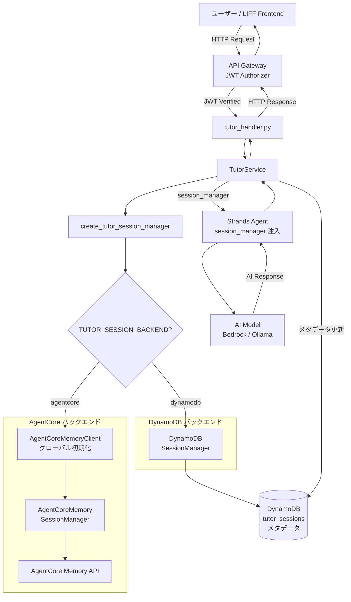
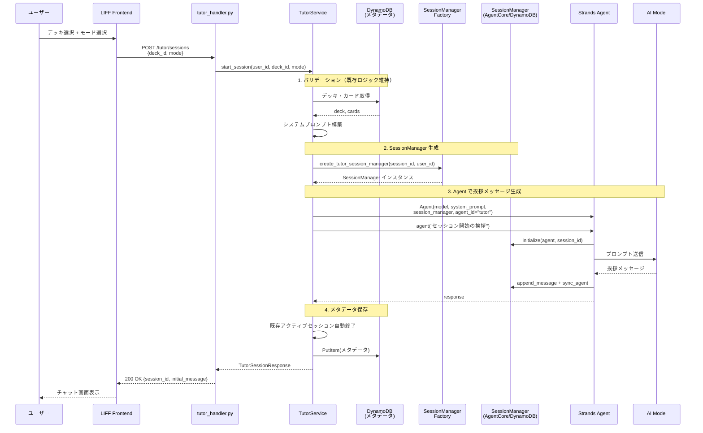
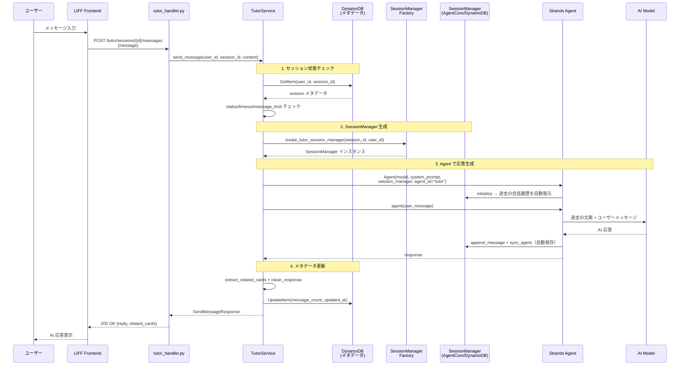
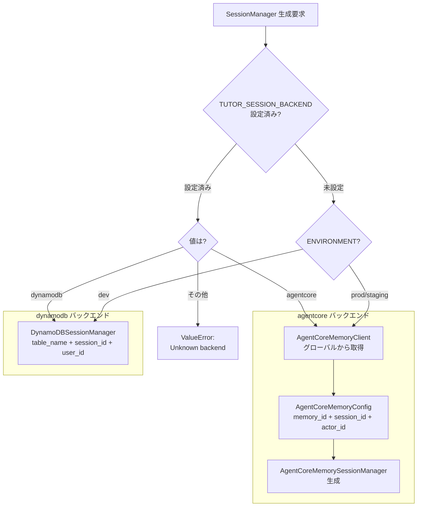
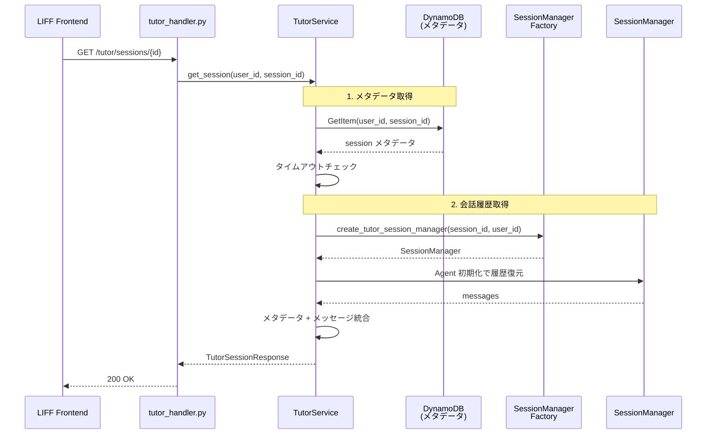
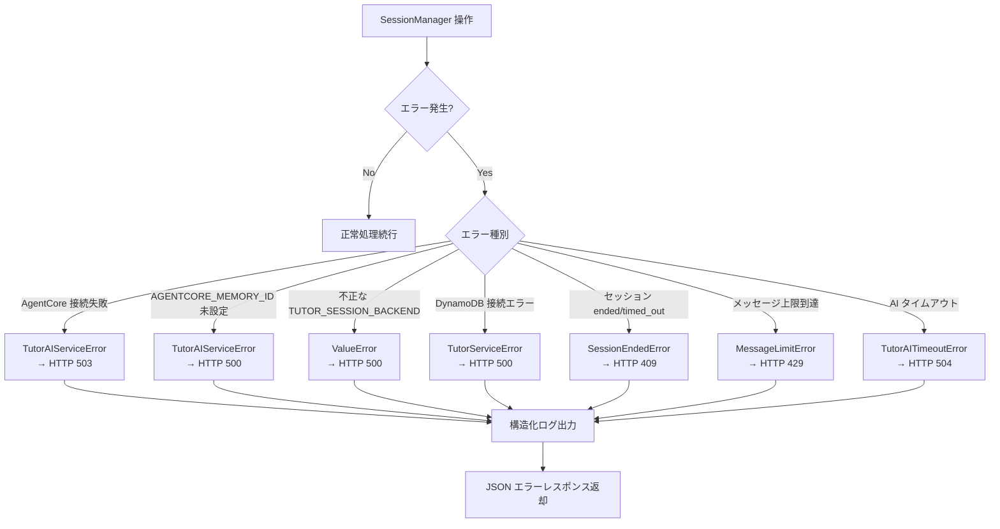

# AgentCore Memory 統合 データフロー図

**作成日**: 2026-03-07
**関連アーキテクチャ**: [architecture.md](architecture.md)
**関連要件定義**: [requirements.md](../../spec/agentcore-memory-integration/requirements.md)

**【信頼性レベル凡例】**:
- 🔵 **青信号**: EARS要件定義書・設計文書・ユーザヒアリングを参考にした確実なフロー
- 🟡 **黄信号**: EARS要件定義書・設計文書・ユーザヒアリングから妥当な推測によるフロー
- 🔴 **赤信号**: EARS要件定義書・設計文書・ユーザヒアリングにない推測によるフロー

---

## システム全体のデータフロー 🔵

**信頼性**: 🔵 *要件定義・ユーザーストーリー・ユーザヒアリングより*



## 主要機能のデータフロー

### 機能1: セッション開始（start_session） 🔵

**信頼性**: 🔵 *ユーザーストーリー 2.1・REQ-004・ユーザヒアリング「全て SessionManager 経由」より*

**関連要件**: REQ-001, REQ-004, REQ-006, REQ-007



**詳細ステップ**:
1. デッキとカードの存在確認（バリデーション失敗時は既存セッションを消失させない: REQ-105）
2. `create_tutor_session_manager()` で環境に応じた SessionManager を生成
3. SessionManager 付き Strands Agent で挨拶メッセージを生成（SessionManager が自動的に履歴保存）
4. セッションメタデータ（status, mode, deck_id 等）を DynamoDB に保存

---

### 機能2: メッセージ送信（send_message） 🔵

**信頼性**: 🔵 *ユーザーストーリー 2.1・REQ-004, REQ-201・ユーザヒアリングより*

**関連要件**: REQ-004, REQ-006, REQ-201, REQ-202



**詳細ステップ**:
1. DynamoDB からセッションメタデータを取得し、状態チェック（ended/timed_out なら拒否: REQ-202）
2. `create_tutor_session_manager()` でセッション固有の SessionManager を生成
3. SessionManager 付き Agent が自動的に過去の会話を復元し、ユーザーメッセージに対して応答
4. メタデータ（message_count, updated_at）を DynamoDB で更新。メッセージ上限到達時は自動終了

---

### 機能3: バックエンド切り替えフロー 🔵

**信頼性**: 🔵 *REQ-001, REQ-101〜REQ-104・feature-backlog.md ファクトリコード例・ユーザヒアリングより*

**関連要件**: REQ-001, REQ-101, REQ-102, REQ-103, REQ-104



---

### 機能4: セッション取得（get_session） 🟡

**信頼性**: 🟡 *REQ-006・既存実装パターンから妥当な推測。会話履歴の取得方法は SessionManager の実装依存*

**関連要件**: REQ-006, REQ-007



**備考**: AgentCore バックエンドでの会話履歴取得方法は、SessionManager の `initialize()` でAgent に復元されるメッセージを抽出する方式。具体的な API は実装時に確認が必要。

---

## エラーハンドリングフロー 🟡

**信頼性**: 🟡 *EDGE-001〜EDGE-004・既存エラーハンドリングパターンから妥当な推測*



## データ処理パターン

### 同期処理 🔵

**信頼性**: 🔵 *既存アーキテクチャ設計より*

すべてのチューター機能は同期処理（リクエスト-レスポンス）で実装する。
- セッション開始: 最大 120 秒（AI 挨拶生成含む）
- メッセージ送信: 最大 120 秒（AI 応答生成含む）
- セッション一覧/詳細: 数秒以内

### 非同期処理 🟡

**信頼性**: 🟡 *将来の拡張として推測*

将来的に AgentCore Memory の `summaryMemoryStrategy` を導入する場合、古い会話の自動要約が非同期で実行される可能性がある。現フェーズでは同期処理のみ。

## Context Manager パターン 🔵

**信頼性**: 🔵 *AgentCore SDK ドキュメント・Strands SDK 調査より*

AgentCore Memory の `batch_size > 1` 使用時は、`close()` でバッファをフラッシュする必要がある。

```python
# 推奨パターン: Context Manager 使用
with create_tutor_session_manager(session_id, user_id) as session_manager:
    agent = Agent(
        model=model,
        system_prompt=system_prompt,
        session_manager=session_manager,
        agent_id="tutor",
    )
    response = agent(user_message)
```

ただし、`batch_size=1`（デフォルト）の場合は即時フラッシュされるため、Context Manager は必須ではない。安全のため Context Manager の使用を推奨。

## データ整合性の保証 🔵

**信頼性**: 🔵 *既存実装パターン・REQ-007より*

- **メタデータと会話履歴の分離**: メタデータは DynamoDB、会話履歴は SessionManager が管理。トランザクション的な一貫性は保証しない（結果整合性）
- **メッセージカウントの正確性**: `message_count` はメタデータ側で管理し、SessionManager の操作とは独立して更新
- **タイムアウトの判定**: メタデータの `updated_at` で判定（既存ロジックを維持）
- **ユーザーデータ分離**: AgentCore の `actor_id` と DynamoDB の `user_id` でデータ分離

## 関連文書

- **アーキテクチャ**: [architecture.md](architecture.md)
- **型定義**: [interfaces.py](interfaces.py)
- **ヒアリング記録**: [design-interview.md](design-interview.md)
- **要件定義**: [requirements.md](../../spec/agentcore-memory-integration/requirements.md)

## 信頼性レベルサマリー

- 🔵 青信号: 10件 (77%)
- 🟡 黄信号: 3件 (23%)
- 🔴 赤信号: 0件 (0%)

**品質評価**: ✅ 高品質（青信号 77%、赤信号なし。黄信号はセッション取得時の会話履歴取得方法、エラーハンドリングの詳細、非同期処理の将来検討で、実装フェーズで確定する項目）
