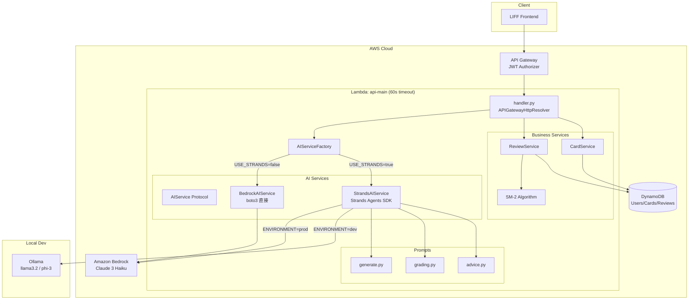

# AI Strands Migration アーキテクチャ設計

**作成日**: 2026-02-23
**関連要件定義**: [requirements.md](../../spec/ai-strands-migration/requirements.md)
**ヒアリング記録**: [design-interview.md](design-interview.md)

**【信頼性レベル凡例】**:
- 🔵 **青信号**: EARS要件定義書・設計文書・ユーザヒアリングを参考にした確実な設計
- 🟡 **黄信号**: EARS要件定義書・設計文書・ユーザヒアリングから妥当な推測による設計
- 🔴 **赤信号**: EARS要件定義書・設計文書・ユーザヒアリングにない推測による設計

---

## システム概要 🔵

**信頼性**: 🔵 *要件定義書 REQ-SM-001〜006・ユーザヒアリングより*

Memoru LIFF の AI 機能を現行の boto3 直接呼び出し（Amazon Bedrock）から AWS Strands Agents SDK ベースの実装へ段階的に移行する。移行と同時に、回答採点/AI 評価・学習アドバイスの新機能を追加する。

フィーチャーフラグ（`USE_STRANDS`）により新旧実装を切り替え可能とし、ローカル開発環境では Ollama プロバイダーで Bedrock なしの AI 動作を実現する。

## アーキテクチャパターン 🔵

**信頼性**: 🔵 *既存設計・CLAUDE.md技術スタック・設計ヒアリングより*

- **パターン**: サーバーレスアーキテクチャ + サービスレイヤーパターン + Protocol ベース抽象化
- **選択理由**:
  - 既存のサーバーレスアーキテクチャ（AWS SAM / Lambda）を維持
  - Python `typing.Protocol` による AI サービスの疎結合化
  - ファクトリパターンで `USE_STRANDS` フラグに応じた実装を動的に選択
  - 既存の Lambda 関数に新エンドポイントを統合（インフラ変更最小化）

## コンポーネント構成

### AI サービス抽象化レイヤー 🔵

**信頼性**: 🔵 *設計ヒアリング Q1「Protocolベース」選択より*

```
AIService Protocol
├── generate_cards()       # カード生成（既存機能の移行）
├── grade_answer()         # 回答採点（新機能）
└── get_learning_advice()  # 学習アドバイス（新機能）

実装クラス:
├── BedrockAIService       # 既存 boto3 実装（USE_STRANDS=false）
├── StrandsAIService       # Strands Agents 実装（USE_STRANDS=true）
│   ├── Bedrock Provider   # 本番環境
│   └── Ollama Provider    # ローカル開発環境
└── AIServiceFactory       # フラグに応じた実装選択
```

### バックエンド 🔵

**信頼性**: 🔵 *既存実装・CLAUDE.md技術スタック・設計ヒアリングより*

- **フレームワーク**: AWS SAM + AWS Lambda Powertools
- **認証方式**: Keycloak OIDC JWT（API Gateway Authorizer）
- **API設計**: REST API（APIGatewayHttpResolver）
- **Lambda構成**: 既存 `api-main` 関数に統合（タイムアウト 60秒）
- **AI サービス**: Protocol ベースの `AIService` インターフェース

### プロンプト管理 🔵

**信頼性**: 🔵 *設計ヒアリング Q3「機能別プロンプトモジュール」選択より*

```
backend/src/services/prompts/
├── __init__.py         # 共通エクスポート
├── generate.py         # カード生成プロンプト（既存 prompts.py を移行）
├── grading.py          # 回答採点プロンプト（新規）
└── advice.py           # 学習アドバイスプロンプト（新規）
```

各モジュールは以下を含む:
- `SYSTEM_PROMPT`: Strands Agent のシステムプロンプト
- テンプレート関数: ユーザー入力からプロンプトを生成

### エラーハンドリング 🔵

**信頼性**: 🔵 *設計ヒアリング Q6「統一例外階層」選択より*

```
AIServiceError (基底クラス)
├── AITimeoutError          # タイムアウト → 504
├── AIRateLimitError        # レート制限 → 429
├── AIInternalError         # 内部エラー → 500
├── AIParseError            # レスポンス解析エラー → 500
└── AIProviderError         # プロバイダーエラー → 503

旧: BedrockServiceError → AIServiceError のサブクラスに変更
    BedrockTimeoutError → AITimeoutError にマッピング
```

## システム構成図 🔵

**信頼性**: 🔵 *要件定義・既存設計・設計ヒアリングより*



## ディレクトリ構造 🔵

**信頼性**: 🔵 *既存プロジェクト構造・設計ヒアリングより*

```
backend/src/
├── api/
│   └── handler.py              # API ハンドラー（既存 + 新エンドポイント追加）
├── models/
│   ├── generate.py             # カード生成モデル（既存）
│   ├── grading.py              # 回答採点モデル（新規）
│   ├── advice.py               # 学習アドバイスモデル（新規）
│   ├── card.py                 # カードモデル（既存）
│   ├── review.py               # レビューモデル（既存）
│   └── user.py                 # ユーザーモデル（既存）
├── services/
│   ├── ai_service.py           # AIService Protocol + Factory（新規）
│   ├── bedrock.py              # BedrockAIService（既存改修）
│   ├── strands_service.py      # StrandsAIService（新規）
│   ├── prompts/                # プロンプトモジュール（新規ディレクトリ）
│   │   ├── __init__.py
│   │   ├── generate.py         # カード生成（既存 prompts.py を移行）
│   │   ├── grading.py          # 回答採点（新規）
│   │   └── advice.py           # 学習アドバイス（新規）
│   ├── card_service.py         # カードサービス（既存）
│   ├── review_service.py       # レビューサービス（既存）
│   ├── srs.py                  # SM-2 アルゴリズム（既存）
│   └── user_service.py         # ユーザーサービス（既存）
└── tests/
    └── unit/
        ├── test_bedrock.py         # 既存テスト（維持）
        ├── test_ai_service.py      # Protocol + Factory テスト（新規）
        ├── test_strands_service.py  # Strands テスト（新規）
        ├── test_grading.py         # 回答採点テスト（新規）
        └── test_advice.py          # 学習アドバイステスト（新規）
```

## AIService Protocol 詳細設計 🔵

**信頼性**: 🔵 *設計ヒアリング Q1・既存 BedrockService インターフェースより*

### Protocol 定義

```python
from typing import Protocol, List
from dataclasses import dataclass

@dataclass
class GeneratedCard:
    front: str
    back: str
    suggested_tags: List[str]

@dataclass
class GenerationResult:
    cards: List[GeneratedCard]
    input_length: int
    model_used: str
    processing_time_ms: int

@dataclass
class GradingResult:
    grade: int          # SRS grade 0-5
    reasoning: str      # AI による採点理由
    model_used: str
    processing_time_ms: int

@dataclass
class LearningAdvice:
    advice_text: str           # アドバイス本文
    weak_areas: List[str]      # 弱点分野
    recommendations: List[str] # 推奨事項
    model_used: str
    processing_time_ms: int

class AIService(Protocol):
    def generate_cards(
        self,
        input_text: str,
        card_count: int = 5,
        difficulty: str = "medium",
        language: str = "ja",
    ) -> GenerationResult: ...

    def grade_answer(
        self,
        card_front: str,
        card_back: str,
        user_answer: str,
        language: str = "ja",
    ) -> GradingResult: ...

    def get_learning_advice(
        self,
        review_summary: dict,
        language: str = "ja",
    ) -> LearningAdvice: ...
```

### Factory パターン 🔵

**信頼性**: 🔵 *設計ヒアリング Q1・REQ-SM-102/103 より*

```python
import os

def create_ai_service() -> AIService:
    """USE_STRANDS フラグに応じた AIService 実装を返す."""
    use_strands = os.environ.get("USE_STRANDS", "false").lower() == "true"

    if use_strands:
        from .strands_service import StrandsAIService
        return StrandsAIService()
    else:
        from .bedrock import BedrockAIService
        return BedrockAIService()
```

## Strands Agents 統合設計 🟡

**信頼性**: 🟡 *Strands Agents SDK 仕様から妥当な推測。SDK の具体的な API は実装時に確認*

### StrandsAIService 構成

```python
from strands import Agent
from strands.models import BedrockModel, OllamaModel

class StrandsAIService:
    def __init__(self):
        self.model = self._create_model()

    def _create_model(self):
        environment = os.environ.get("ENVIRONMENT", "prod")
        if environment == "dev":
            return OllamaModel(
                host=os.environ.get("OLLAMA_HOST", "http://ollama:11434"),
                model_id=os.environ.get("OLLAMA_MODEL", "llama3.2"),
            )
        else:
            return BedrockModel(
                model_id=os.environ.get(
                    "BEDROCK_MODEL_ID",
                    "anthropic.claude-3-haiku-20240307-v1:0"
                ),
            )

    def generate_cards(self, input_text, card_count=5, difficulty="medium", language="ja"):
        agent = Agent(
            model=self.model,
            system_prompt=CARD_GENERATION_SYSTEM_PROMPT,
        )
        # Agent にユーザープロンプトを渡して推論
        result = agent(get_card_generation_prompt(input_text, card_count, difficulty, language))
        return self._parse_generation_result(result)

    def grade_answer(self, card_front, card_back, user_answer, language="ja"):
        agent = Agent(
            model=self.model,
            system_prompt=GRADING_SYSTEM_PROMPT,
        )
        result = agent(get_grading_prompt(card_front, card_back, user_answer, language))
        return self._parse_grading_result(result)

    def get_learning_advice(self, review_summary, language="ja"):
        agent = Agent(
            model=self.model,
            system_prompt=ADVICE_SYSTEM_PROMPT,
        )
        result = agent(get_advice_prompt(review_summary, language))
        return self._parse_advice_result(result)
```

## 非機能要件の実現方法

### パフォーマンス 🔵

**信頼性**: 🔵 *REQ-SM-401・設計ヒアリング Q2 より*

- **Lambda タイムアウト**: 60 秒（既存 30 秒から拡張）
- **カード生成**: 30 秒以内（既存ベースライン維持）
- **回答採点**: 10 秒以内を目標（単純な推論タスク）
- **学習アドバイス**: 15 秒以内を目標（データ集計 + 推論）
- **最適化**: Strands Agent の初期化コストを Lambda の warm start で軽減

### セキュリティ 🔵

**信頼性**: 🔵 *NFR-SM-101/102・既存セキュリティ設計より*

- **認証**: 全 AI エンドポイントに Keycloak JWT 認証必須
- **IAM**: Lambda 実行ロールに `bedrock:InvokeModel` 最小権限
- **プロンプトインジェクション**: ユーザー入力をサニタイズ後にプロンプトテンプレートに埋め込み
- **レスポンス検証**: AI 出力の JSON バリデーション（Pydantic v2）

### 可用性 🟡

**信頼性**: 🟡 *NFR 要件から妥当な推測*

- **フィーチャーフラグフォールバック**: Strands 障害時に `USE_STRANDS=false` で即時ロールバック
- **Bedrock エラーリトライ**: 既存の Full Jitter 指数バックオフを Strands 実装でも継承
- **グレースフルデグレード**: ツール実行失敗時はツール結果なしで推論継続

### 運用監視 🟡

**信頼性**: 🟡 *NFR-SM-201/202 から妥当な推測*

- **構造化ロギング**: Lambda Powertools Logger で AI 呼び出しメトリクスを記録
- **CloudWatch メトリクス**: レイテンシー、エラー率、モデル使用量
- **アラート**: AI サービスエラー率閾値超過時に通知

## 技術的制約

### パフォーマンス制約 🔵

**信頼性**: 🔵 *既存実装・template.yaml より*

- Lambda 実行時間: 最大 60 秒（API エンドポイント）
- DynamoDB: 1 アイテム最大 400KB
- Bedrock Claude Context Window: 200K トークン（Haiku）

### セキュリティ制約 🔵

**信頼性**: 🔵 *既存 IAM ポリシー・セキュリティ設計より*

- IAM 権限: `bedrock:InvokeModel`, `bedrock:InvokeModelWithResponseStream` のみ
- ユーザーデータ分離: `user_id` ベースのデータアクセス制御

### 互換性制約 🔵

**信頼性**: 🔵 *CLAUDE.md・既存実装より*

- Python 3.12 ランタイム
- Pydantic v2
- 既存 `GenerateCardsResponse` API 形式の維持（REQ-SM-402）
- 既存 260+ テストの保護（REQ-SM-405）

## 関連文書

- **データフロー**: [dataflow.md](dataflow.md)
- **API仕様**: [api-endpoints.md](api-endpoints.md)
- **要件定義**: [requirements.md](../../spec/ai-strands-migration/requirements.md)
- **ユーザストーリー**: [user-stories.md](../../spec/ai-strands-migration/user-stories.md)
- **受け入れ基準**: [acceptance-criteria.md](../../spec/ai-strands-migration/acceptance-criteria.md)

## 信頼性レベルサマリー

- 🔵 青信号: 18件 (82%)
- 🟡 黄信号: 4件 (18%)
- 🔴 赤信号: 0件 (0%)

**品質評価**: ✅ 高品質（青信号 82%、赤信号なし。黄信号は Strands SDK の具体的 API、可用性・監視の詳細など実装フェーズで確定する項目）
