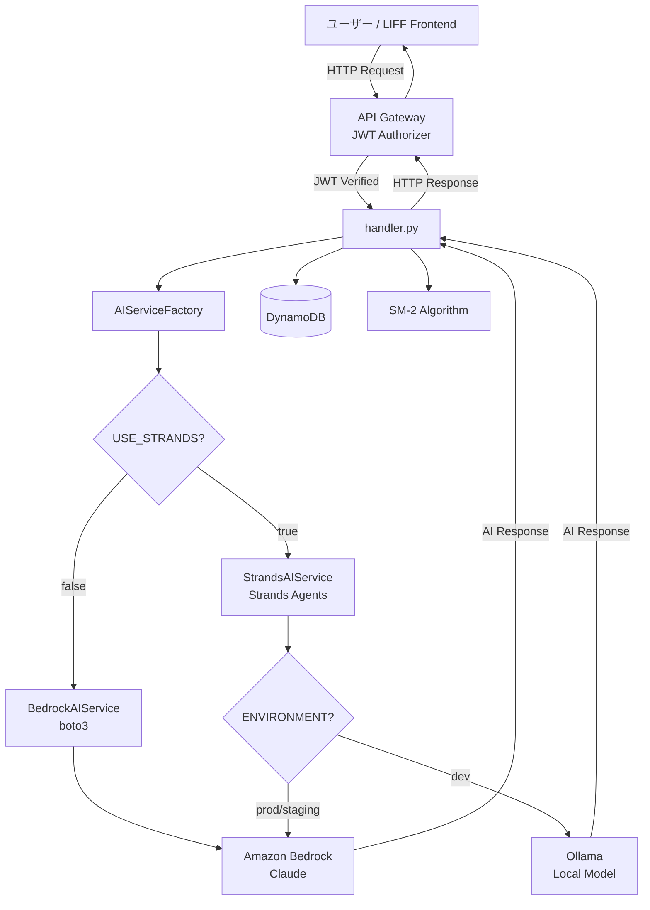
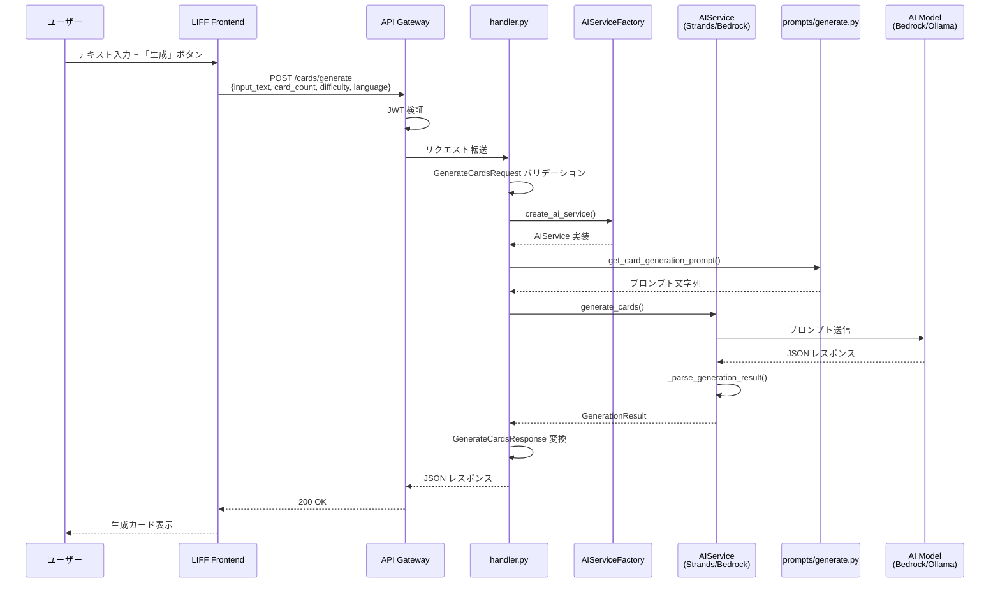
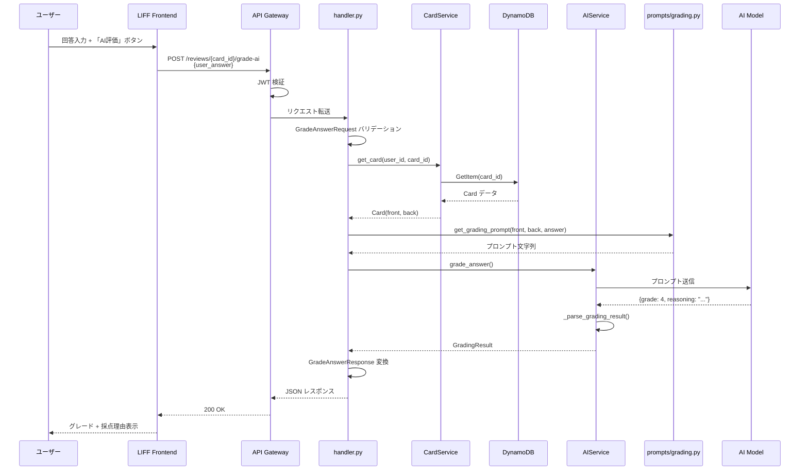
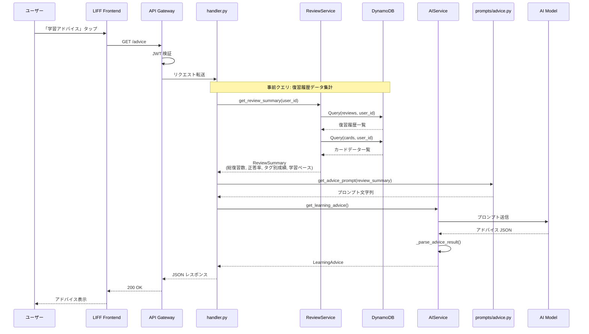
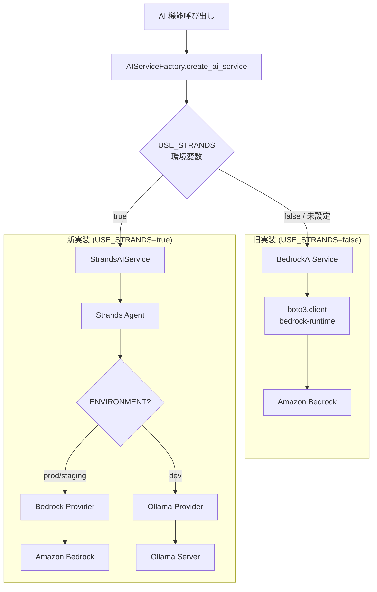
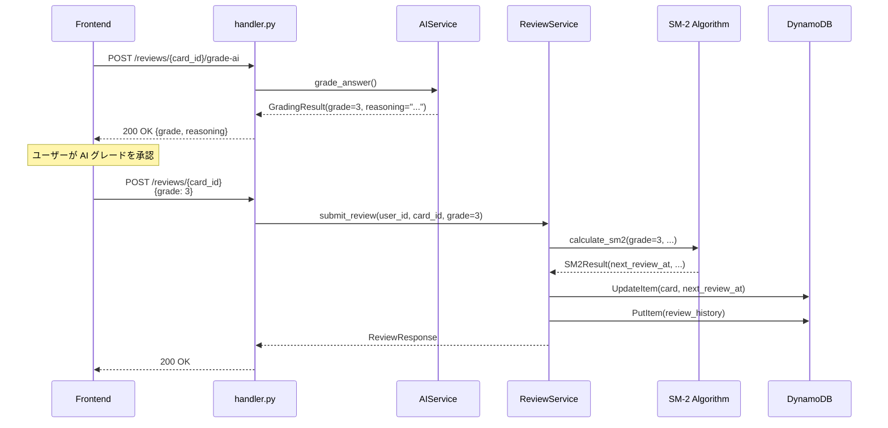
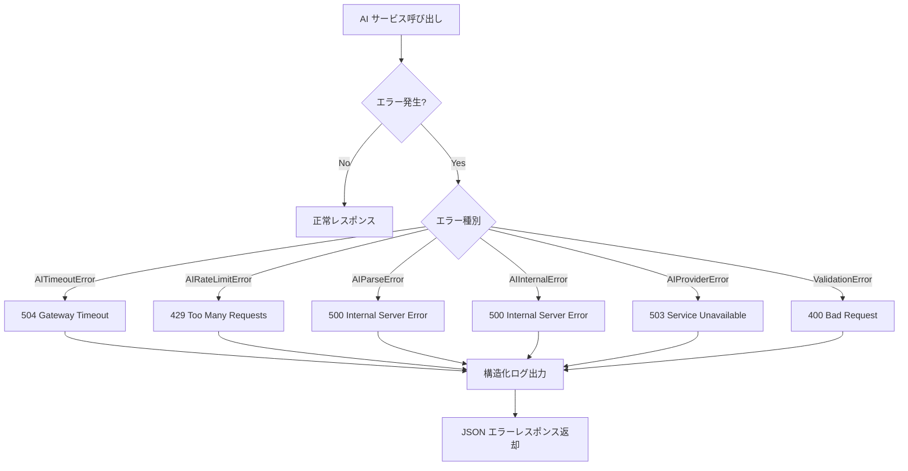

# AI Strands Migration データフロー図

**作成日**: 2026-02-23
**関連アーキテクチャ**: [architecture.md](architecture.md)
**関連要件定義**: [requirements.md](../../spec/ai-strands-migration/requirements.md)

**【信頼性レベル凡例】**:
- 🔵 **青信号**: EARS要件定義書・設計文書・ユーザヒアリングを参考にした確実なフロー
- 🟡 **黄信号**: EARS要件定義書・設計文書・ユーザヒアリングから妥当な推測によるフロー
- 🔴 **赤信号**: EARS要件定義書・設計文書・ユーザヒアリングにない推測によるフロー

---

## システム全体のデータフロー 🔵

**信頼性**: 🔵 *要件定義・ユーザーストーリー・設計ヒアリングより*

## 主要機能のデータフロー

### 機能1: カード生成（Strands 移行） 🔵

**信頼性**: 🔵 *ユーザーストーリー 1.1・既存実装 `bedrock.py`・受け入れ基準 TC-002 より*

**関連要件**: REQ-SM-001, REQ-SM-002, REQ-SM-402

**詳細ステップ**:
1. ユーザーが入力テキスト・カード数・難易度・言語を指定してカード生成をリクエスト
2. API Gateway が JWT を検証し、handler.py にリクエストを転送
3. Pydantic v2 でリクエストバリデーション（`GenerateCardsRequest`）
4. `AIServiceFactory` が `USE_STRANDS` フラグに応じた AIService を返す
5. `prompts/generate.py` からプロンプトを生成
6. AIService が AI モデルにプロンプトを送信し、JSON レスポンスを受信
7. レスポンスを `GenerationResult` にパースし、`GenerateCardsResponse` 形式で返却

---

### 機能2: 回答採点・AI 評価 🔵

**信頼性**: 🔵 *ユーザーストーリー 2.1・要件 REQ-SM-003・設計ヒアリング Q4 より*

**関連要件**: REQ-SM-003

**詳細ステップ**:
1. ユーザーが復習画面でカードの問題に回答し、「AI評価」をリクエスト
2. handler.py が CardService 経由でカードの front（問題）と back（正解）を取得
3. `prompts/grading.py` が SM-2 グレード定義を含むプロンプトを生成
4. AI が回答を分析し、SRS グレード（0-5）と採点理由を JSON で返却
5. `GradingResult` にパースしてレスポンス返却
6. フロントエンドでグレードと理由を表示、ユーザーは受入/上書き可能

---

### 機能3: 学習アドバイス 🔵

**信頼性**: 🔵 *ユーザーストーリー 3.1・要件 REQ-SM-004・設計ヒアリング Q5 より*

**関連要件**: REQ-SM-004

**詳細ステップ**:
1. ユーザーが学習アドバイスをリクエスト
2. handler.py が ReviewService 経由で DynamoDB から復習履歴・カードデータを事前取得
3. Python でデータを集計（総復習数、タグ別正答率、学習ペース等）
4. 集計結果を `prompts/advice.py` のプロンプトに埋め込み
5. AI が集計データを分析し、弱点分野・推奨事項・学習アドバイスを JSON で返却
6. `LearningAdvice` にパースしてレスポンス返却

---

### 機能4: フィーチャーフラグ切替 🔵

**信頼性**: 🔵 *ユーザーストーリー 1.2・要件 REQ-SM-102/103・設計ヒアリング Q1 より*

**関連要件**: REQ-SM-102, REQ-SM-103, REQ-SM-201

---

### 機能5: AI 採点 → SRS スケジュール連携 🟡

**信頼性**: 🟡 *ユーザーストーリー 2.2・既存 SRS 実装から妥当な推測*

**関連要件**: REQ-SM-003

**備考**: AI 採点と SRS 更新は2ステップ。まず AI がグレードを提案し、ユーザーが承認後に既存の `submit_review` で SRS を更新する。

---

## エラーハンドリングフロー 🔵

**信頼性**: 🔵 *既存実装パターン・設計ヒアリング Q6 より*

## データ処理パターン

### 同期処理 🔵

**信頼性**: 🔵 *既存アーキテクチャ設計より*

すべての AI 機能は同期処理（リクエスト-レスポンス）で実装する。
- カード生成: 最大 30 秒
- 回答採点: 最大 10 秒
- 学習アドバイス: 最大 15 秒

Lambda タイムアウト 60 秒以内に全処理が完了する設計。

### 非同期処理 🟡

**信頼性**: 🟡 *将来の拡張として推測*

Phase 4 のツール統合（Web検索、URL読み込み）では、複数ステップの推論が必要になり、非同期処理が必要になる可能性がある。現フェーズでは同期処理のみで実装。

## データ整合性の保証 🔵

**信頼性**: 🔵 *既存 review_service.py・srs.py の実装パターンより*

- **AI 採点と SRS 更新の分離**: AI 採点は参照のみ、SRS 更新は既存の `submit_review` トランザクションで実行
- **ユーザーデータ分離**: すべてのクエリに `user_id` パーティションキーを使用
- **復習履歴の一貫性**: `ReviewService.submit_review()` 内の DynamoDB トランザクションで保証

## 関連文書

- **アーキテクチャ**: [architecture.md](architecture.md)
- **API仕様**: [api-endpoints.md](api-endpoints.md)
- **要件定義**: [requirements.md](../../spec/ai-strands-migration/requirements.md)

## 信頼性レベルサマリー

- 🔵 青信号: 10件 (83%)
- 🟡 黄信号: 2件 (17%)
- 🔴 赤信号: 0件 (0%)

**品質評価**: ✅ 高品質（青信号 83%、赤信号なし。黄信号は SRS 連携の詳細フローと非同期処理の将来検討）
