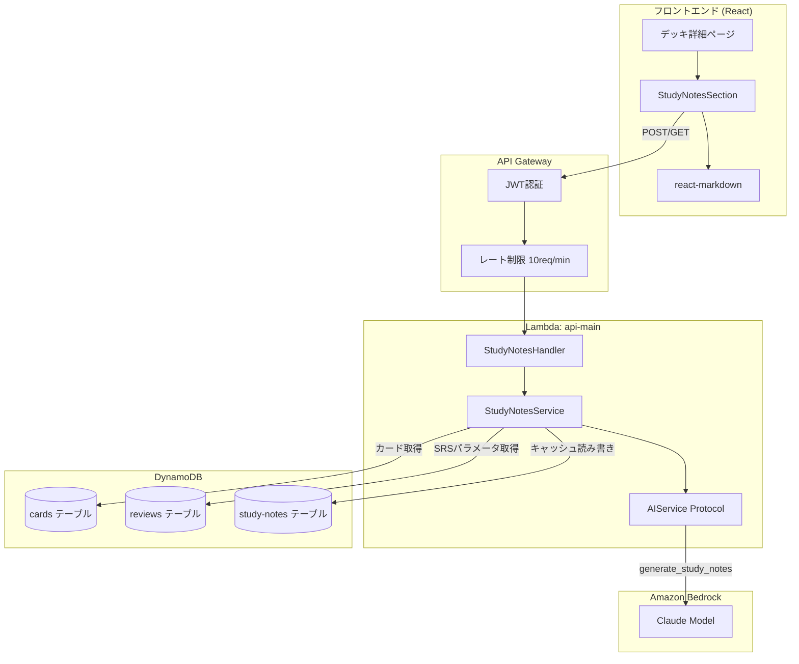

# Auto Study Notes アーキテクチャ設計

**作成日**: 2026-03-07
**関連要件定義**: [requirements.md](../../spec/auto-study-notes/requirements.md)
**ヒアリング記録**: [design-interview.md](design-interview.md)

**【信頼性レベル凡例】**:
- 🔵 **青信号**: EARS要件定義書・設計文書・ユーザヒアリングを参考にした確実な設計
- 🟡 **黄信号**: EARS要件定義書・設計文書・ユーザヒアリングから妥当な推測による設計
- 🔴 **赤信号**: EARS要件定義書・設計文書・ユーザヒアリングにない推測による設計

---

## システム概要 🔵

**信頼性**: 🔵 *要件定義書REQ-ASN-001〜034・ヒアリングQ1〜Q8より*

デッキまたはタグ内のカード群をAI（Bedrock Claude）で分析し、「全体像要約」「重要ポイント」「カード間の関連性」「学習のヒント」を含む要約ノートを自動生成する機能。生成結果はDynamoDBにキャッシュし、カード変更時に無効化する。

## アーキテクチャパターン 🔵

**信頼性**: 🔵 *既存AIアーキテクチャ設計（AIService Protocol + Factory）より*

- **パターン**: 既存の AIService Protocol 拡張 + サービスレイヤーパターン
- **選択理由**:
  - 既存の `AIService Protocol` に `generate_study_notes()` メソッドを追加する形で統合（REQ-ASN-401）
  - 既存の Factory パターン（`USE_STRANDS` フラグ）をそのまま活用
  - キャッシュロジックは新規サービスクラス `StudyNotesService` に分離

## コンポーネント構成

### バックエンド 🔵

**信頼性**: 🔵 *既存アーキテクチャ・note.md技術スタックより*

- **フレームワーク**: AWS SAM (Lambda + API Gateway)
- **言語**: Python 3.12
- **AIサービス**: Strands Agents SDK / Amazon Bedrock (Claude)
- **認証**: JWT (Keycloak OIDC) — 既存の認証ミドルウェアを適用
- **データストア**: DynamoDB（新規 `study-notes` テーブル）

#### 新規コンポーネント

| コンポーネント | パス | 責務 | 信頼性 |
|---|---|---|---|
| `StudyNotesHandler` | `backend/src/api/handlers/study_notes_handler.py` | API エンドポイント（生成・取得） | 🔵 |
| `StudyNotesService` | `backend/src/services/study_notes_service.py` | ビジネスロジック（キャッシュ管理・カード取得・AI呼び出し） | 🔵 |
| `generate_study_notes()` | `backend/src/services/ai_service.py` | AIService Protocol の新メソッド | 🔵 |
| `StudyNotesResult` | `backend/src/services/ai_service.py` | 生成結果のデータクラス | 🔵 |
| `study_notes_prompt` | `backend/src/services/prompts/study_notes.py` | プロンプトテンプレート | 🟡 |
| `StudyNotesModel` | `backend/src/models/study_notes.py` | Pydantic リクエスト/レスポンスモデル | 🔵 |

### フロントエンド 🔵

**信頼性**: 🔵 *既存フロントエンド設計・設計ヒアリングより*

- **フレームワーク**: React 19 + TypeScript 5.x
- **UIライブラリ**: Tailwind CSS 4
- **Markdown表示**: react-markdown（設計ヒアリングで選定）

#### 新規コンポーネント

| コンポーネント | パス | 責務 | 信頼性 |
|---|---|---|---|
| `StudyNotesSection` | `frontend/src/components/StudyNotesSection.tsx` | 要約ノート表示セクション（デッキ詳細画面に統合） | 🔵 |
| `useStudyNotes` | `frontend/src/hooks/useStudyNotes.ts` | 要約ノート取得・生成のカスタムフック | 🟡 |
| `studyNotesApi` | `frontend/src/services/studyNotesApi.ts` | API呼び出しサービス | 🟡 |
| `StudyNotes` 型 | `frontend/src/types/studyNotes.ts` | TypeScript型定義 | 🔵 |

### データベース 🔵

**信頼性**: 🔵 *設計ヒアリング「新規テーブル（推奨）」選択より*

- **DBMS**: DynamoDB（既存マルチテーブル設計に追加）
- **新規テーブル**: `memoru-study-notes`
- **キャッシュ無効化**: 同期的フラグ更新（設計ヒアリングで選定）

## システム構成図 🔵

**信頼性**: 🔵 *既存アーキテクチャ・要件定義より*



## ディレクトリ構造（変更箇所） 🔵

**信頼性**: 🔵 *既存プロジェクト構造より*

```
backend/src/
├── api/handlers/
│   └── study_notes_handler.py   # NEW: API ハンドラー
├── models/
│   └── study_notes.py           # NEW: Pydantic モデル
├── services/
│   ├── ai_service.py            # MODIFIED: Protocol に generate_study_notes 追加
│   ├── strands_service.py       # MODIFIED: generate_study_notes 実装追加
│   ├── bedrock.py               # MODIFIED: generate_study_notes 実装追加
│   ├── study_notes_service.py   # NEW: ビジネスロジック
│   └── prompts/
│       └── study_notes.py       # NEW: プロンプトテンプレート

frontend/src/
├── components/
│   └── StudyNotesSection.tsx     # NEW: 要約ノート表示
├── hooks/
│   └── useStudyNotes.ts         # NEW: カスタムフック
├── services/
│   └── studyNotesApi.ts         # NEW: API サービス
└── types/
    └── studyNotes.ts            # NEW: 型定義
```

## 非機能要件の実現方法

### パフォーマンス 🔵

**信頼性**: 🔵 *NFR-ASN-001〜003・既存制約より*

- **AI生成レスポンス**: 25秒以内（API Gateway HTTP APIタイムアウト30秒に対し5秒のマージン確保）
- **キャッシュ取得**: 500ms以内（DynamoDB GetItem）
- **トークン制約**: 100枚のカード × 平均1,500文字 ≒ 約50K トークン（200K上限内）
- **代表カード選択**: 100枚超の場合、ease_factor昇順ソート（難易度の高いカード優先）で上位100枚を選択

### セキュリティ 🔵

**信頼性**: 🔵 *NFR-ASN-101〜102・既存セキュリティ設計より*

- **認証**: 既存JWT認証（Keycloak OIDC）を適用（REQ-ASN-404）
- **データ分離**: user_id ベースのデータ分離を厳守（REQ-ASN-405）
- **プロンプトインジェクション対策**: カード内容をサニタイズ後にプロンプトテンプレートに埋め込み
- **レート制限**: 既存の AI生成API レート制限（10リクエスト/分）を適用

### 可用性 🟡

**信頼性**: 🟡 *既存Lambda制約から妥当な推測*

- **Lambda同期実行**: Lambdaタイムアウト60秒、API Gateway HTTP APIタイムアウト30秒に設定。AI生成は25秒以内を目標とし5秒のマージンを確保
- **エラーリトライ**: Bedrock APIタイムアウト時はユーザーに再試行を案内
- **キャッシュ永続性**: DynamoDBの高耐久性により、キャッシュ消失リスクは低い
- **ページ離脱時の動作**: AWS LambdaはAPI Gatewayのコネクション切断後も実行を継続するため、ユーザーがページを離脱しても生成結果はキャッシュに保存される（EDGE-ASN-003）

## 技術的制約 🔵

**信頼性**: 🔵 *REQ-ASN-401〜405・既存制約より*

### 実装制約

- AIService Protocol に `generate_study_notes()` メソッドを追加する形で実装（REQ-ASN-401）
- AI生成APIのレート制限 10リクエスト/分を遵守（REQ-ASN-402）
- Lambda実行時間 60秒以内に完了（REQ-ASN-403）
- 既存JWT認証を適用（REQ-ASN-404）
- ユーザー自身のカードのみを要約対象とする（REQ-ASN-405）

### パフォーマンス制約

- カード100枚の要約は Bedrock Claude のコンテキストウィンドウ（200Kトークン）内に収まること（NFR-ASN-003）
- 最小カード数: 5枚（REQ-ASN-101）
- 最大カード数: 100枚（超える場合はease_factor昇順で上位100枚を選択）（REQ-ASN-102）

## 関連文書

- **データフロー**: [dataflow.md](dataflow.md)
- **DBスキーマ**: [database-schema.md](database-schema.md)
- **API仕様**: [api-endpoints.md](api-endpoints.md)
- **型定義（バックエンド）**: [interfaces.py](interfaces.py)
- **型定義（フロントエンド）**: [interfaces.ts](interfaces.ts)
- **要件定義**: [requirements.md](../../spec/auto-study-notes/requirements.md)
- **設計ヒアリング**: [design-interview.md](design-interview.md)

## 信頼性レベルサマリー

| レベル | 件数 | 割合 |
|--------|------|------|
| 🔵 青信号 | 18件 | 82% |
| 🟡 黄信号 | 4件 | 18% |
| 🔴 赤信号 | 0件 | 0% |

**品質評価**: ✅ 高品質（青信号が82%、赤信号なし）
