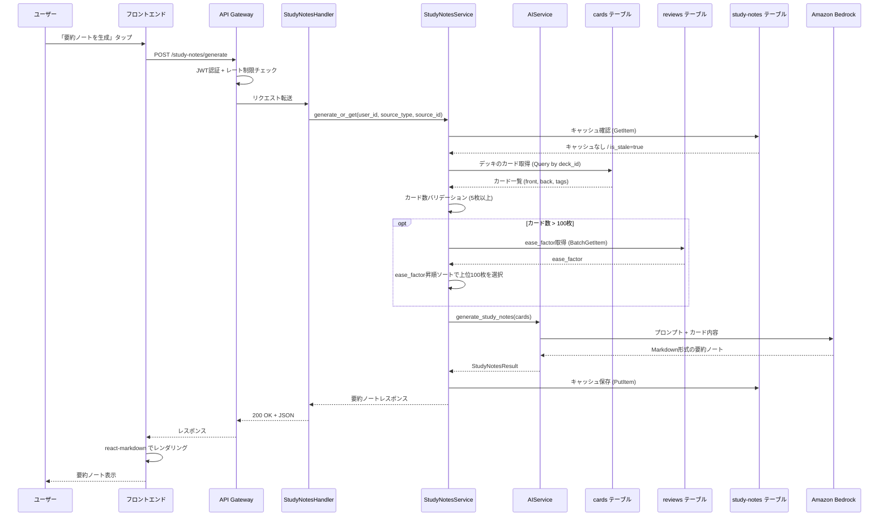
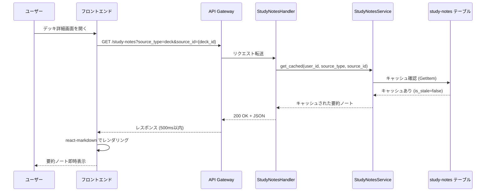
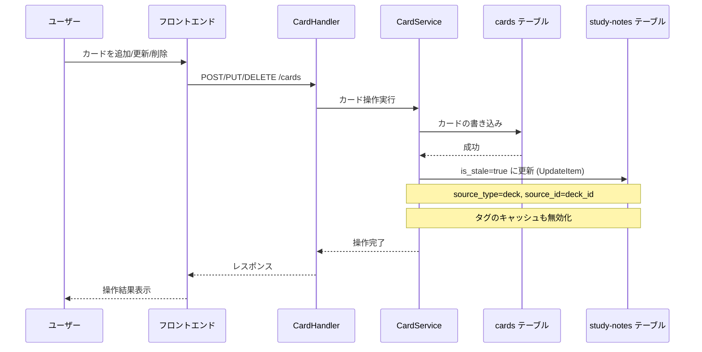
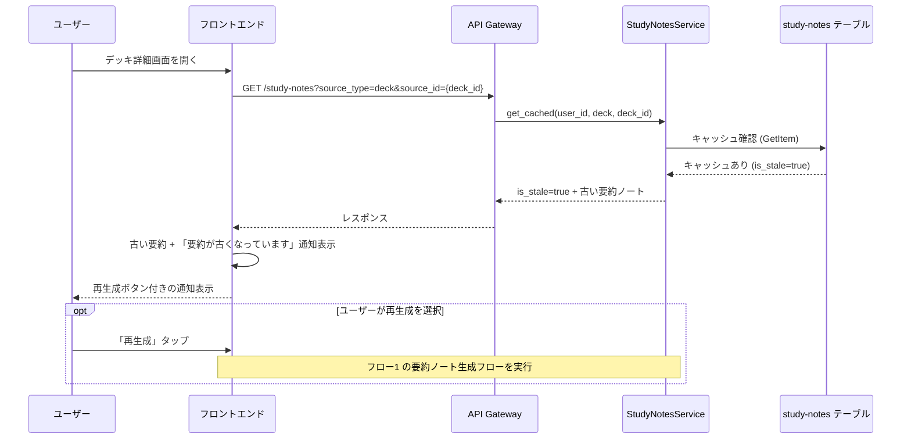
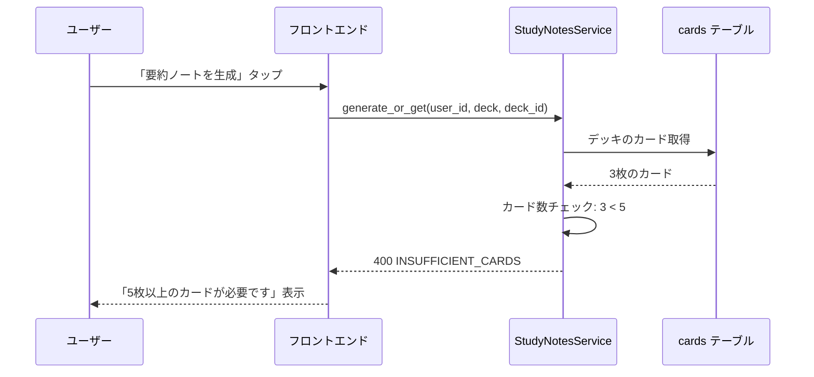
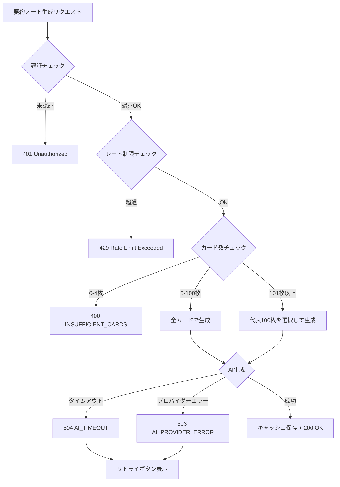
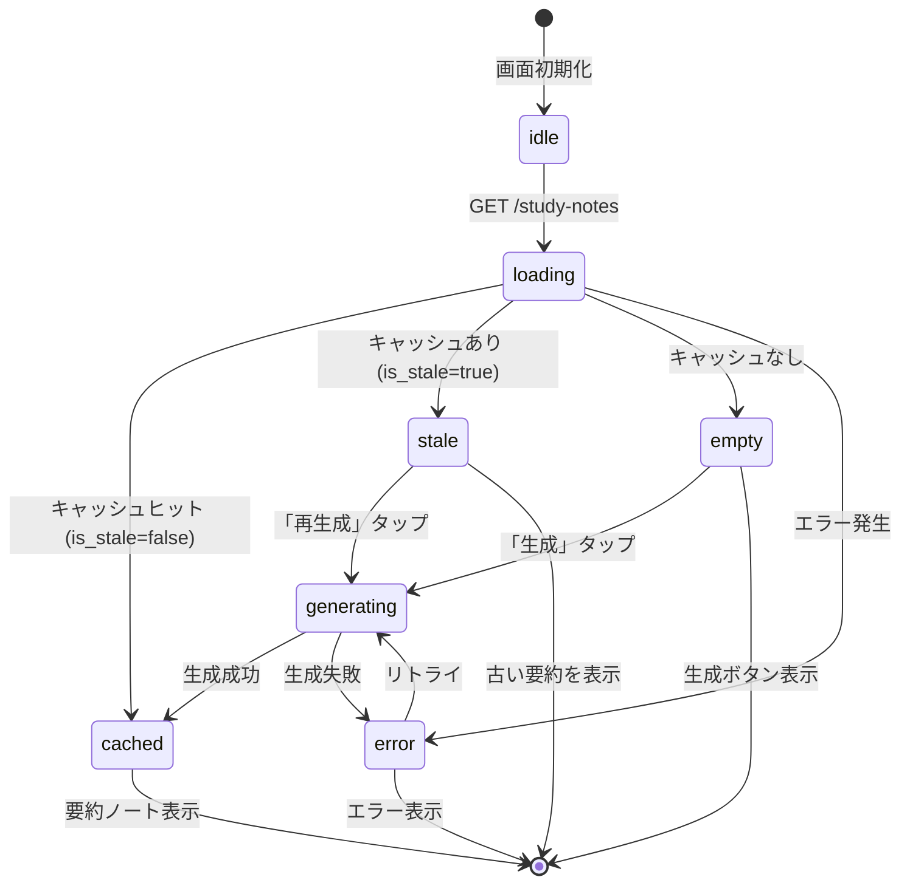

# Auto Study Notes データフロー図

**作成日**: 2026-03-07
**関連アーキテクチャ**: [architecture.md](architecture.md)
**関連要件定義**: [requirements.md](../../spec/auto-study-notes/requirements.md)

**【信頼性レベル凡例】**:
- 🔵 **青信号**: EARS要件定義書・設計文書・ユーザヒアリングを参考にした確実なフロー
- 🟡 **黄信号**: EARS要件定義書・設計文書・ユーザヒアリングから妥当な推測によるフロー
- 🔴 **赤信号**: EARS要件定義書・設計文書・ユーザヒアリングにない推測によるフロー

---

## 主要機能のデータフロー

### フロー1: 要約ノート生成（キャッシュミス） 🔵

**信頼性**: 🔵 *ユーザーストーリー1.1・REQ-ASN-001・REQ-ASN-021より*

**関連要件**: REQ-ASN-001, REQ-ASN-021, REQ-ASN-031〜034, REQ-ASN-051

**詳細ステップ**:
1. ユーザーがデッキ詳細画面で「要約ノートを生成」ボタンをタップ
2. フロントエンドが `POST /study-notes/generate` を呼び出し
3. API Gatewayが JWT認証とレート制限（10req/min）をチェック
4. StudyNotesService がキャッシュを確認（キャッシュなし or is_stale=true）
5. cards テーブルからデッキのカード一覧を取得
6. カード数バリデーション（5枚未満は拒否、100枚超はease_factor昇順で上位100枚を選択）
7. AIService.generate_study_notes() で Bedrock Claude に要約生成を依頼
8. 生成結果を study-notes テーブルにキャッシュ保存
9. フロントエンドが react-markdown で Markdown をレンダリング

---

### フロー2: 要約ノート取得（キャッシュヒット） 🔵

**信頼性**: 🔵 *ユーザーストーリー2.1・REQ-ASN-023より*

**関連要件**: REQ-ASN-023, NFR-ASN-002

---

### フロー3: キャッシュ無効化（カードCRUD時） 🔵

**信頼性**: 🔵 *REQ-ASN-022・設計ヒアリング「同期的フラグ更新」選択より*

**関連要件**: REQ-ASN-022, REQ-ASN-103

**詳細ステップ**:
1. ユーザーがカードのCRUD操作を実行
2. CardService がカードの書き込みを完了
3. 同一トランザクション内で study-notes テーブルの `is_stale` フラグを `true` に更新
4. カードの `deck_id` に紐づくキャッシュと、カードの `tags` に紐づくキャッシュの両方を無効化
5. カード更新時にdeck_idやtagsが変更された場合は、旧値のキャッシュも無効化

---

### フロー4: 無効化後の再生成通知 🟡

**信頼性**: 🟡 *REQ-ASN-103・UX設計として妥当な推測*

**補足（EDGE-ASN-003）**: AWS LambdaはAPI Gatewayのコネクション切断後も実行を継続するため、フロー1の生成中にユーザーがページを離脱しても、生成結果はキャッシュに保存される。次回アクセス時にはフロー2（キャッシュヒット）で即座に表示される。

**関連要件**: REQ-ASN-103

---

### フロー5: カード数不足エラー 🔵

**信頼性**: 🔵 *REQ-ASN-101・ヒアリングQ5より*

**関連要件**: REQ-ASN-101

---

## エラーハンドリングフロー 🟡

**信頼性**: 🟡 *既存AIエラーハンドリング・EDGE-ASN-001から妥当な推測*

## フロントエンド状態管理 🟡

**信頼性**: 🟡 *既存Reactパターンから妥当な推測*

## 関連文書

- **アーキテクチャ**: [architecture.md](architecture.md)
- **DBスキーマ**: [database-schema.md](database-schema.md)
- **API仕様**: [api-endpoints.md](api-endpoints.md)
- **型定義（バックエンド）**: [interfaces.py](interfaces.py)
- **型定義（フロントエンド）**: [interfaces.ts](interfaces.ts)

## 信頼性レベルサマリー

| レベル | 件数 | 割合 |
|--------|------|------|
| 🔵 青信号 | 5件 | 71% |
| 🟡 黄信号 | 2件 | 29% |
| 🔴 赤信号 | 0件 | 0% |

**品質評価**: ✅ 高品質（青信号が71%、赤信号なし）
