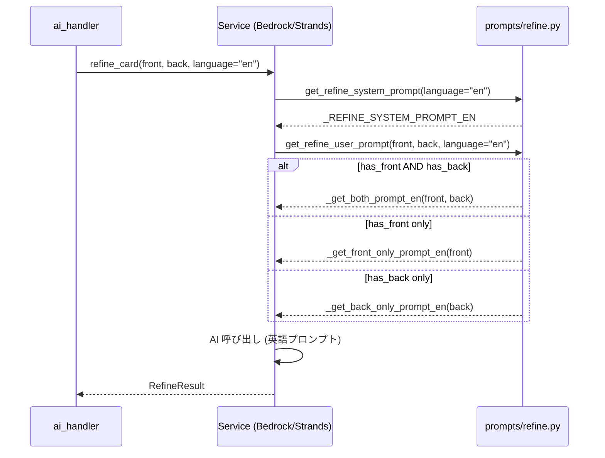
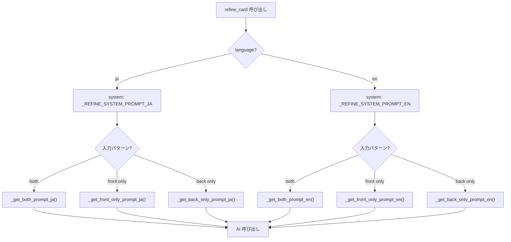
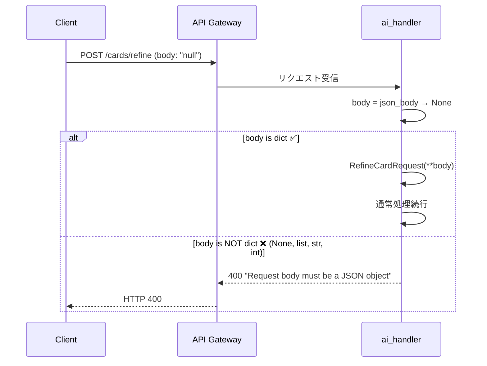
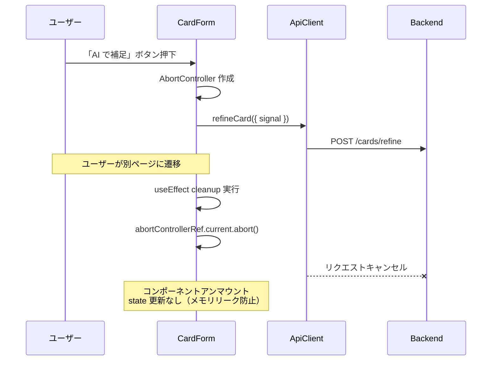
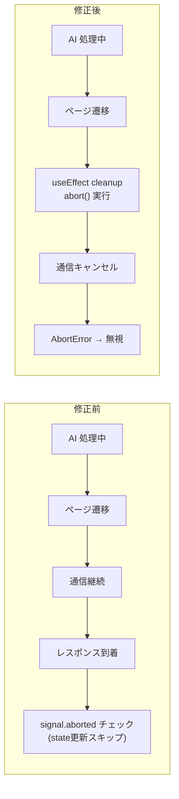

# カード AI 補足機能 レビュー修正 データフロー図

**作成日**: 2026-03-03
**関連アーキテクチャ**: [architecture.md](architecture.md)
**関連要件定義**: [requirements.md](../../spec/card-back-ai-assist-fix/requirements.md)
**元機能データフロー**: [card-back-ai-assist/dataflow.md](../card-back-ai-assist/dataflow.md)

**【信頼性レベル凡例】**:
- 🔵 **青信号**: コードレビュー・既存実装を参考にした確実なフロー
- 🟡 **黄信号**: 既存実装パターンから妥当な推測によるフロー

---

## 修正 1: language 対応プロンプト生成フロー 🔵

**信頼性**: 🔵 *レビュー指摘 #1・既存 `generate.py` パターンより*
**関連要件**: REQ-FIX-001, REQ-FIX-002

元のフローからの変更点: プロンプト生成で `language` パラメータによる分岐が追加される。



### language フロー比較



---

## 修正 2: body=null ハンドリングフロー 🔵

**信頼性**: 🔵 *レビュー指摘 #2・Codex Powertools v3.23.0 検証より*
**関連要件**: REQ-FIX-003, REQ-FIX-004

元のフローからの変更点: `json_body` 取得後に `isinstance(body, dict)` チェックが追加される。



### 不正ボディの分類

```mermaid
flowchart TD
    BODY[json_body] --> CHECK{isinstance(body, dict)?}

    CHECK -->|Yes| VALID[Pydantic バリデーション]
    CHECK -->|No| INVALID[400 エラー]

    VALID -->|pass| PROCESS[サービス呼び出し]
    VALID -->|fail| VALIDATION_ERR[400 ValidationError]

    subgraph "body=null のケース"
        NULL_BODY["body: 'null'<br/>json_body → None"]
        ARRAY_BODY["body: '[1,2]'<br/>json_body → [1,2]"]
        STRING_BODY["body: '\"hello\"'<br/>json_body → 'hello'"]
        NUM_BODY["body: '42'<br/>json_body → 42"]
    end

    NULL_BODY --> CHECK
    ARRAY_BODY --> CHECK
    STRING_BODY --> CHECK
    NUM_BODY --> CHECK
```

---

## 修正 3: CardForm アンマウント時キャンセルフロー 🔵

**信頼性**: 🔵 *レビュー指摘 #4・React ベストプラクティスより*
**関連要件**: REQ-FIX-005

元のフローからの変更点: コンポーネントのアンマウント時に `abort()` が呼ばれる。



### 修正前後の比較



---

## 関連文書

- **アーキテクチャ**: [architecture.md](architecture.md)
- **元機能データフロー**: [card-back-ai-assist/dataflow.md](../card-back-ai-assist/dataflow.md)
- **要件定義**: [requirements.md](../../spec/card-back-ai-assist-fix/requirements.md)

## 信頼性レベルサマリー

- 🔵 青信号: 5 件 (100%)
- 🟡 黄信号: 0 件 (0%)
- 🔴 赤信号: 0 件 (0%)

**品質評価**: ✅ 高品質
