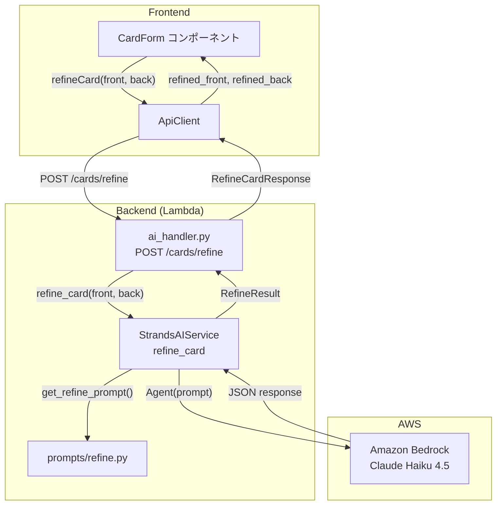

# カード AI アシスト入力 アーキテクチャ設計

**作成日**: 2026-03-03
**関連要件定義**: [requirements.md](../../spec/card-back-ai-assist/requirements.md)
**ヒアリング記録**: [design-interview.md](design-interview.md)

**【信頼性レベル凡例】**:
- 🔵 **青信号**: EARS要件定義書・設計文書・ユーザヒアリングを参考にした確実な設計
- 🟡 **黄信号**: EARS要件定義書・設計文書・ユーザヒアリングから妥当な推測による設計
- 🔴 **赤信号**: EARS要件定義書・設計文書・ユーザヒアリングにない推測による設計

---

## システム概要 🔵

**信頼性**: 🔵 *要件定義書 REQ-001〜REQ-007 より*

既存の CardForm コンポーネントに「AI で補足」ボタンを追加し、ユーザーが入力した表面・裏面テキストを 1 回の API コールで AI に送信して、表面の表現整理と裏面の補足・拡充を行う。既存の AI サービス基盤（Strands Agents SDK / Amazon Bedrock）を拡張する形で実装する。

## アーキテクチャパターン 🔵

**信頼性**: 🔵 *既存アーキテクチャパターンの踏襲*

- **パターン**: 既存のレイヤードアーキテクチャを踏襲（Handler → Service → AI Provider）
- **選択理由**: 既存の `generate_cards` と同じパターンで `refine_card` を追加することで、一貫性を保ちつつ最小限の変更で実現できる

## コンポーネント構成

### フロントエンド 🔵

**信頼性**: 🔵 *既存実装パターンより*

- **変更対象**: `CardForm` コンポーネント（`frontend/src/components/CardForm.tsx`）
- **追加要素**: 「AI で補足」ボタン、ローディング状態管理、エラー表示
- **API 呼び出し**: `cardsApi.refineCard()` メソッドを `ApiClient` に追加
- **型定義**: `RefineCardRequest`, `RefineCardResponse` を `frontend/src/types/card.ts` に追加

### バックエンド 🔵

**信頼性**: 🔵 *既存実装パターンより*

- **API エンドポイント**: `POST /cards/refine`（`backend/src/api/handlers/ai_handler.py`）
- **AI サービス**: `AIService` Protocol に `refine_card()` メソッドを追加
- **Strands 実装**: `StrandsAIService` に `refine_card()` と `_parse_refine_result()` を実装
- **プロンプト**: `backend/src/services/prompts/refine.py` を新規作成
- **リクエストモデル**: `RefineCardRequest` Pydantic モデルを追加

## システム構成図 🔵

**信頼性**: 🔵 *既存アーキテクチャ + 要件定義より*



## 変更対象ファイル一覧 🔵

**信頼性**: 🔵 *既存プロジェクト構造より*

### バックエンド（新規）
```
backend/src/services/prompts/refine.py    # プロンプト定義
```

### バックエンド（変更）
```
backend/src/services/ai_service.py        # RefineResult + Protocol 追加
backend/src/services/strands_service.py   # refine_card() 実装
backend/src/services/prompts/__init__.py  # export 追加
backend/src/api/handlers/ai_handler.py    # POST /cards/refine ハンドラー
backend/src/models/generate.py            # RefineCardRequest/Response 追加
```

### フロントエンド（変更）
```
frontend/src/types/card.ts                # RefineCardRequest/Response 型
frontend/src/services/api.ts              # refineCard() メソッド追加
frontend/src/components/CardForm.tsx      # 「AI で補足」ボタン追加
```

## リクエスト・レスポンス設計 🔵

**信頼性**: 🔵 *要件定義 REQ-402〜404・既存 API パターンより*

### リクエスト

```python
class RefineCardRequest(BaseModel):
    front: str = Field(default="", max_length=1000)  # オプション
    back: str = Field(default="", max_length=2000)    # オプション
    language: Literal["ja", "en"] = "ja"

    @model_validator(mode="after")
    def validate_at_least_one(self) -> "RefineCardRequest":
        if not self.front.strip() and not self.back.strip():
            raise ValueError("front or back must be provided")
        return self
```

### レスポンス

```python
class RefineCardResponse(BaseModel):
    refined_front: str    # 整理された表面（入力が空の場合は空文字）
    refined_back: str     # 補足された裏面（入力が空の場合は空文字）
    model_used: str
    processing_time_ms: int
```

## プロンプト設計 🟡

**信頼性**: 🟡 *要件定義 REQ-006, REQ-007 から妥当な推測*

### システムプロンプト

```
あなたはフラッシュカード改善の専門家です。
ユーザーが入力した暗記カードの表面（問題文）と裏面（解答）を改善してください。

【表面（問題文）の改善方針】
- ユーザーの意図を維持しつつ、明確で簡潔な質問形式に整える
- 曖昧な表現をより具体的にする
- 学習者が問われている内容を即座に理解できるようにする

【裏面（解答）の改善方針】
- ユーザーの入力内容を基盤として維持する
- 不足している重要な情報を補足する
- 学習に最適な構造（箇条書き、定義+例示など）に整形する
- 正確性を保ちながら簡潔にまとめる

JSON 形式のみで回答してください:
{"refined_front": "...", "refined_back": "..."}
```

### ユーザープロンプト（表面・裏面両方あり）

```
以下のフラッシュカードを改善してください。

## 問題文（表面）
{front}

## 解答（裏面）
{back}

改善結果を JSON 形式で出力してください。
```

### ユーザープロンプト（表面のみ）

```
以下のフラッシュカードの問題文を改善してください。
裏面は入力されていないため、refined_back は空文字にしてください。

## 問題文（表面）
{front}

改善結果を JSON 形式で出力してください。
```

### ユーザープロンプト（裏面のみ）

```
以下のフラッシュカードの解答を改善してください。
表面は入力されていないため、refined_front は空文字にしてください。

## 解答（裏面）
{back}

改善結果を JSON 形式で出力してください。
```

## エラーハンドリング 🔵

**信頼性**: 🔵 *既存実装パターンより*

既存の `map_ai_error_to_http()` をそのまま活用:

| エラー種別 | HTTP ステータス | フロントエンド表示 |
|-----------|---------------|------------------|
| `AITimeoutError` | 504 | 「AIの処理がタイムアウトしました。再度お試しください」 |
| `AIRateLimitError` | 429 | 「リクエスト制限に達しました。しばらくお待ちください」 |
| `AIProviderError` | 503 | 「AIサービスが一時的に利用できません」 |
| `AIParseError` | 500 | 「AIの応答処理でエラーが発生しました」 |
| バリデーションエラー | 400 | 「入力内容を確認してください」 |

## 非機能要件の実現方法

### パフォーマンス 🟡

**信頼性**: 🟡 *NFR 要件から妥当な推測*

- **レスポンスタイム**: 10 秒以内（Claude Haiku 4.5 は軽量で高速）
- **フロントエンドタイムアウト**: 15 秒（AbortController で制御）
- **最適化**: 補足は 1 カードのみのため、カード生成（複数枚）より高速

### セキュリティ 🔵

**信頼性**: 🔵 *既存セキュリティパターンより*

- **認証**: 既存の JWT 認証を使用（`get_user_id_from_context`）
- **入力バリデーション**: Pydantic モデルで文字数制限・空チェック
- **プロンプトインジェクション対策**: システムプロンプトで JSON のみの出力を強制

## 関連文書

- **データフロー**: [dataflow.md](dataflow.md)
- **要件定義**: [requirements.md](../../spec/card-back-ai-assist/requirements.md)
- **コンテキストノート**: [note.md](../../spec/card-back-ai-assist/note.md)

## 信頼性レベルサマリー

- 🔵 青信号: 11 件 (85%)
- 🟡 黄信号: 2 件 (15%)
- 🔴 赤信号: 0 件 (0%)

**品質評価**: ✅ 高品質
