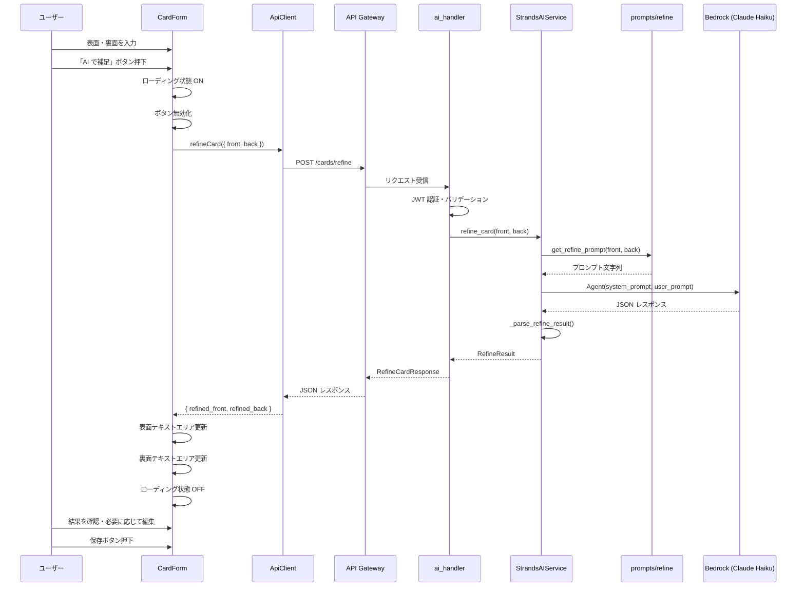
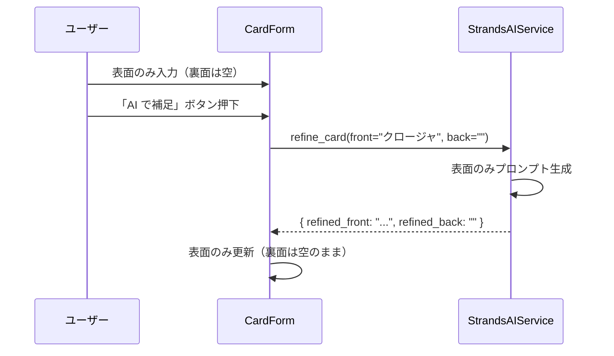
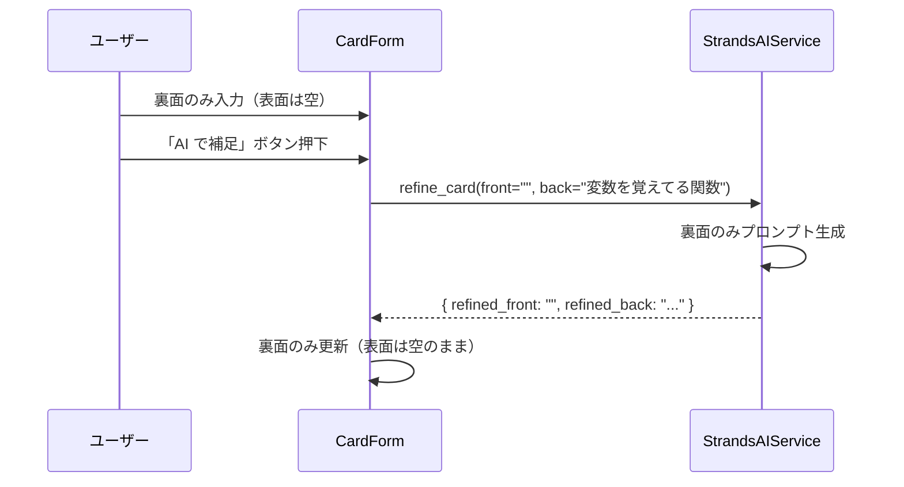
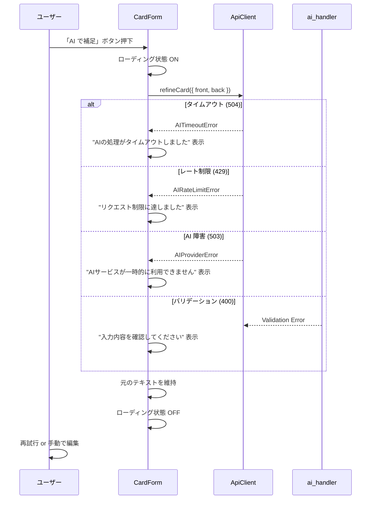
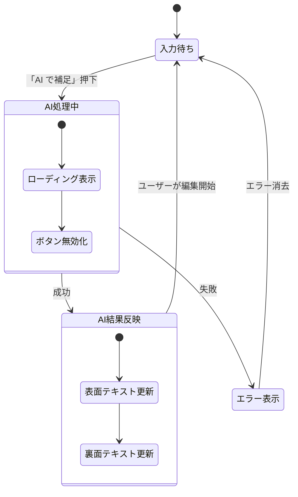

# カード AI アシスト入力 データフロー図

**作成日**: 2026-03-03
**関連アーキテクチャ**: [architecture.md](architecture.md)
**関連要件定義**: [requirements.md](../../spec/card-back-ai-assist/requirements.md)

**【信頼性レベル凡例】**:
- 🔵 **青信号**: EARS要件定義書・設計文書・ユーザヒアリングを参考にした確実なフロー
- 🟡 **黄信号**: EARS要件定義書・設計文書・ユーザヒアリングから妥当な推測によるフロー
- 🔴 **赤信号**: EARS要件定義書・設計文書・ユーザヒアリングにない推測によるフロー

---

## メインフロー: AI カード補足 🔵

**信頼性**: 🔵 *要件定義 REQ-001〜007・ユーザヒアリングより*

**関連要件**: REQ-001, REQ-002, REQ-003, REQ-004, REQ-006, REQ-007

**詳細ステップ**:
1. ユーザーが CardForm で表面・裏面にメモを入力する
2. 「AI で補足」ボタンを押下する
3. フロントエンドがローディング状態に遷移し、ボタンを無効化する
4. `POST /cards/refine` に表面・裏面テキストを送信する
5. バックエンドが JWT 認証とバリデーションを行う
6. AI サービスがプロンプトを構築し Bedrock に送信する
7. Claude Haiku が表面の表現を整理し、裏面を補足した JSON を返す
8. バックエンドがレスポンスをパースしてフロントエンドに返す
9. フロントエンドが表面・裏面のテキストエリアをインラインで更新する
10. ユーザーが結果を確認・編集し、保存する

## 部分入力フロー: 表面のみ 🟡

**信頼性**: 🟡 *要件定義 REQ-103 から妥当な推測*

**関連要件**: REQ-103

## 部分入力フロー: 裏面のみ 🟡

**信頼性**: 🟡 *要件定義 REQ-104 から妥当な推測*

**関連要件**: REQ-104

## エラーハンドリングフロー 🔵

**信頼性**: 🔵 *既存実装パターンより*

## フロントエンド状態管理フロー 🔵

**信頼性**: 🔵 *既存 CardForm パターンより*

**状態変数**:
- `isRefining: boolean` — AI 処理中フラグ
- `refineError: string | null` — エラーメッセージ

**ボタン有効条件**:
- `!isRefining && !isSaving && (front.trim() || back.trim())`

## 関連文書

- **アーキテクチャ**: [architecture.md](architecture.md)
- **要件定義**: [requirements.md](../../spec/card-back-ai-assist/requirements.md)

## 信頼性レベルサマリー

- 🔵 青信号: 4 件 (67%)
- 🟡 黄信号: 2 件 (33%)
- 🔴 赤信号: 0 件 (0%)

**品質評価**: ✅ 高品質
