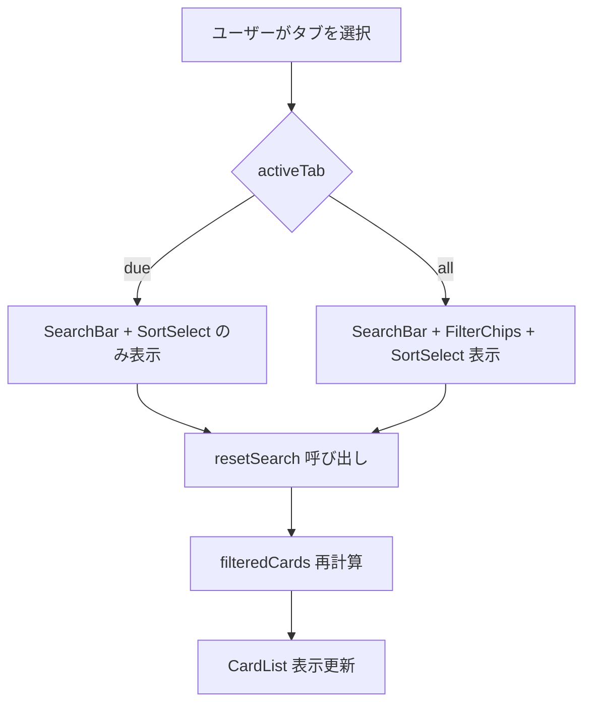
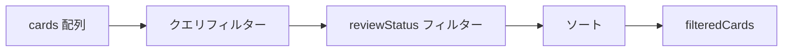
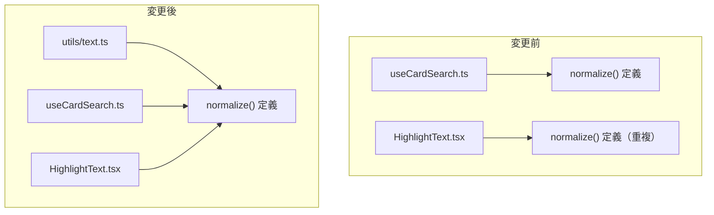

# card-search-review-fixes データフロー図

**作成日**: 2026-03-01
**関連アーキテクチャ**: [architecture.md](architecture.md)
**関連要件定義**: [requirements.md](../../spec/card-search-review-fixes/requirements.md)

**【信頼性レベル凡例】**:
- 🔵 **青信号**: コードレビュー結果・既存実装を参考にした確実なフロー
- 🟡 **黄信号**: 既存実装パターンから妥当な推測によるフロー

---

## フロー1: FilterChips 条件付き表示 🔵

**信頼性**: 🔵 *REQ-001・既存 CardsPage.tsx の activeTab ロジックより*

**変更前**: FilterChips は両タブで常に表示
**変更後**: `activeTab === "due"` のとき FilterChips を非表示

## フロー2: useCardSearch フィルタリングパイプライン（変更なし） 🔵

**信頼性**: 🔵 *既存実装より（本修正ではロジック変更なし）*

**注意**: フロー2 自体に変更はないが、フロー1 により「復習対象タブでは reviewStatus フィルターが `all` 固定」となる。

## フロー3: normalize 関数の共通化 🟡

**信頼性**: 🟡 *REQ-102・DRY 原則より*

## 信頼性レベルサマリー

- 🔵 青信号: 2件 (67%)
- 🟡 黄信号: 1件 (33%)
- 🔴 赤信号: 0件 (0%)

**品質評価**: ✅ 高品質
