# code-quality-improvements データフロー図

**作成日**: 2026-03-01
**関連アーキテクチャ**: [architecture.md](architecture.md)
**関連要件定義**: [requirements.md](../../spec/code-quality-improvements/requirements.md)

**【信頼性レベル凡例】**:

- 🔵 **青信号**: 要件定義書・コードレビュー結果・ユーザヒアリングから確実なフロー
- 🟡 **黄信号**: 要件定義書・コードレビュー結果から妥当な推測によるフロー
- 🔴 **赤信号**: 要件定義書・コードレビュー結果にない推測によるフロー

---

## 修正対象のデータフロー一覧

本設計では既存のデータフローの内部実装を修正するため、**変更前後の差分** を示す。
外部インターフェース（API レスポンス形式）は一切変更しない。

---

## 1. JWT 認証フロー（REQ-001, 002, 003: フォールバック統合・強化） 🔵

**信頼性**: 🔵 *CR-01: 両レビュアー一致・ヒアリング Q3 で方針確定*

### Before（現行: 二重実装）

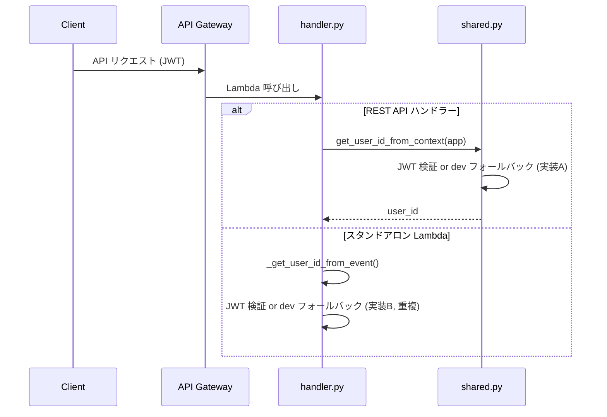
```mermaid
sequenceDiagram
    participant C as Client
    participant AG as API Gateway
    participant H as handler.py
    participant S as shared.py

    C->>AG: API リクエスト (JWT)
    AG->>H: Lambda 呼び出し

    alt REST API ハンドラー
        H->>S: get_user_id_from_context(app)
        S->>S: JWT 検証 or dev フォールバック (実装A)
        S-->>H: user_id
    else スタンドアロン Lambda
        H->>H: _get_user_id_from_event()
        H->>H: JWT 検証 or dev フォールバック (実装B, 重複)
    end
```

### After（修正後: shared.py に統一 + 環境変数強化）

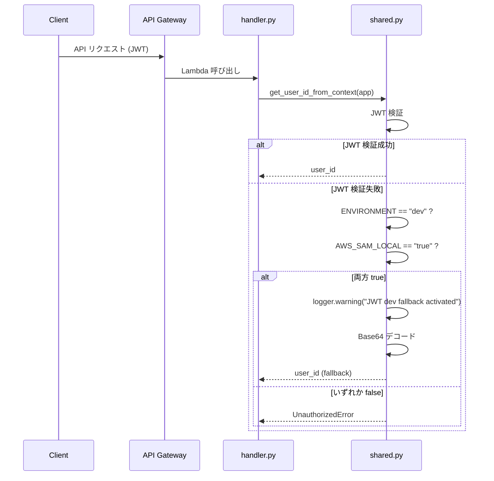
```mermaid
sequenceDiagram
    participant C as Client
    participant AG as API Gateway
    participant H as handler.py
    participant S as shared.py

    C->>AG: API リクエスト (JWT)
    AG->>H: Lambda 呼び出し

    H->>S: get_user_id_from_context(app)
    S->>S: JWT 検証

    alt JWT 検証成功
        S-->>H: user_id
    else JWT 検証失敗
        S->>S: ENVIRONMENT == "dev" ?
        S->>S: AWS_SAM_LOCAL == "true" ?
        alt 両方 true
            S->>S: logger.warning("JWT dev fallback activated")
            S->>S: Base64 デコード
            S-->>H: user_id (fallback)
        else いずれか false
            S-->>H: UnauthorizedError
        end
    end
```

**変更ポイント**:
1. `handler.py` の `_get_user_id_from_event()` 削除 → `shared.py` に統一 🔵
2. フォールバック条件: `ENVIRONMENT=dev` AND `AWS_SAM_LOCAL=true` の二重チェック 🔵
3. フォールバック発動時に `logger.warning` 出力 🔵

---

## 2. AI サービス呼び出しフロー（REQ-004, 005, 010: system_prompt + 例外共通化） 🔵

**信頼性**: 🔵 *H-06, H-03: コードレビュー指摘*

### Before（現行: system_prompt 未設定 + 例外重複）

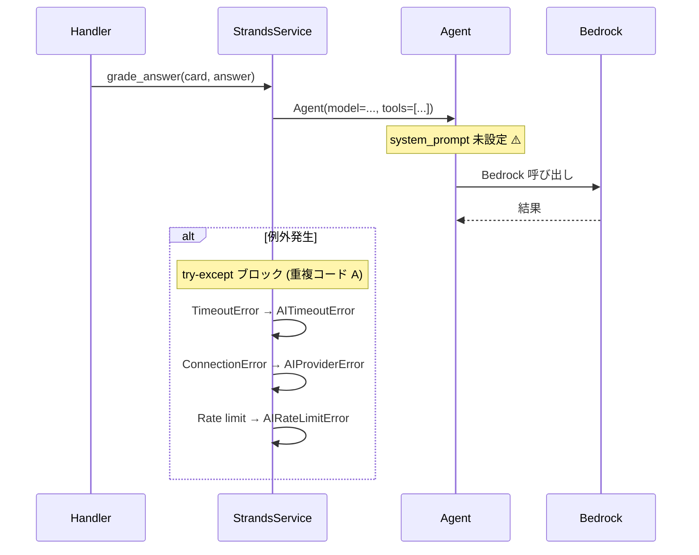
```mermaid
sequenceDiagram
    participant H as Handler
    participant SS as StrandsService
    participant A as Agent
    participant B as Bedrock

    H->>SS: grade_answer(card, answer)
    SS->>A: Agent(model=..., tools=[...])
    Note over A: system_prompt 未設定 ⚠️
    A->>B: Bedrock 呼び出し
    B-->>A: 結果

    alt 例外発生
        Note over SS: try-except ブロック (重複コード A)
        SS->>SS: TimeoutError → AITimeoutError
        SS->>SS: ConnectionError → AIProviderError
        SS->>SS: Rate limit → AIRateLimitError
    end
```

### After（修正後: system_prompt 設定 + コンテキストマネージャ）

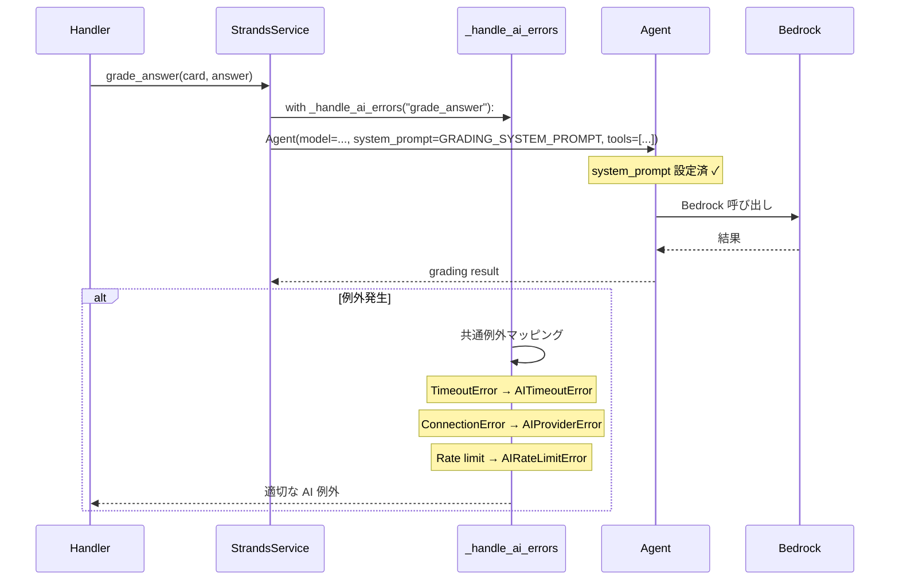
```mermaid
sequenceDiagram
    participant H as Handler
    participant SS as StrandsService
    participant CM as _handle_ai_errors
    participant A as Agent
    participant B as Bedrock

    H->>SS: grade_answer(card, answer)
    SS->>CM: with _handle_ai_errors("grade_answer"):
    SS->>A: Agent(model=..., system_prompt=GRADING_SYSTEM_PROMPT, tools=[...])
    Note over A: system_prompt 設定済 ✓
    A->>B: Bedrock 呼び出し
    B-->>A: 結果
    A-->>SS: grading result

    alt 例外発生
        CM->>CM: 共通例外マッピング
        Note over CM: TimeoutError → AITimeoutError
        Note over CM: ConnectionError → AIProviderError
        Note over CM: Rate limit → AIRateLimitError
        CM-->>H: 適切な AI 例外
    end
```

**変更ポイント**:
1. `Agent` 初期化に `system_prompt` パラメータ追加（`grade_answer`, `generate_cards`） 🔵
2. 3メソッドの try-except → `_handle_ai_errors` コンテキストマネージャ 🔵

---

## 3. カード全件取得フロー（REQ-007: get_due_cards ページネーション） 🔵

**信頼性**: 🔵 *H-01: 両レビュアー一致*

### Before（現行: 単一クエリ、1MB 上限リスク）

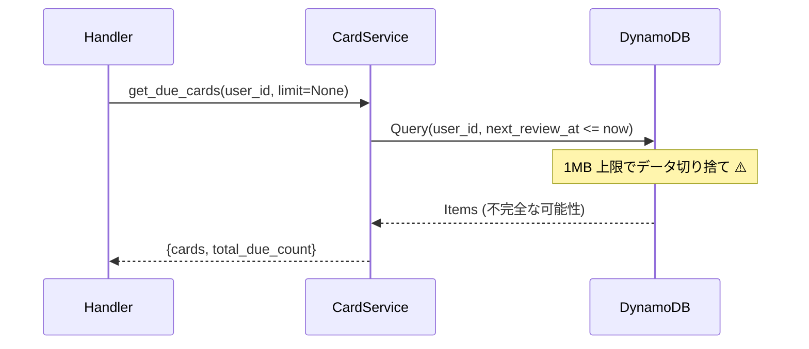
```mermaid
sequenceDiagram
    participant H as Handler
    participant CS as CardService
    participant DB as DynamoDB

    H->>CS: get_due_cards(user_id, limit=None)
    CS->>DB: Query(user_id, next_review_at <= now)
    Note over DB: 1MB 上限でデータ切り捨て ⚠️
    DB-->>CS: Items (不完全な可能性)
    CS-->>H: {cards, total_due_count}
```

### After（修正後: ページネーションループ）

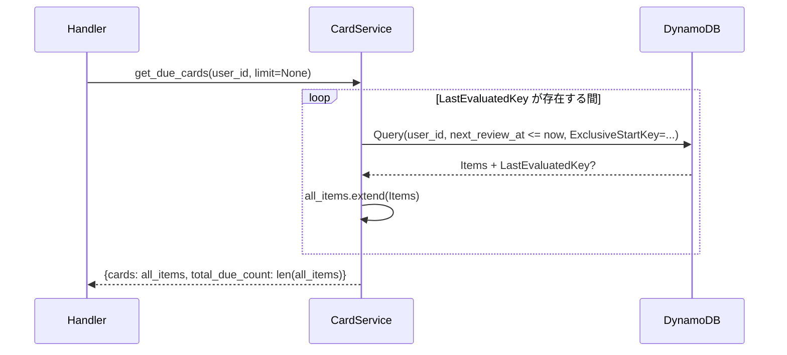
```mermaid
sequenceDiagram
    participant H as Handler
    participant CS as CardService
    participant DB as DynamoDB

    H->>CS: get_due_cards(user_id, limit=None)

    loop LastEvaluatedKey が存在する間
        CS->>DB: Query(user_id, next_review_at <= now, ExclusiveStartKey=...)
        DB-->>CS: Items + LastEvaluatedKey?
        CS->>CS: all_items.extend(Items)
    end

    CS-->>H: {cards: all_items, total_due_count: len(all_items)}
```

**変更ポイント**:
1. `limit=None` 時のみ `LastEvaluatedKey` ページネーションループ実行 🔵
2. `limit` 指定時は従来通り単一クエリ（変更なし） 🔵

---

## 4. カード削除フロー（REQ-008: レビュー削除ページネーション） 🔵

**信頼性**: 🔵 *M-03: 両レビュアー一致*

### Before（現行: 単一クエリでレビュー削除）

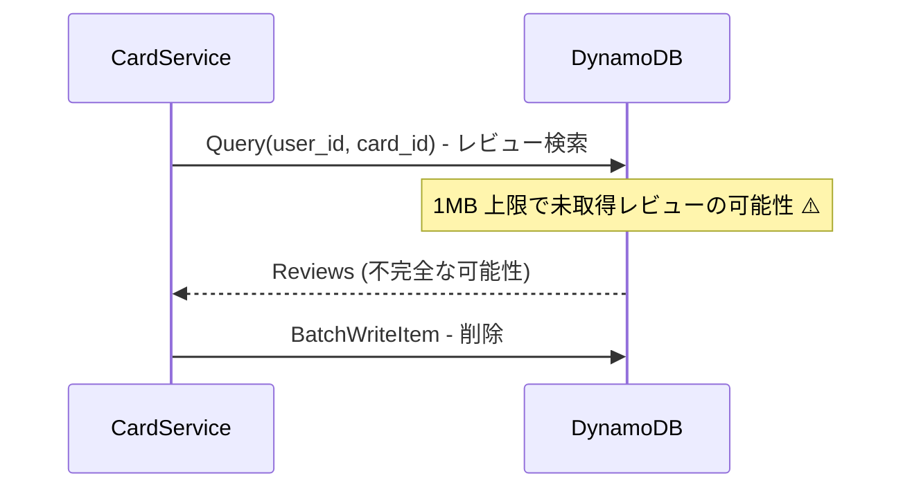
```mermaid
sequenceDiagram
    participant CS as CardService
    participant DB as DynamoDB

    CS->>DB: Query(user_id, card_id) - レビュー検索
    Note over DB: 1MB 上限で未取得レビューの可能性 ⚠️
    DB-->>CS: Reviews (不完全な可能性)
    CS->>DB: BatchWriteItem - 削除
```

### After（修正後: ページネーション付きレビュー削除）

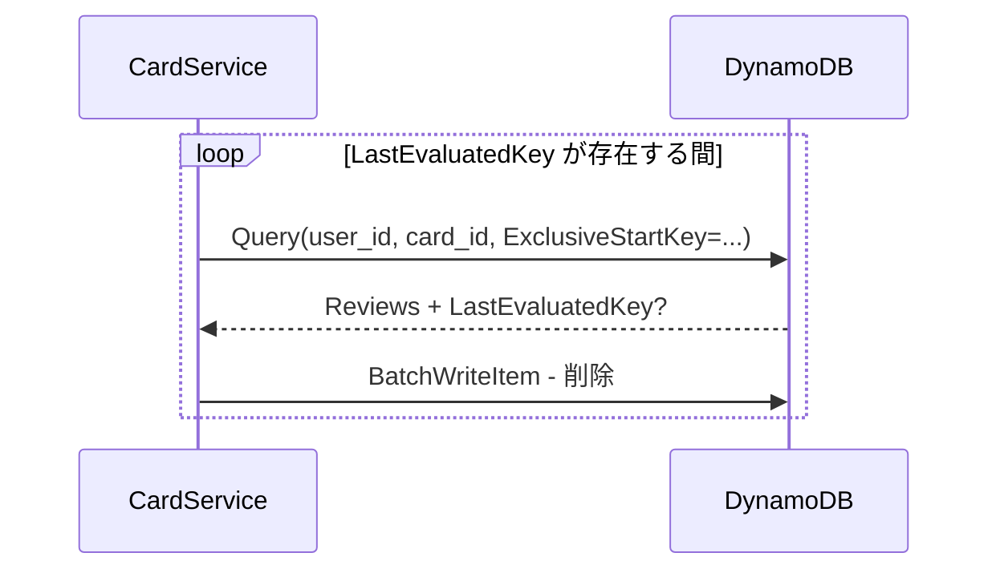
```mermaid
sequenceDiagram
    participant CS as CardService
    participant DB as DynamoDB

    loop LastEvaluatedKey が存在する間
        CS->>DB: Query(user_id, card_id, ExclusiveStartKey=...)
        DB-->>CS: Reviews + LastEvaluatedKey?
        CS->>DB: BatchWriteItem - 削除
    end
```

---

## 5. レビュー送信フロー（REQ-015: list_append による原子的更新） 🔵

**信頼性**: 🔵 *H-02: 両レビュアー一致・設計ヒアリングで list_append 方式に決定*

### Before（現行: 読み取り→書き込みの非原子操作）

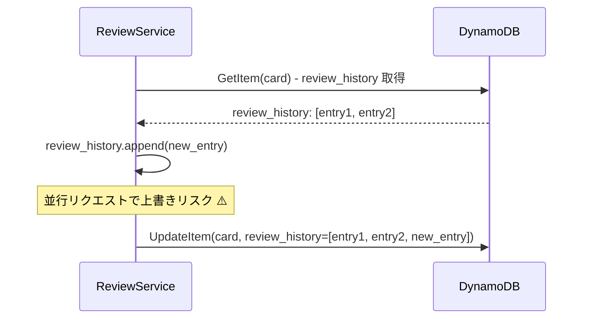
```mermaid
sequenceDiagram
    participant RS as ReviewService
    participant DB as DynamoDB

    RS->>DB: GetItem(card) - review_history 取得
    DB-->>RS: review_history: [entry1, entry2]
    RS->>RS: review_history.append(new_entry)
    Note over RS: 並行リクエストで上書きリスク ⚠️
    RS->>DB: UpdateItem(card, review_history=[entry1, entry2, new_entry])
```

### After（修正後: list_append 原子操作）

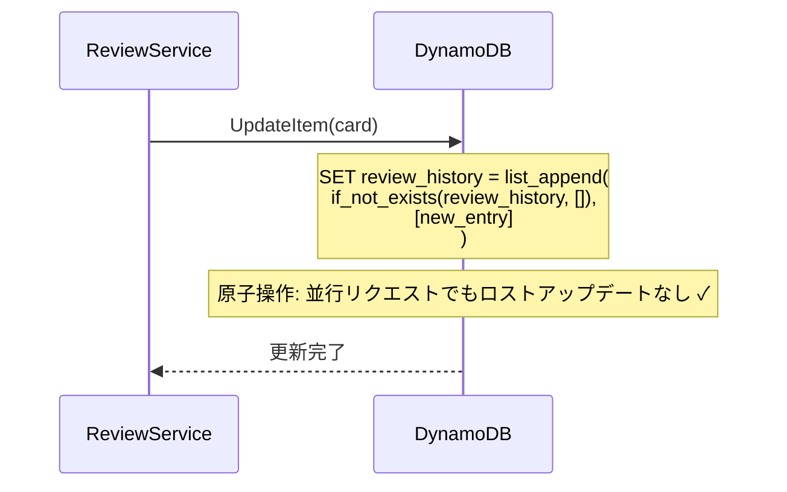
```mermaid
sequenceDiagram
    participant RS as ReviewService
    participant DB as DynamoDB

    RS->>DB: UpdateItem(card)
    Note over DB: SET review_history = list_append(<br/>  if_not_exists(review_history, []),<br/>  [new_entry]<br/>)
    Note over DB: 原子操作: 並行リクエストでもロストアップデートなし ✓
    DB-->>RS: 更新完了
```

---

## 6. 401 リフレッシュフロー（REQ-014: 再帰制限） 🔵

**信頼性**: 🔵 *M-01: 両レビュアー一致*

### Before（現行: 無限再帰リスク）

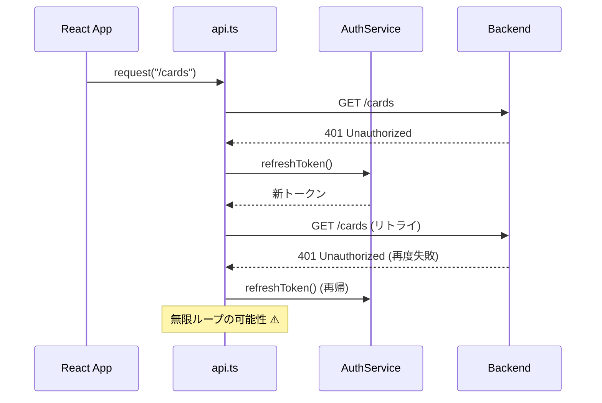
```mermaid
sequenceDiagram
    participant App as React App
    participant API as api.ts
    participant Auth as AuthService
    participant Server as Backend

    App->>API: request("/cards")
    API->>Server: GET /cards
    Server-->>API: 401 Unauthorized
    API->>Auth: refreshToken()
    Auth-->>API: 新トークン
    API->>Server: GET /cards (リトライ)
    Server-->>API: 401 Unauthorized (再度失敗)
    API->>Auth: refreshToken() (再帰)
    Note over API: 無限ループの可能性 ⚠️
```

### After（修正後: _isRetry フラグで1回制限）

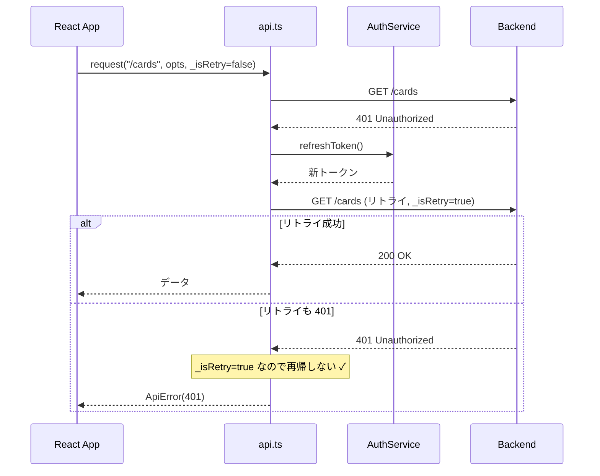
```mermaid
sequenceDiagram
    participant App as React App
    participant API as api.ts
    participant Auth as AuthService
    participant Server as Backend

    App->>API: request("/cards", opts, _isRetry=false)
    API->>Server: GET /cards
    Server-->>API: 401 Unauthorized
    API->>Auth: refreshToken()
    Auth-->>API: 新トークン
    API->>Server: GET /cards (リトライ, _isRetry=true)

    alt リトライ成功
        Server-->>API: 200 OK
        API-->>App: データ
    else リトライも 401
        Server-->>API: 401 Unauthorized
        Note over API: _isRetry=true なので再帰しない ✓
        API-->>App: ApiError(401)
    end
```

---

## 7. LINE 連携フロー（REQ-016: 原子的更新） 🔵

**信頼性**: 🔵 *M-08: Codex 指摘・設計ヒアリングで ConditionExpression 方式に決定*

### Before（現行: check-then-update）

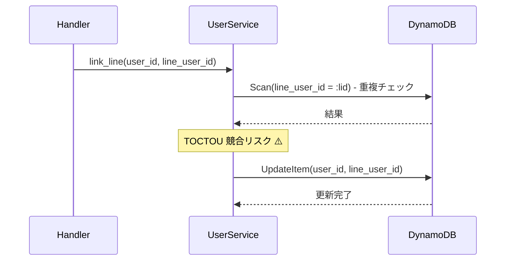
```mermaid
sequenceDiagram
    participant H as Handler
    participant US as UserService
    participant DB as DynamoDB

    H->>US: link_line(user_id, line_user_id)
    US->>DB: Scan(line_user_id = :lid) - 重複チェック
    DB-->>US: 結果
    Note over US: TOCTOU 競合リスク ⚠️
    US->>DB: UpdateItem(user_id, line_user_id)
    DB-->>US: 更新完了
```

### After（修正後: ConditionExpression で原子的更新）

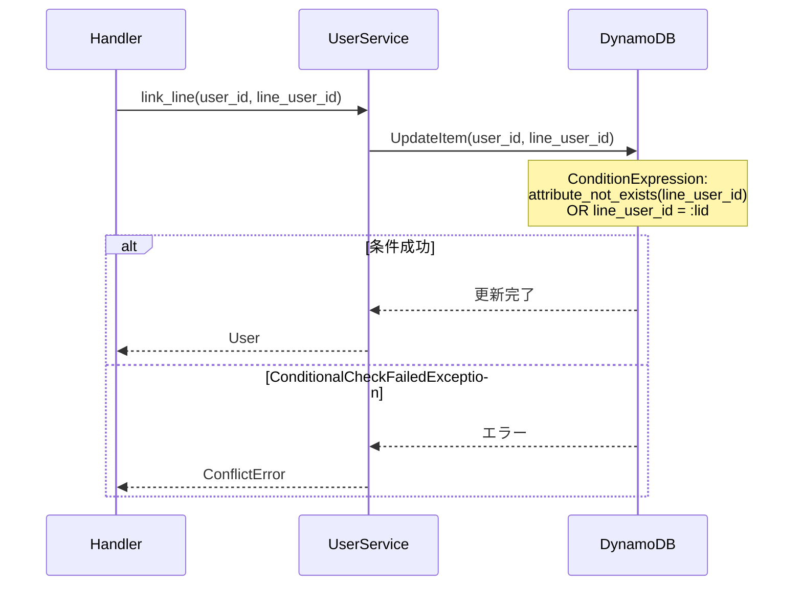
```mermaid
sequenceDiagram
    participant H as Handler
    participant US as UserService
    participant DB as DynamoDB

    H->>US: link_line(user_id, line_user_id)
    US->>DB: UpdateItem(user_id, line_user_id)
    Note over DB: ConditionExpression:<br/>attribute_not_exists(line_user_id)<br/>OR line_user_id = :lid

    alt 条件成功
        DB-->>US: 更新完了
        US-->>H: User
    else ConditionalCheckFailedException
        DB-->>US: エラー
        US-->>H: ConflictError
    end
```

---

## エラーハンドリングフロー（REQ-011: サイレント例外解消） 🔵

**信頼性**: 🔵 *H-05: 両レビュアー一致*

### Before（現行: エラー握りつぶし）

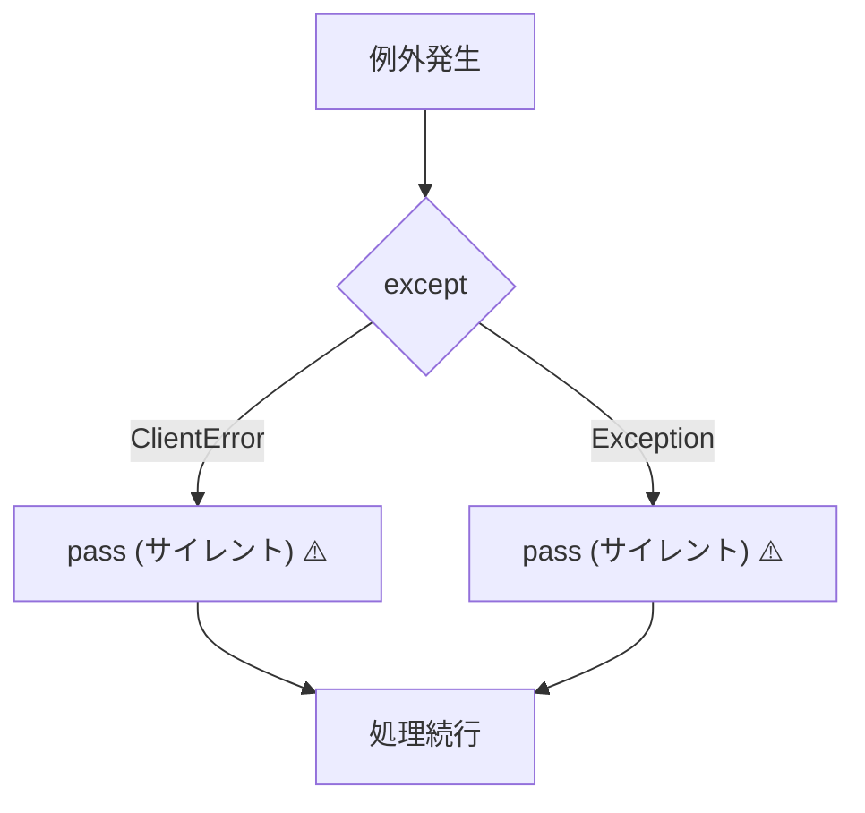
```mermaid
flowchart TD
    A[例外発生] --> B{except}
    B -->|ClientError| C["pass (サイレント) ⚠️"]
    B -->|Exception| D["pass (サイレント) ⚠️"]
    C --> E[処理続行]
    D --> E
```

### After（修正後: ログ出力）

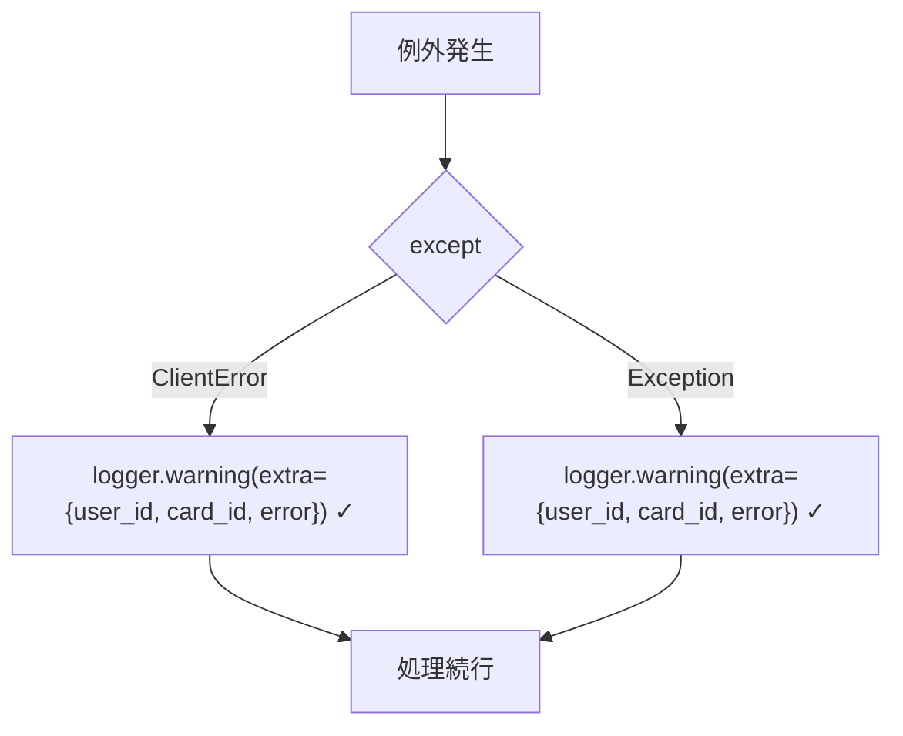
```mermaid
flowchart TD
    A[例外発生] --> B{except}
    B -->|ClientError| C["logger.warning(extra={user_id, card_id, error}) ✓"]
    B -->|Exception| D["logger.warning(extra={user_id, card_id, error}) ✓"]
    C --> E[処理続行]
    D --> E
```

---

## 構造化ログフロー（REQ-012） 🔵

**信頼性**: 🔵 *H-04: Claude 指摘*

### Before（f-string ログ）

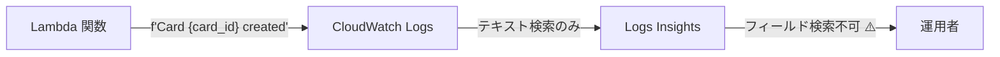
```mermaid
flowchart LR
    A[Lambda 関数] -->|"f'Card {card_id} created'"| B[CloudWatch Logs]
    B -->|"テキスト検索のみ"| C[Logs Insights]
    C -->|"フィールド検索不可 ⚠️"| D[運用者]
```

### After（構造化ログ）

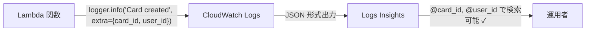
```mermaid
flowchart LR
    A[Lambda 関数] -->|"logger.info('Card created', extra={card_id, user_id})"| B[CloudWatch Logs]
    B -->|"JSON 形式出力"| C[Logs Insights]
    C -->|"@card_id, @user_id で検索可能 ✓"| D[運用者]
```

---

## 関連文書

- **アーキテクチャ**: [architecture.md](architecture.md)
- **要件定義**: [requirements.md](../../spec/code-quality-improvements/requirements.md)
- **既存データフロー**: [dataflow.md](../memoru-liff/dataflow.md)

---

## 信頼性レベルサマリー

| レベル | 件数 | 割合 |
|--------|------|------|
| 🔵 青信号 | 10件 | 100% |
| 🟡 黄信号 | 0件 | 0% |
| 🔴 赤信号 | 0件 | 0% |

**品質評価**: ✅ 高品質（全フローが青信号、コードレビュー結果とヒアリングに基づく確実なフロー）
