# code-review-fixes-v2 データフロー図

**作成日**: 2026-02-17
**関連アーキテクチャ**: [architecture.md](architecture.md)
**関連要件定義**: [requirements.md](../../spec/code-review-fixes-v2/requirements.md)

**【信頼性レベル凡例】**:

- 🔵 **青信号**: 要件定義書・設計文書・ユーザヒアリング・コード分析から確実なフロー
- 🟡 **黄信号**: 要件定義書・設計文書から妥当な推測によるフロー
- 🔴 **赤信号**: 要件定義書・設計文書にない推測によるフロー

---

## 修正対象のデータフロー一覧

本設計では既存のデータフローを修正するため、**変更前後の差分** を示す。

---

## 1. LINE 連携フロー（H-01: 本人性検証追加） 🔵

**信頼性**: 🔵 *H-01: ユーザヒアリングで LIFF IDトークン + LINE API 検証に決定*

**関連要件**: REQ-V2-021〜023

### Before（現行: line_user_id 直接送信）

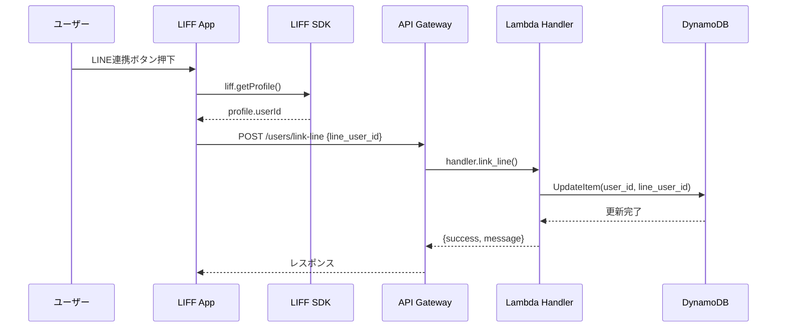

### After（修正後: IDトークン検証）

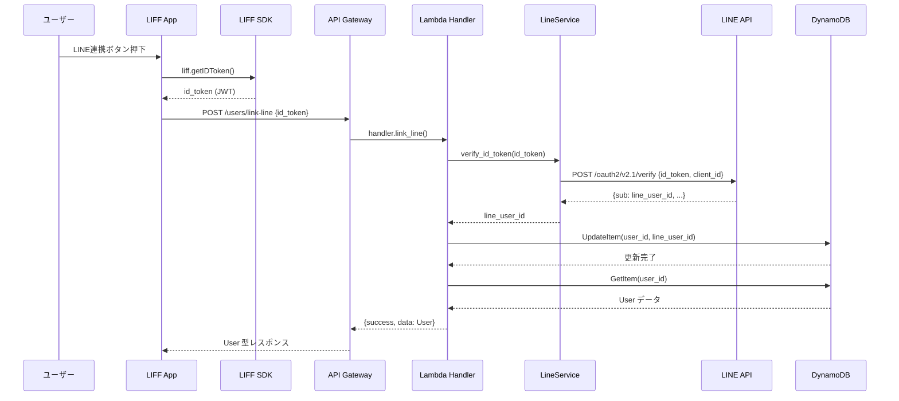

**変更ポイント**:
1. フロントエンド: `liff.getProfile()` → `liff.getIDToken()` 🔵
2. リクエスト: `{line_user_id}` → `{id_token}` 🔵
3. サーバー: LINE API で ID トークン検証を追加 🔵
4. レスポンス: `{success, message}` → `{success, data: User}` (H-02) 🔵

---

## 2. カード作成フロー（CR-02: トランザクション修正） 🔵

**信頼性**: 🔵 *CR-02: card_service.py のコード分析で確認*

**関連要件**: REQ-V2-011〜014

### Before（現行: card_count 問題あり）

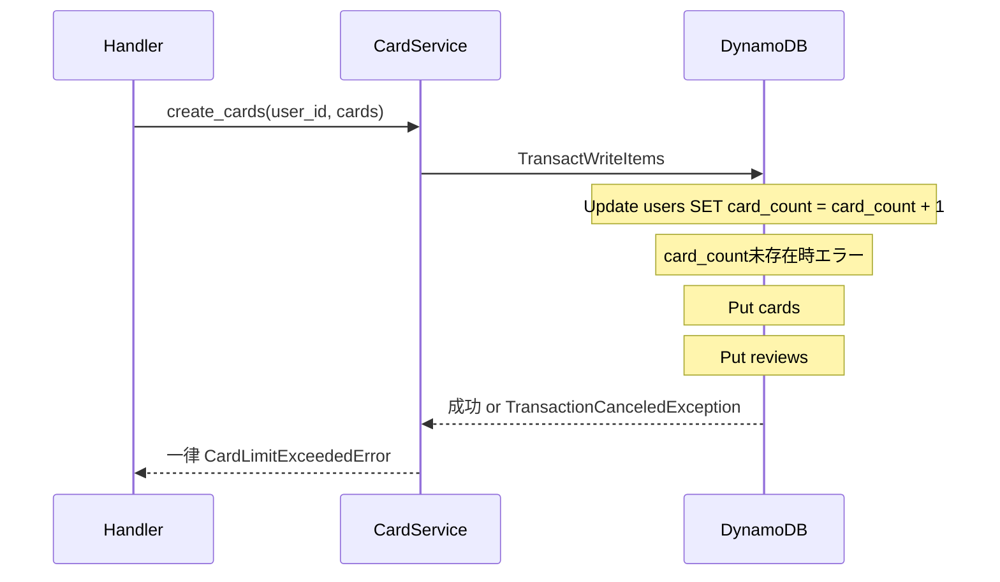

### After（修正後: 安全なトランザクション）

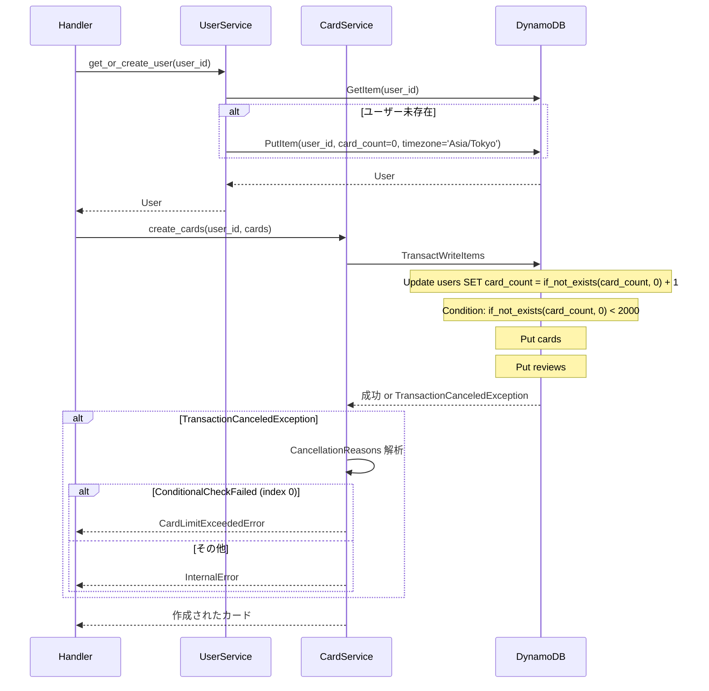

**変更ポイント**:
1. ハンドラーで `get_or_create_user()` を事前呼び出し 🔵
2. `if_not_exists(card_count, :zero)` で安全な加算 🔵
3. `CancellationReasons` で正確なエラー分類 🔵

---

## 3. カード削除フロー（CR-02: card_count 減算追加） 🔵

**信頼性**: 🔵 *CR-02: delete_card() の card_count 未減算を確認*

**関連要件**: REQ-V2-013

### Before（現行: card_count 未減算）

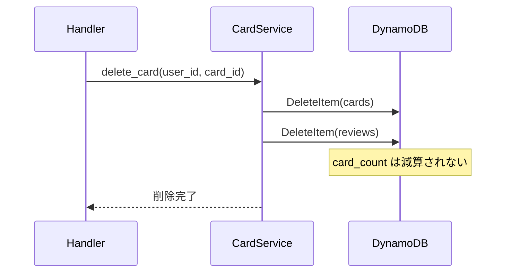

### After（修正後: トランザクションで減算）

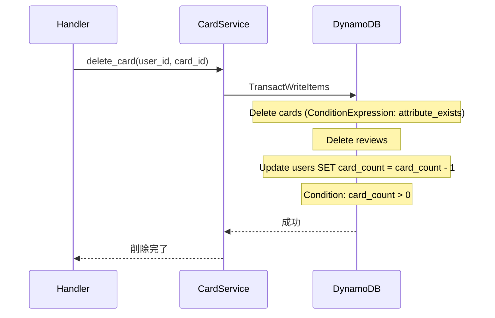

---

## 4. 通知送信フロー（H-03: 時刻判定追加） 🔵

**信頼性**: 🔵 *H-03: notification_service.py のコード分析で確認*

**関連要件**: REQ-V2-041〜042, REQ-V2-111〜112

### Before（現行: 日付チェックのみ）

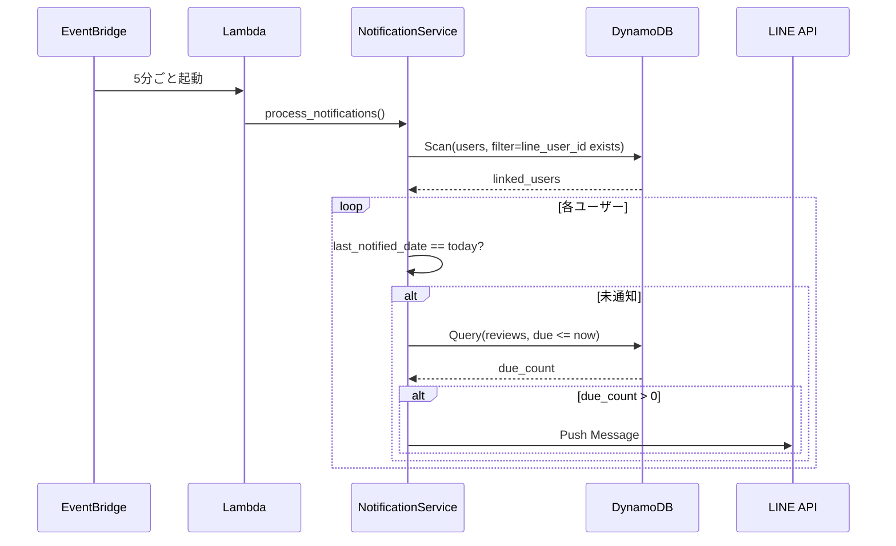

### After（修正後: タイムゾーン + 時刻チェック追加）

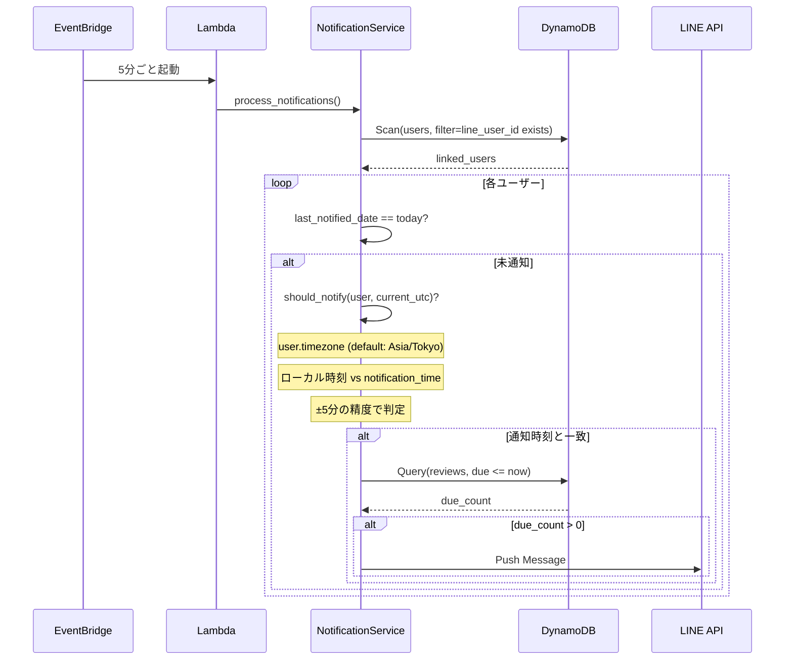

**変更ポイント**:
1. `should_notify()` メソッド追加（タイムゾーン変換 + 時刻比較） 🔵
2. users テーブルの `timezone` 属性参照 🔵
3. デフォルトタイムゾーン `Asia/Tokyo` 🔵

---

## 5. API ルーティングフロー（CR-01: 3レイヤー統一） 🔵

**信頼性**: 🔵 *CR-01: コード分析で確認*

**関連要件**: REQ-V2-001〜004

### 修正後の統一されたルーティング

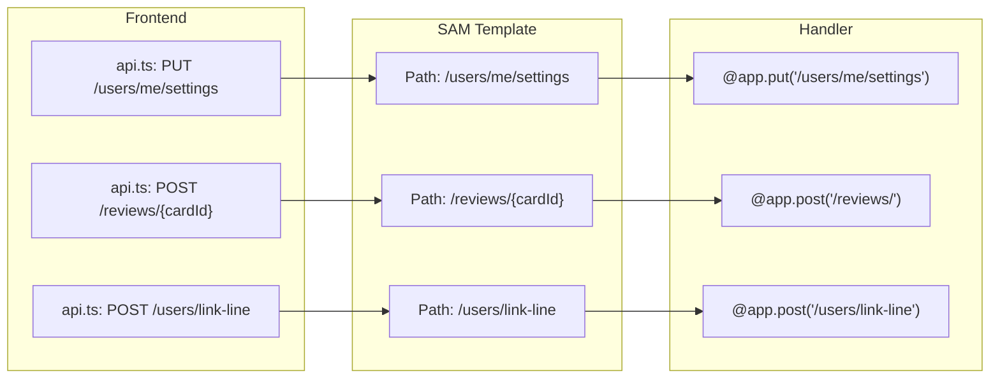

---

## エラーハンドリングフロー 🔵

**信頼性**: 🔵 *CR-02, H-01 のエラー分類設計より*

### card_count トランザクションエラー分類

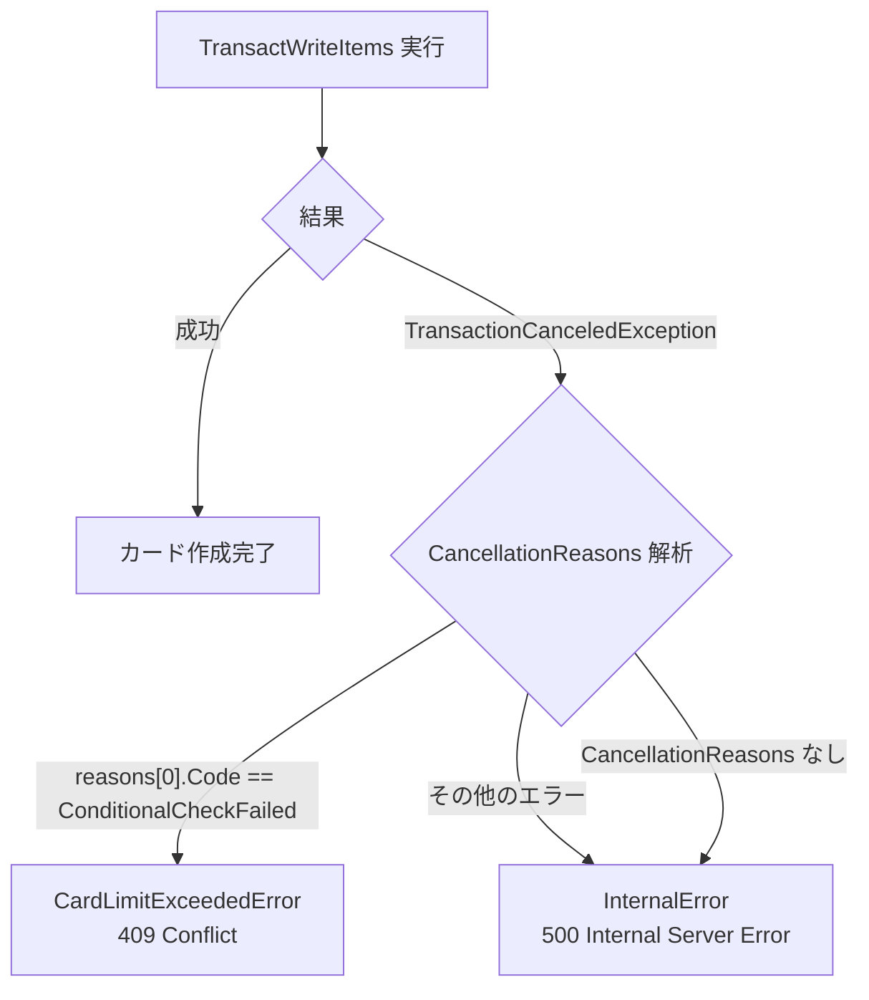

### LINE ID トークン検証エラー分類

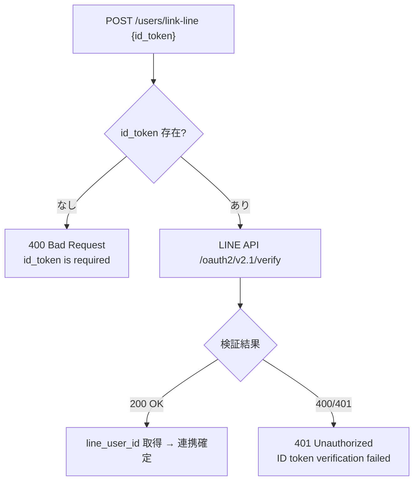

---

## 関連文書

- **アーキテクチャ**: [architecture.md](architecture.md)
- **API 仕様**: [api-endpoints.md](api-endpoints.md)
- **要件定義**: [requirements.md](../../spec/code-review-fixes-v2/requirements.md)
- **既存データフロー**: [dataflow.md](../memoru-liff/dataflow.md)

---

## 信頼性レベルサマリー

| レベル | 件数 | 割合 |
|--------|------|------|
| 🔵 青信号 | 12件 | 100% |
| 🟡 黄信号 | 0件 | 0% |
| 🔴 赤信号 | 0件 | 0% |

**品質評価**: ✅ 高品質（全フローが青信号）
