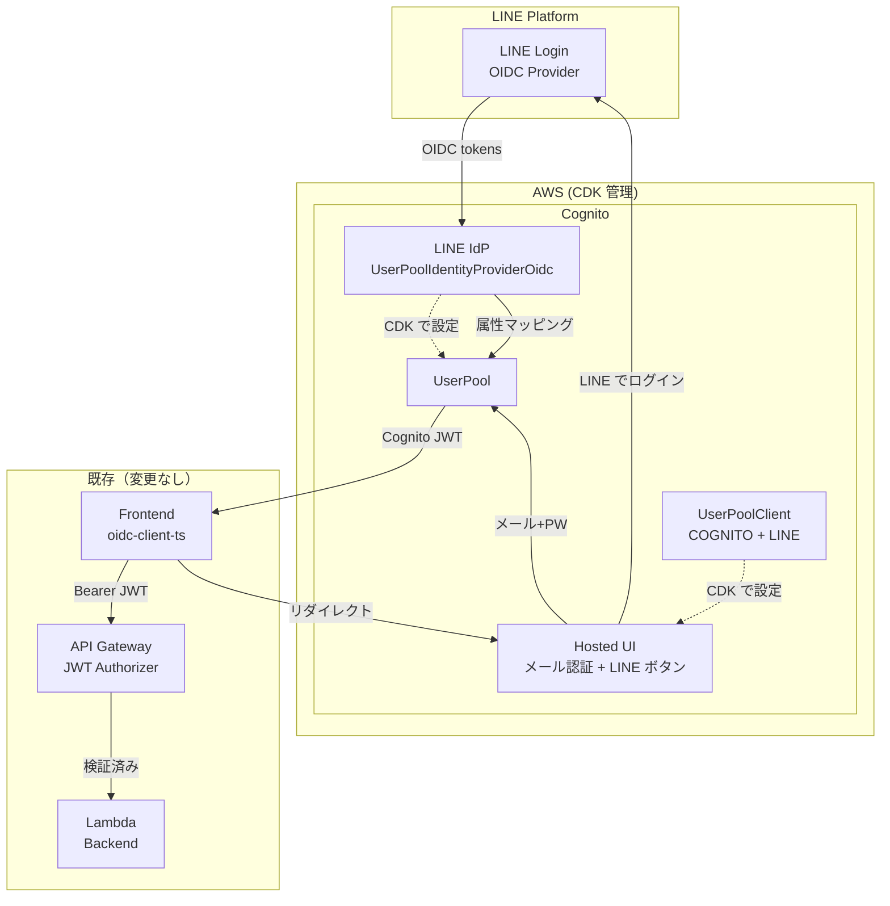

# Cognito LINE Login 外部 IdP 統合 アーキテクチャ設計

**作成日**: 2026-03-03
**関連要件定義**: [requirements.md](../../spec/cognito-line-login/requirements.md)
**ヒアリング記録**: [design-interview.md](design-interview.md)

**【信頼性レベル凡例】**:
- 🔵 **青信号**: EARS要件定義書・設計文書・ユーザヒアリングを参考にした確実な設計
- 🟡 **黄信号**: EARS要件定義書・設計文書・ユーザヒアリングから妥当な推測による設計
- 🔴 **赤信号**: EARS要件定義書・設計文書・ユーザヒアリングにない推測による設計

---

## システム概要 🔵

**信頼性**: 🔵 *要件定義書・auth-provider-switch architecture.md・ユーザヒアリングより*

Cognito UserPool に LINE Login を外部 OIDC IdP（方式A）として CDK で登録する。Cognito Hosted UI に LINE ログインボタンを追加し、既存のメール+パスワード認証と併存させる。

変更スコープは CDK（`cognito-stack.ts` + `app.ts`）のみ。フロントエンド・バックエンドのコード変更は不要。

## アーキテクチャパターン 🔵

**信頼性**: 🔵 *auth-provider-switch architecture.md 方式A・ユーザヒアリングより*

- **パターン**: Cognito Federated Identity Provider（外部 OIDC IdP）
- **選択理由**: Cognito が LINE Login と OIDC 標準プロトコルでフェデレーションし、トークン変換を担当。フロントエンド（`oidc-client-ts`）は Cognito Hosted UI にリダイレクトするだけで LINE Login を利用可能。コード変更ゼロの原則を維持。

## コンポーネント構成

### 変更対象コンポーネント

#### 1. `CognitoStackProps` の拡張 🔵

**信頼性**: 🔵 *REQ-006・REQ-007・既存 Props パターンより*

```typescript
export interface CognitoStackProps extends cdk.StackProps {
  environment: Environment;
  cognitoDomainPrefix: string;
  callbackUrls: string[];
  logoutUrls: string[];
  // --- LINE Login 追加 Props ---
  lineLoginChannelId?: string;    // LINE Login Channel ID（省略時は LINE IdP 未登録）
  lineLoginChannelSecret?: string; // LINE Login Channel Secret
}
```

**設計判断**:
- `lineLoginChannelId` / `lineLoginChannelSecret` はオプショナル（`?`）とする 🔵 *REQ-001 受け入れ基準「未指定の場合 LINE IdP が登録されない」より*
- 両方が指定された場合のみ LINE IdP を登録する条件分岐を追加
- 既存のデプロイ（LINE なし）に影響を与えない後方互換性を確保

#### 2. `UserPoolIdentityProviderOidc` の追加 🔵

**信頼性**: 🔵 *REQ-001・REQ-002・aws-cdk-lib/aws-cognito API 仕様より*

```typescript
// Props が指定されている場合のみ LINE IdP を登録
if (props.lineLoginChannelId && props.lineLoginChannelSecret) {
  const lineProvider = new cognito.UserPoolIdentityProviderOidc(this, 'LineLoginProvider', {
    userPool: this.userPool,
    name: 'LINE',
    clientId: props.lineLoginChannelId,
    clientSecret: props.lineLoginChannelSecret,
    issuerUrl: 'https://access.line.me',
    scopes: ['openid', 'profile'],
    endpoints: {
      authorization: 'https://access.line.me/oauth2/v2.1/authorize',
      token: 'https://api.line.me/oauth2/v2.1/token',
      userInfo: 'https://api.line.me/v2/profile',
      jwksUri: 'https://api.line.me/oauth2/v2.1/certs',
    },
    attributeMapping: {
      custom: {
        'sub': cognito.ProviderAttribute.other('sub'),
        'name': cognito.ProviderAttribute.other('name'),
        'picture': cognito.ProviderAttribute.other('picture'),
      },
    },
  });
}
```

**LINE Login OIDC エンドポイント**: 🟡

**信頼性**: 🟡 *LINE Developers 公式ドキュメントから妥当な推測。デプロイ時に実動作確認が必要*

| エンドポイント | URL |
|---|---|
| Authorization | `https://access.line.me/oauth2/v2.1/authorize` |
| Token | `https://api.line.me/oauth2/v2.1/token` |
| UserInfo | `https://api.line.me/v2/profile` |
| JWKS URI | `https://api.line.me/oauth2/v2.1/certs` |
| Issuer URL | `https://access.line.me` |

**注意**: LINE が Cognito の `issuerUrl` 自動検出（`.well-known/openid-configuration`）に対応していない可能性がある。その場合は `endpoints` の手動指定で対応する（REQ-002）。

#### 3. 属性マッピング 🔵

**信頼性**: 🔵 *REQ-003・デプロイ手順書 Step 3.4・Cognito IdP 仕様より*

LINE Login から取得する属性を Cognito ユーザー属性にマッピングする。

| LINE 属性 | Cognito 属性 | 説明 |
|---|---|---|
| `sub` | `username`（自動） | LINE ユーザー ID（Cognito 内部 sub とは別） |
| `name` | `name` | 表示名 |
| `picture` | `picture` | プロフィール画像 URL |

**注意**: Cognito が発行する JWT の `sub` は Cognito 独自 UUID であり、LINE の `sub`（`U` + 32文字）とは異なる。

#### 4. `UserPoolClient` の更新 🔵

**信頼性**: 🔵 *REQ-004・REQ-005・ユーザヒアリング「両方併存」より*

```typescript
supportedIdentityProviders: [
  cognito.UserPoolClientIdentityProvider.COGNITO,       // メール+パスワード
  ...(lineProvider
    ? [cognito.UserPoolClientIdentityProvider.custom('LINE')]
    : []),
],
```

LINE IdP が登録されている場合のみ `supportedIdentityProviders` に追加。Hosted UI にメール認証フォームと LINE ログインボタンの両方を表示する。

#### 5. `app.ts` の更新 🔵

**信頼性**: 🔵 *REQ-007・既存 app.ts の環境分離パターンより*

```typescript
new CognitoStack(app, 'MemoruCognitoDev', {
  environment: 'dev',
  cognitoDomainPrefix: 'memoru-dev',
  callbackUrls: ['http://localhost:3000/callback', 'https://localhost:3000/callback'],
  logoutUrls: ['http://localhost:3000/', 'https://localhost:3000/'],
  // LINE Login（環境変数 or 直接指定）
  lineLoginChannelId: process.env.LINE_LOGIN_CHANNEL_ID,
  lineLoginChannelSecret: process.env.LINE_LOGIN_CHANNEL_SECRET,
});
```

**Channel Secret 管理**: 🟡

**信頼性**: 🟡 *セキュリティベストプラクティスから妥当な推測*

- `app.ts` では `process.env` 経由で注入
- CDK コード内へのハードコードは禁止（REQ-007）
- 将来的に AWS Secrets Manager への移行も可能だが、初期は環境変数で十分

### 変更不要コンポーネント 🔵

**信頼性**: 🔵 *REQ-401〜405・ユーザヒアリング・OIDC 汎用化済み実装より*

| コンポーネント | 理由 |
|---|---|
| `frontend/src/config/oidc.ts` | OIDC 汎用化済み。`VITE_OIDC_AUTHORITY` で Cognito Hosted UI と互換 |
| `frontend/src/services/auth.ts` | `oidc-client-ts` は OIDC 標準互換でプロバイダ非依存 |
| `frontend/src/services/liff.ts` | LIFF SDK は OIDC 認証と独立して動作 |
| `backend/template.yaml` | `OidcIssuer`/`OidcAudience` パラメータ化済み |
| `backend/src/api/shared.py` | JWT `sub` クレーム抽出のみ。プロバイダ非依存 |
| `backend/src/services/line_service.py` | 手動リンク機能は維持。変更不要 |
| `backend/src/api/handlers/user_handler.py` | `/users/link-line` はそのまま維持 |

## システム構成図 🔵

**信頼性**: 🔵 *auth-provider-switch architecture.md・要件定義より*



## ディレクトリ構造（変更箇所のみ） 🔵

**信頼性**: 🔵 *既存プロジェクト構造より*

```
infrastructure/cdk/
├── bin/
│   └── app.ts                    # LINE Login Props 追加
└── lib/
    └── cognito-stack.ts          # LINE IdP 追加、Client 更新
```

## 非機能要件の実現方法

### セキュリティ 🟡

**信頼性**: 🟡 *セキュリティベストプラクティス・NFR 要件より*

- **Channel Secret 管理**: 環境変数経由で注入。CDK コード内にハードコードしない
- **PKCE**: 既存の `authorizationCodeGrant` + `generateSecret: false` でフロントエンドは PKCE を使用
- **トークン検証**: API Gateway JWT Authorizer が Cognito 発行の JWT を検証（既存動作）

### 互換性 🔵

**信頼性**: 🔵 *REQ-401〜404・OIDC 汎用化済み設計より*

- **後方互換**: `lineLoginChannelId` が未指定の場合、既存の Cognito 単体動作に影響なし
- **OIDC 互換**: Cognito Hosted UI は OIDC 標準準拠。`oidc-client-ts` との互換性を維持
- **JWT 互換**: Cognito が発行する JWT は LINE Login 経由でもメール経由でも同じ形式

### 可用性 🟡

**信頼性**: 🟡 *両方併存の設計から妥当な推測*

- **フォールバック**: LINE Login の OIDC エンドポイントが一時的に利用不可でも、メール+パスワード認証は独立して動作
- **Cognito Hosted UI**: AWS マネージドサービスの SLA に準拠

## 技術的制約 🔵

**信頼性**: 🔵 *Cognito 仕様・LINE Login 仕様・既存実装より*

- `cognitoDomainPrefix` はグローバル一意（既存制約）
- LINE Login の OIDC エンドポイントが変更された場合、CDK の再デプロイが必要
- Cognito の `sub` は LINE `sub` とは別の UUID（LINE ユーザー ID の自動連携はスコープ外）
- LINE Login チャネルは LINE Developers Console で事前作成が必要（CDK スコープ外）
- Cognito UserPool に登録できる外部 IdP は最大 50 個（実質的に問題なし）

## 関連文書

- **データフロー**: [dataflow.md](dataflow.md)
- **設計ヒアリング記録**: [design-interview.md](design-interview.md)
- **要件定義**: [requirements.md](../../spec/cognito-line-login/requirements.md)
- **コンテキストノート**: [note.md](../../spec/cognito-line-login/note.md)
- **認証プロバイダ切り替え設計**: [architecture.md](../auth-provider-switch/architecture.md)
- **デプロイ手順書**: [deployment-guide-dev.md](../../deployment-guide-dev.md)

## 信頼性レベルサマリー

- 🔵 青信号: 15件 (79%)
- 🟡 黄信号: 4件 (21%)
- 🔴 赤信号: 0件 (0%)

**品質評価**: ✅ 高品質 — 要件定義・ヒアリング・既存設計を基に設計。LINE OIDC エンドポイントの実動作確認がデプロイ時に必要。
