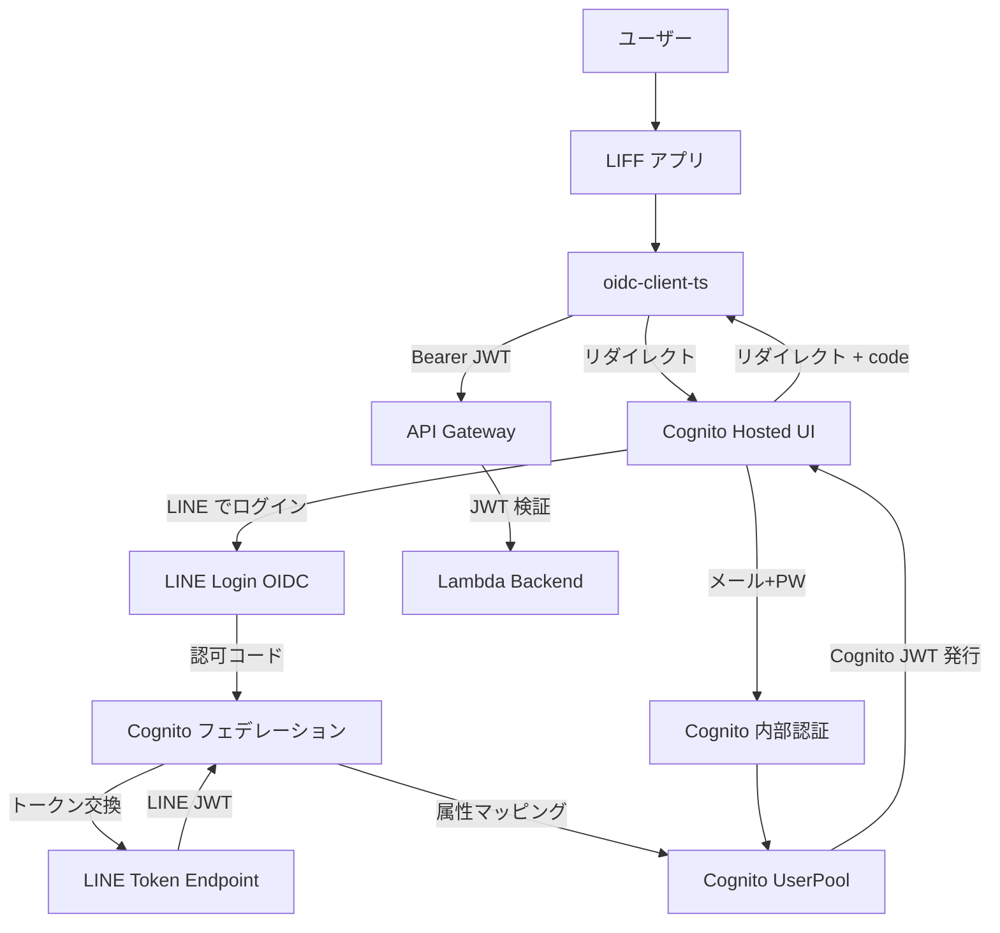
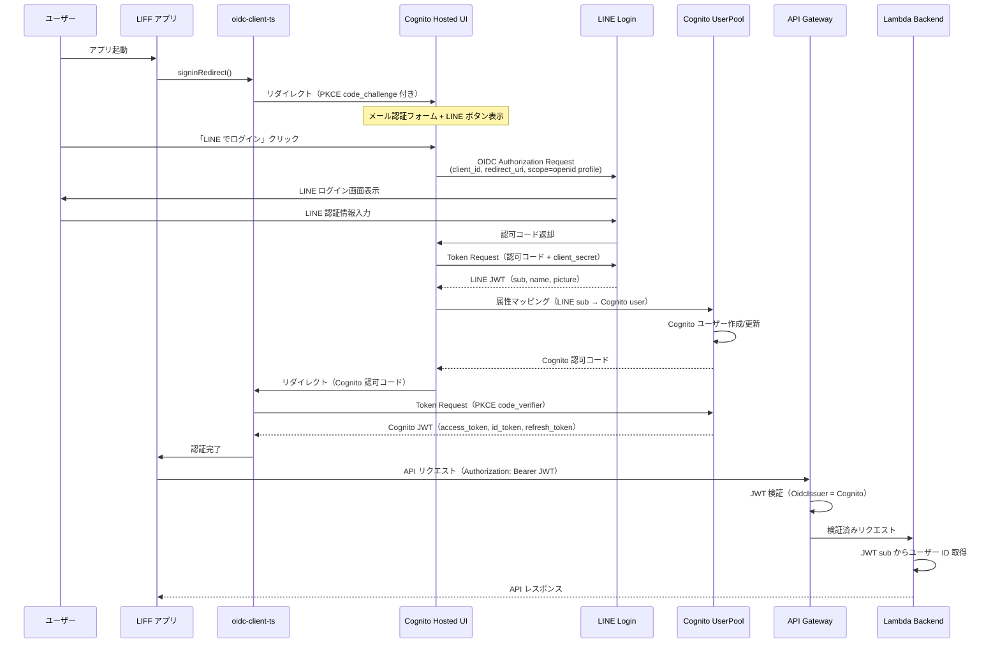
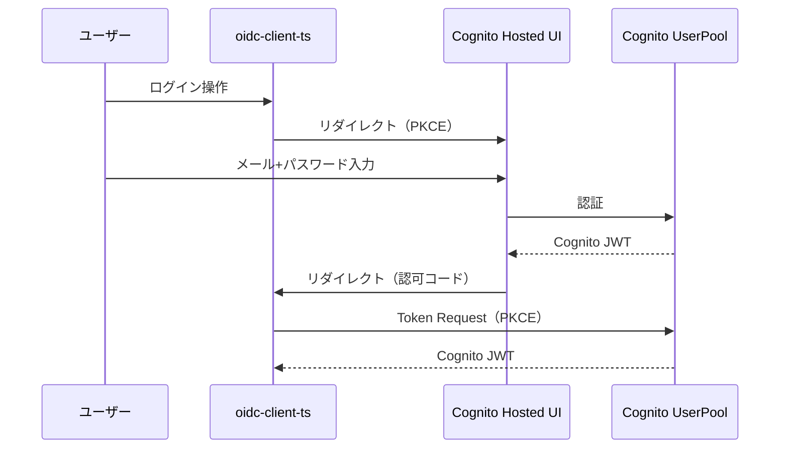
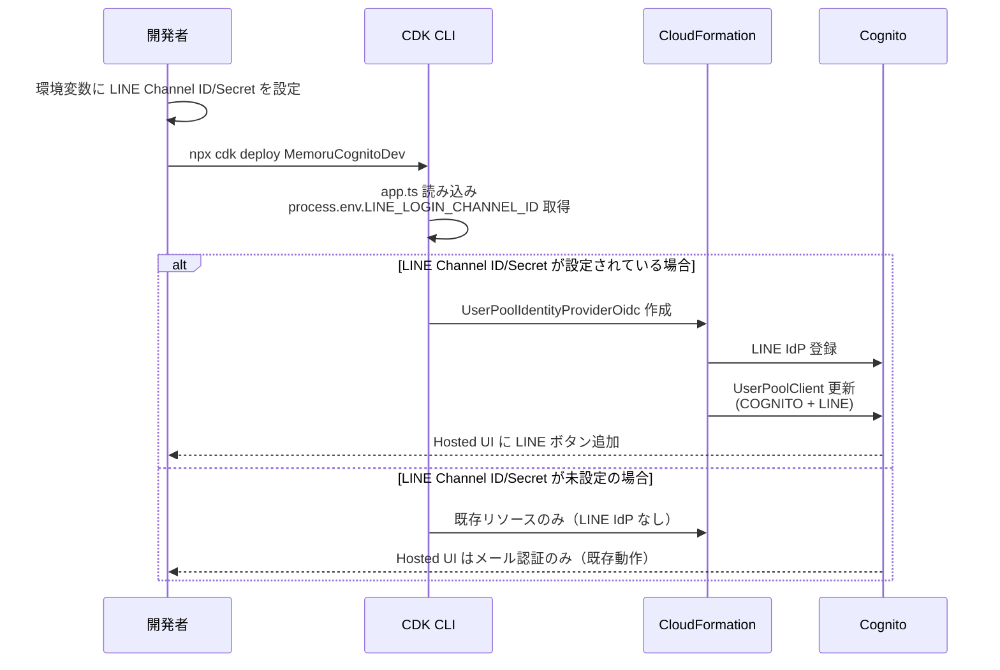
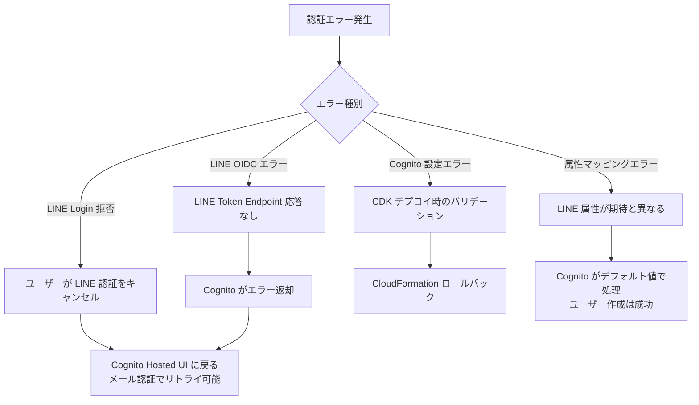

# Cognito LINE Login 外部 IdP 統合 データフロー図

**作成日**: 2026-03-03
**関連アーキテクチャ**: [architecture.md](architecture.md)
**関連要件定義**: [requirements.md](../../spec/cognito-line-login/requirements.md)

**【信頼性レベル凡例】**:
- 🔵 **青信号**: EARS要件定義書・設計文書・ユーザヒアリングを参考にした確実なフロー
- 🟡 **黄信号**: EARS要件定義書・設計文書・ユーザヒアリングから妥当な推測によるフロー
- 🔴 **赤信号**: EARS要件定義書・設計文書・ユーザヒアリングにない推測によるフロー

---

## システム全体のデータフロー 🔵

**信頼性**: 🔵 *auth-provider-switch architecture.md・note.md ターゲットフローより*

## 主要機能のデータフロー

### フロー1: LINE Login 経由の認証 🔵

**信頼性**: 🔵 *note.md ターゲットフロー・auth-provider-switch architecture.md 方式A・ユーザヒアリングより*

**関連要件**: REQ-001, REQ-004, REQ-005

**詳細ステップ**:
1. `oidc-client-ts` が Cognito Hosted UI にリダイレクト（PKCE フロー）
2. Hosted UI に LINE ログインボタンとメール認証フォームが表示
3. ユーザーが LINE ボタンをクリック → LINE Login の認証画面に遷移
4. LINE 認証完了後、Cognito が LINE のトークンを受け取り属性マッピング
5. Cognito がフェデレーテッドユーザーを作成/更新し、Cognito JWT を発行
6. `oidc-client-ts` が Cognito JWT を受け取り、API リクエストに使用

### フロー2: メール+パスワード認証（既存、変更なし） 🔵

**信頼性**: 🔵 *既存実装・OIDC 汎用化済み設計より*

**関連要件**: REQ-005

このフローは LINE IdP 追加前後で変更なし。`supportedIdentityProviders` に `COGNITO` が含まれている限り動作する。

### フロー3: CDK デプロイフロー 🔵

**信頼性**: 🔵 *REQ-001・REQ-006・REQ-007・既存 CDK デプロイパターンより*

**関連要件**: REQ-001, REQ-006, REQ-007

**詳細ステップ**:
1. 開発者が `LINE_LOGIN_CHANNEL_ID` / `LINE_LOGIN_CHANNEL_SECRET` 環境変数を設定
2. `npx cdk deploy` 実行 → `app.ts` が `process.env` から Props を取得
3. `cognito-stack.ts` が Props を判定し、LINE IdP を条件付きで作成
4. CloudFormation が Cognito リソースを更新

## データ処理パターン

### 同期処理 🔵

**信頼性**: 🔵 *Cognito フェデレーション仕様より*

- **LINE OIDC トークン交換**: Cognito が LINE Token Endpoint を同期的に呼び出し、トークンを取得
- **属性マッピング**: トークン取得後、即座に Cognito ユーザー属性にマッピング
- **CDK デプロイ**: CloudFormation による同期的なリソース作成/更新

### 非同期処理

**該当なし** — 本要件のスコープでは非同期処理は発生しない。

## エラーハンドリングフロー 🟡

**信頼性**: 🟡 *Cognito フェデレーション・LINE Login の一般的な動作から妥当な推測*

**重要**: LINE Login 障害時でもメール+パスワード認証は独立して動作する（フォールバック）。

## 関連文書

- **アーキテクチャ**: [architecture.md](architecture.md)
- **設計ヒアリング記録**: [design-interview.md](design-interview.md)
- **要件定義**: [requirements.md](../../spec/cognito-line-login/requirements.md)

## 信頼性レベルサマリー

- 🔵 青信号: 8件 (89%)
- 🟡 黄信号: 1件 (11%)
- 🔴 赤信号: 0件 (0%)

**品質評価**: ✅ 高品質 — 既存の OIDC フロー設計とユーザヒアリングに基づく確実なデータフロー設計。
