# deck-review-fixes データフロー図

**作成日**: 2026-03-01
**関連アーキテクチャ**: [architecture.md](architecture.md)
**関連要件定義**: [requirements.md](../../spec/deck-review-fixes/requirements.md)

**【信頼性レベル凡例】**:
- 🔵 **青信号**: EARS要件定義書・設計文書・ユーザヒアリングを参考にした確実なフロー
- 🟡 **黄信号**: EARS要件定義書・設計文書・ユーザヒアリングから妥当な推測によるフロー
- 🔴 **赤信号**: EARS要件定義書・設計文書・ユーザヒアリングにない推測によるフロー

---

## フロー1: デッキ別カード一覧表示（H-1 / REQ-001） 🔵

**信頼性**: 🔵 *レビュー H-1・ユーザーストーリー 1.1 より*

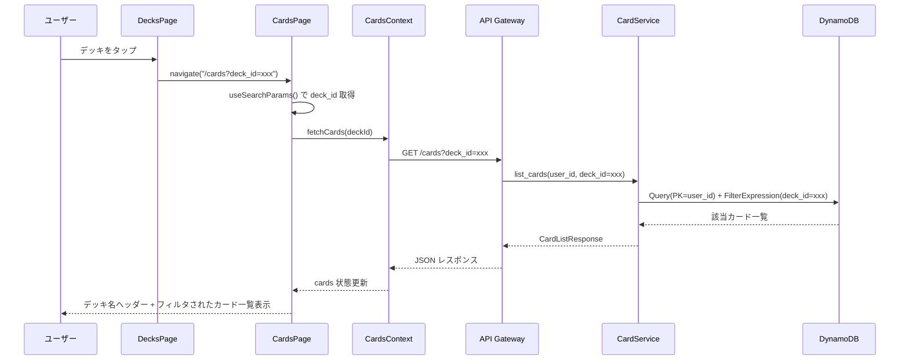

**詳細ステップ**:
1. DecksPage でデッキタップ → `/cards?deck_id=xxx` に遷移
2. CardsPage が `useSearchParams()` で `deck_id` を読み取り
3. CardsContext の `fetchCards(deckId)` を呼び出し
4. バックエンド `GET /cards?deck_id=xxx` はフィルタ対応済み
5. deck_id 指定時はページヘッダーにデッキ名を表示（REQ-101）
6. deck_id なしの場合は従来通り全カード表示（REQ-102）

---

## フロー2: カード deck_id 解除（H-2 / REQ-002） 🔵

**信頼性**: 🔵 *レビュー H-2・ユーザーストーリー 2.1 より*

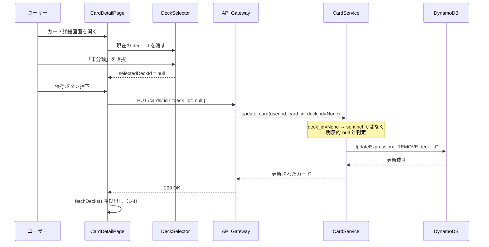

**3層修正の流れ**:
1. **フロントエンド型定義**: `UpdateCardRequest.deck_id` を `string | null` に変更
2. **フロントエンド送信**: CardDetailPage が `{ deck_id: null }` を API に送信
3. **バックエンド処理**: `card_service.py` が `deck_id=None` を検出 → `REMOVE deck_id`

**null vs 未送信の区別**:
```
{ "deck_id": null }     → REMOVE deck_id（明示的クリア）
{ "front": "updated" }  → deck_id 変更なし（未送信）
{ "deck_id": "deck-1" } → SET deck_id = "deck-1"（値変更）
```

---

## フロー3: デッキ作成（アトミック検証）（H-3, H-4 / REQ-003, REQ-004） 🔵

**信頼性**: 🔵 *追加レビュー H-3, H-4・ヒアリング回答より*

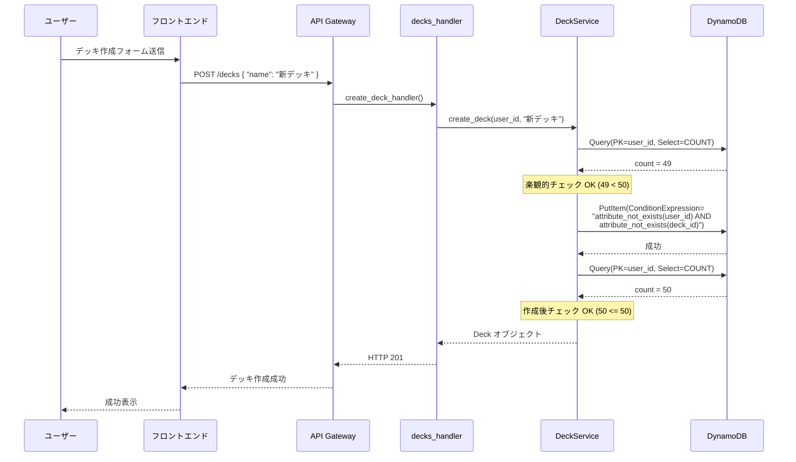

**上限超過時のフロー**:
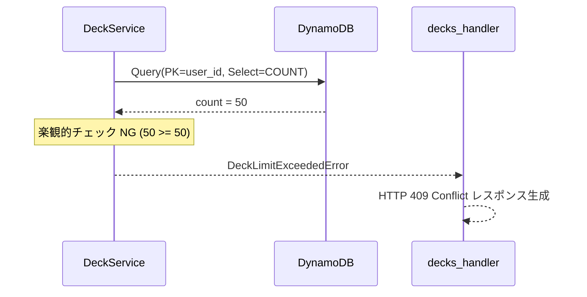

**レース検出時のフロー**:
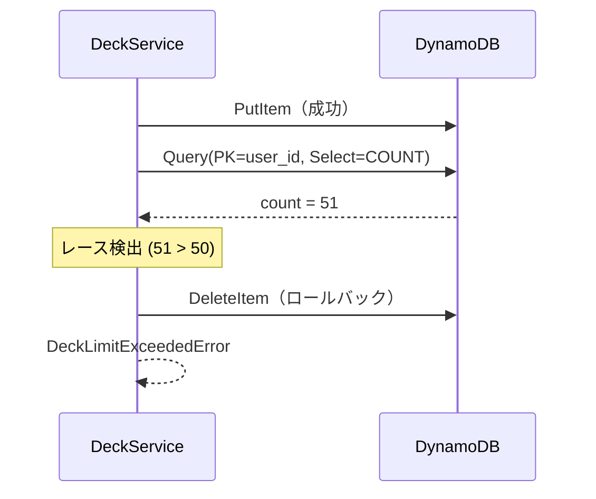

---

## フロー4: デッキフィールドクリア（M-3 / REQ-105, REQ-106） 🔵

**信頼性**: 🔵 *レビュー M-3 より*

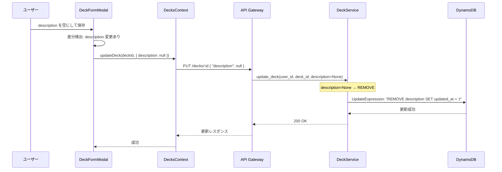

---

## フロー5: 復習対象カード数の正確な取得（M-1 / REQ-005） 🔵

**信頼性**: 🔵 *レビュー M-1 より*

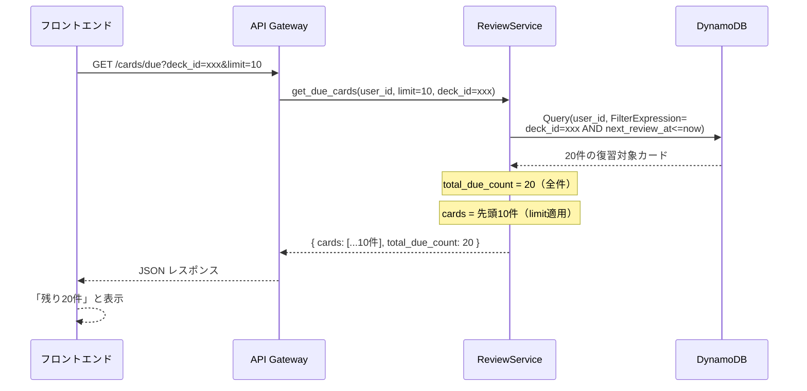

**修正のポイント**: `total_due_count` は limit 適用前の全件数を返す。limit は返却するカードの件数のみに影響する。

---

## フロー6: handler.py ルーター分割（L-2 / REQ-401） 🔵

**信頼性**: 🔵 *ヒアリング回答（ルーター分割方式）より*

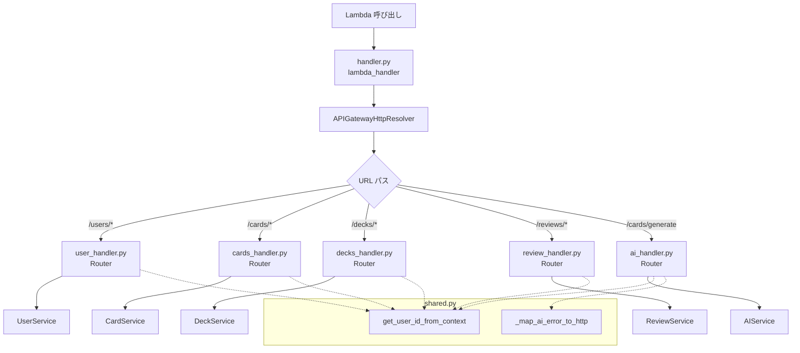

**エンドポイント分配**:

| ファイル | エンドポイント | ルート数 |
|---------|---------------|---------|
| `user_handler.py` | `/users/me`, `/users/link-line`, `/users/me/settings`, `/users/me/unlink-line` | 4 |
| `cards_handler.py` | `/cards` (GET/POST), `/cards/<id>` (GET/PUT/DELETE) | 5 |
| `decks_handler.py` | `/decks` (GET/POST), `/decks/<id>` (PUT/DELETE) | 4 |
| `review_handler.py` | `/cards/due` (GET), `/reviews/<id>` (POST), `/reviews/<id>/undo` (POST) | 3 |
| `ai_handler.py` | `/cards/generate` (POST) | 1 |

---

## フロー7: DeckFormModal 差分送信（M-4 / REQ-202） 🔵

**信頼性**: 🔵 *レビュー M-4 より*

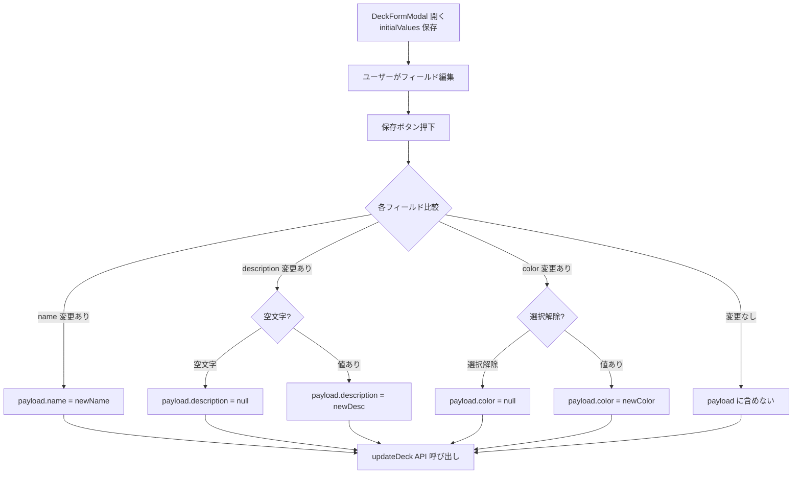

---

## フロー8: CardDetailPage デッキ変更後の更新（L-4 / REQ-203） 🔵

**信頼性**: 🔵 *レビュー L-4 より*

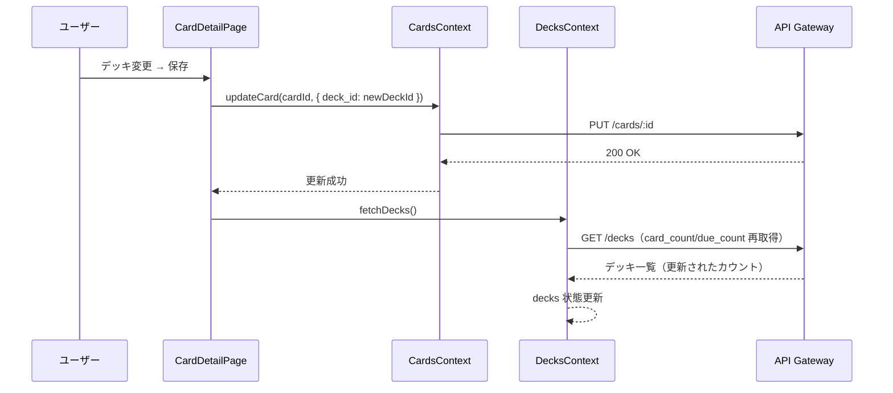

**効果**: デッキの `card_count` / `due_count` が即座に反映され、DecksPage やホーム画面の DeckSummary に正確な値が表示される。

---

## エラーハンドリングフロー 🔵

**信頼性**: 🔵 *既存実装パターン・要件定義書 EDGE-001〜003 より*

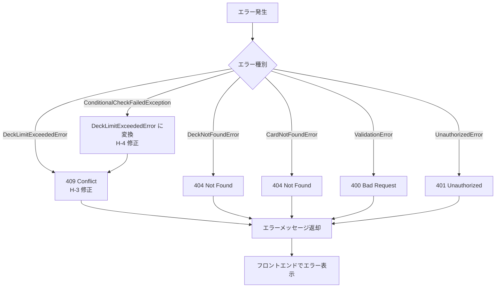

---

## 関連文書

- **アーキテクチャ**: [architecture.md](architecture.md)
- **設計ヒアリング記録**: [design-interview.md](design-interview.md)
- **要件定義**: [requirements.md](../../spec/deck-review-fixes/requirements.md)
- **受け入れ基準**: [acceptance-criteria.md](../../spec/deck-review-fixes/acceptance-criteria.md)

## 信頼性レベルサマリー

- 🔵 青信号: 8件 (100%)
- 🟡 黄信号: 0件 (0%)
- 🔴 赤信号: 0件 (0%)

**品質評価**: ✅ 高品質
