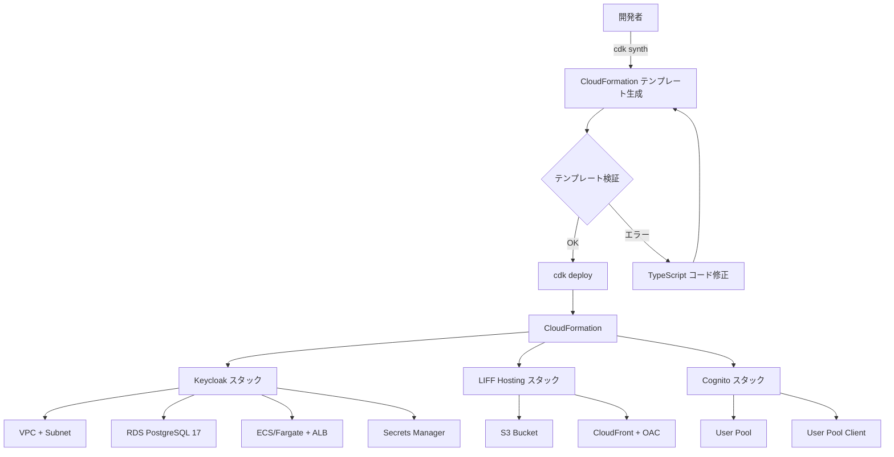
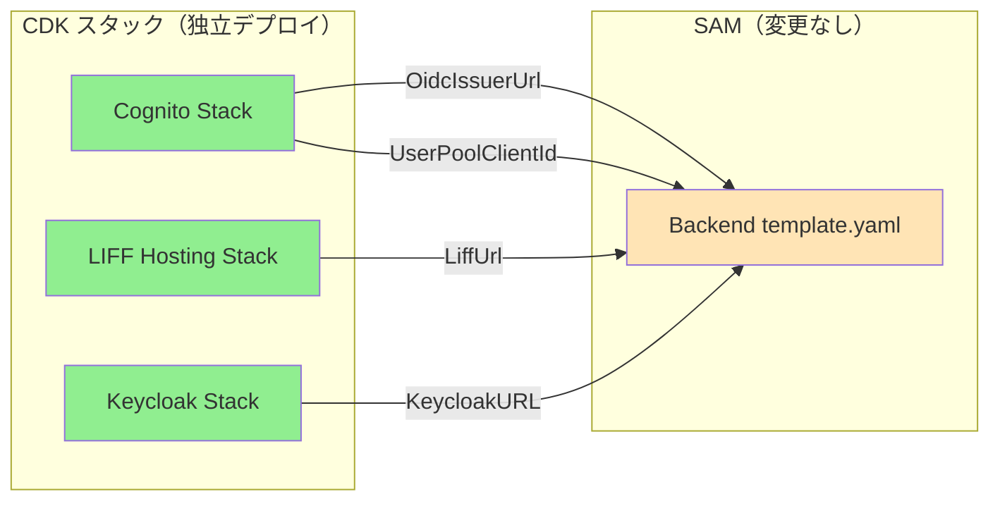
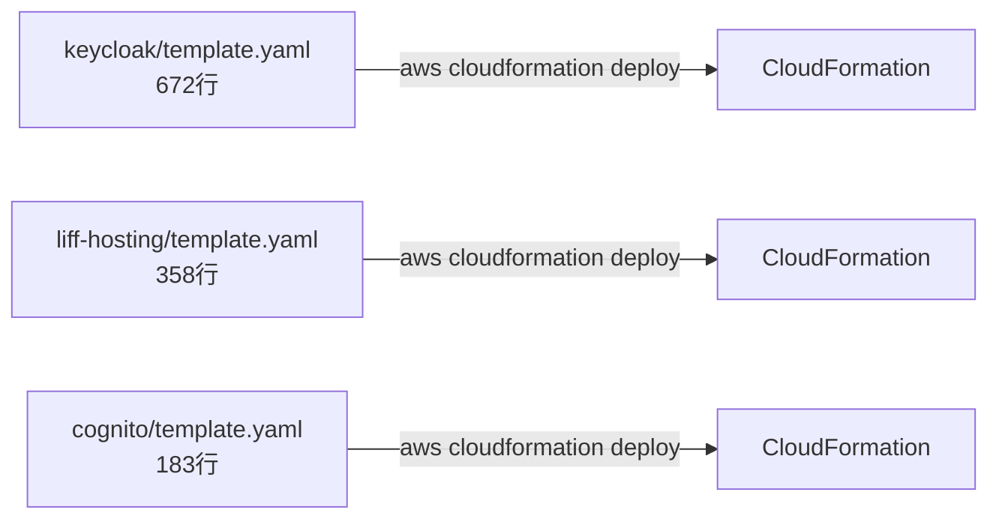
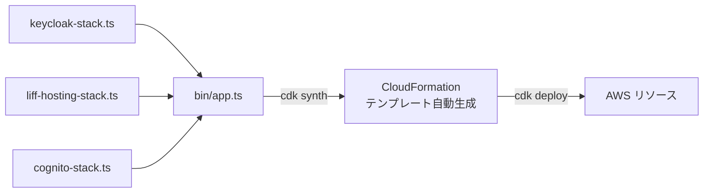
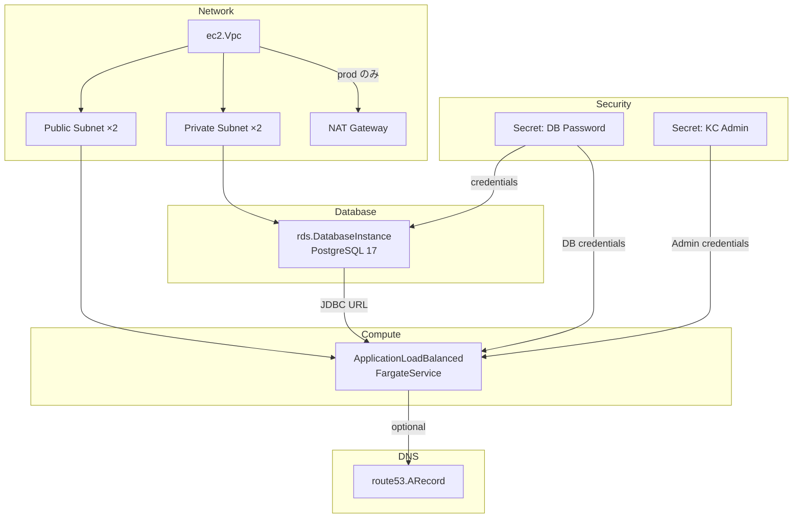
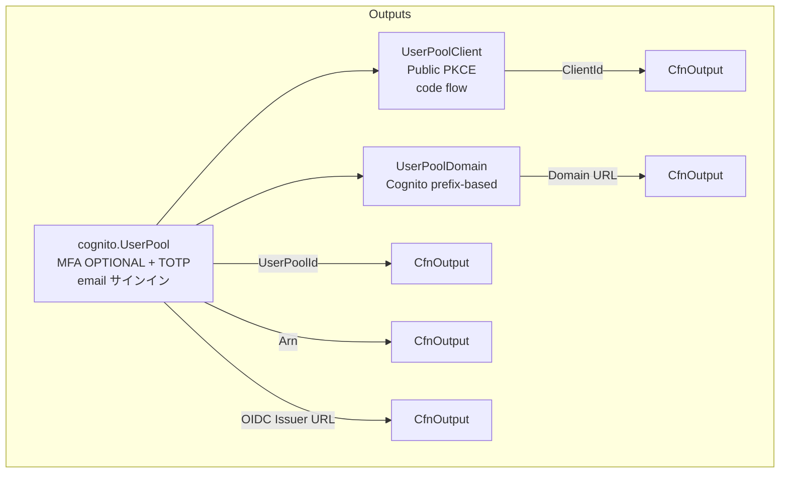

# infra-cdk-migration データフロー図

**作成日**: 2026-03-02
**関連アーキテクチャ**: [architecture.md](architecture.md)
**関連要件定義**: [requirements.md](../../spec/infra-cdk-migration/requirements.md)

**【信頼性レベル凡例】**:
- 🔵 **青信号**: 要件定義書・既存テンプレート・ユーザヒアリングを参考にした確実なフロー
- 🟡 **黄信号**: 要件定義書・既存テンプレート・CDK ベストプラクティスから妥当な推測によるフロー
- 🔴 **赤信号**: 推測によるフロー

---

## CDK デプロイフロー 🔵

**信頼性**: 🔵 *CDK 公式ドキュメント・要件定義より*



## スタック間関係 🔵

**信頼性**: 🔵 *既存テンプレートの Export/Import 構成より*



**接続方法**: 各 CDK スタックの CfnOutput を確認し、backend の SAM テンプレートにパラメータとして手動で渡す（既存運用と同じ）。

## 移行前後のフロー比較 🔵

**信頼性**: 🔵 *既存テンプレート構成・CDK 設計より*

### 移行前（CloudFormation 直接）



### 移行後（CDK）



## 各スタックの内部データフロー

### Keycloak スタック 🔵

**信頼性**: 🔵 *既存テンプレートのリソース依存関係より*



### LIFF Hosting スタック 🔵

**信頼性**: 🔵 *既存テンプレートのリソース依存関係より*

```mermaid
flowchart TD
    subgraph Storage
        S3[s3.Bucket<br/>暗号化・バージョニング有効]
        S3Log[s3.Bucket<br/>ログ用 prod のみ]
    end

    subgraph CDN
        OAC[OAC<br/>自動設定]
        S3 --> OAC --> CF[cloudfront.Distribution]

        CF --> Default[DefaultBehavior<br/>CachingOptimized]
        CF --> Assets[/assets/*<br/>長期キャッシュ]
        CF --> Index[/index.html<br/>キャッシュ無効]
        CF --> SPA[ErrorResponse<br/>403,404 → index.html]
        CF --> Headers[ResponseHeadersPolicy<br/>CSP, HSTS, X-Frame]
    end

    subgraph DNS
        CF -->|optional| R53[route53.ARecord]
    end

    CF -->|prod のみ| S3Log
```

### Cognito スタック 🔵

**信頼性**: 🔵 *既存テンプレートのリソース依存関係より*



## デプロイ順序 🟡

**信頼性**: 🟡 *スタック間依存関係から妥当な推測*

各スタックは独立しているため順序に制約はないが、推奨デプロイ順:

1. **Cognito** — backend が OIDC 設定に必要な値を出力
2. **Keycloak** — 認証プロバイダとして先にデプロイ
3. **LIFF Hosting** — フロントエンド配信（API Endpoint を CSP に含めるため backend デプロイ後が望ましい）

```bash
# 推奨デプロイ順
cdk deploy MemoruCognitoDev
cdk deploy MemoruKeycloakDev
cdk deploy MemoruLiffHostingDev
```

## 関連文書

- **アーキテクチャ**: [architecture.md](architecture.md)
- **ヒアリング記録**: [design-interview.md](design-interview.md)
- **要件定義**: [../../spec/infra-cdk-migration/requirements.md](../../spec/infra-cdk-migration/requirements.md)

## 信頼性レベルサマリー

- 🔵 青信号: 8件 (89%)
- 🟡 黄信号: 1件 (11%)
- 🔴 赤信号: 0件 (0%)

**品質評価**: ✅ 高品質
