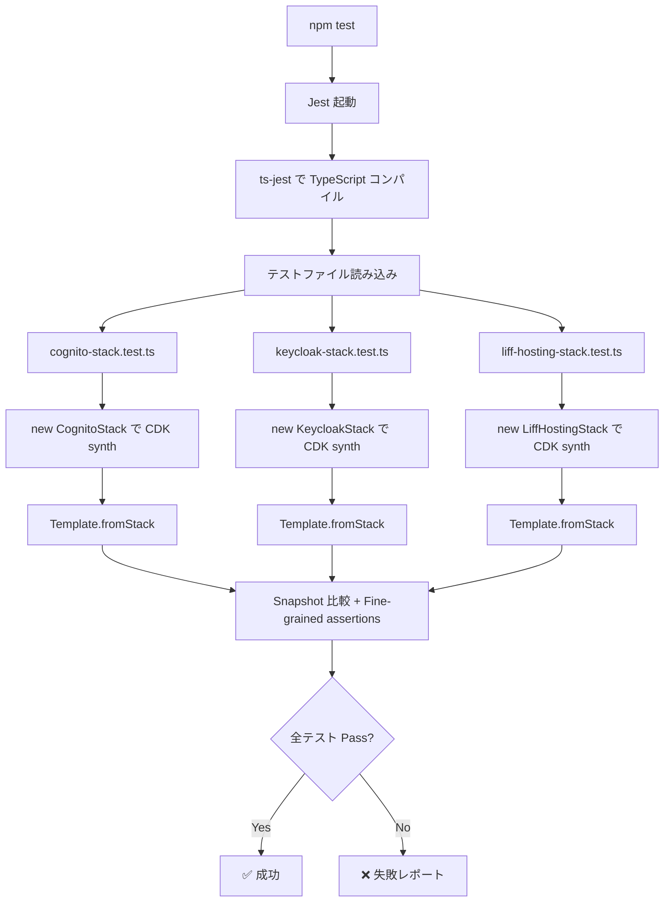
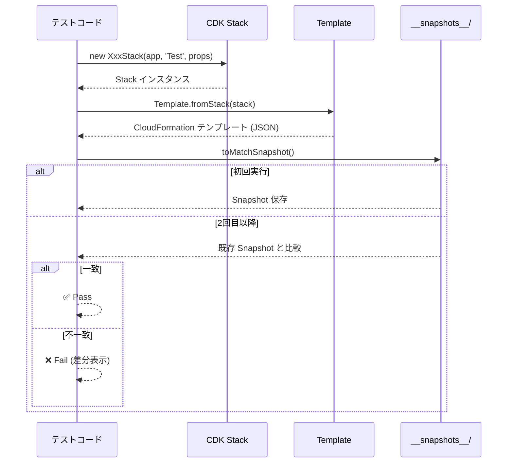
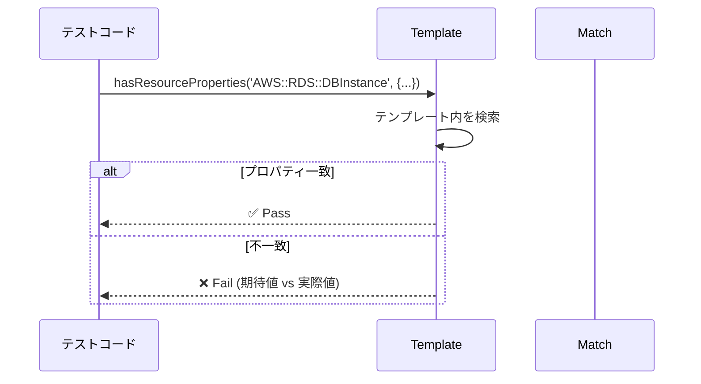
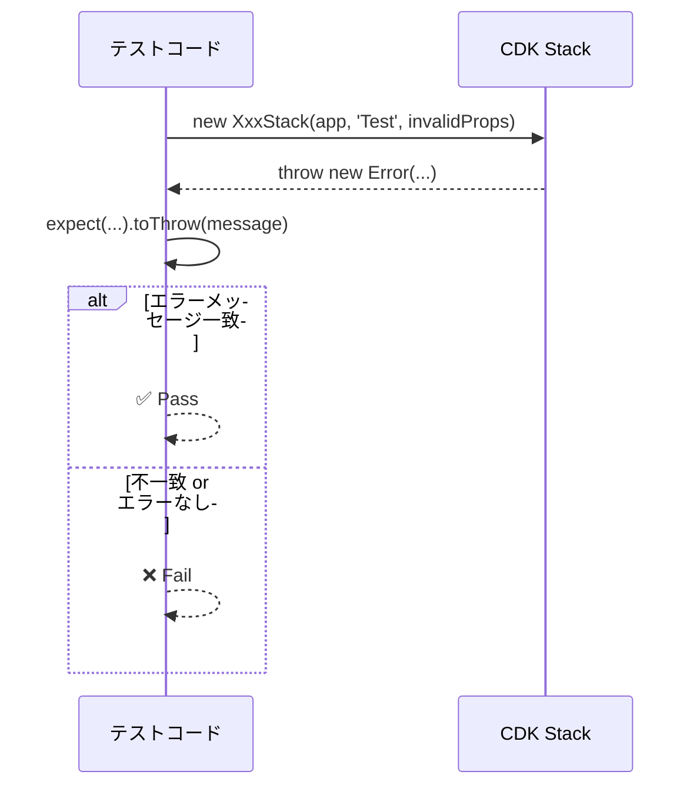
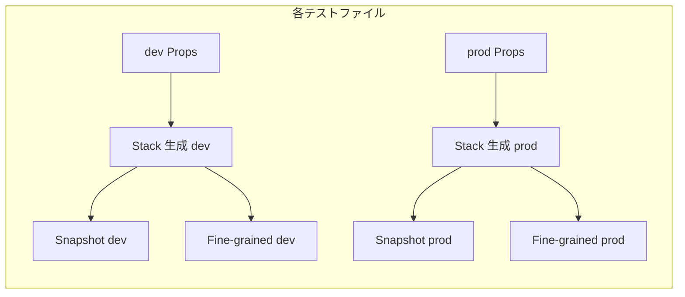

# infra-cdk-tests データフロー図

**作成日**: 2026-03-03
**関連アーキテクチャ**: [architecture.md](architecture.md)
**関連要件定義**: [requirements.md](../../spec/infra-cdk-tests/requirements.md)

**【信頼性レベル凡例】**:
- 🔵 **青信号**: 要件定義書・CDK ドキュメント・ユーザヒアリングを参考にした確実なフロー

---

## テスト実行フロー 🔵

**信頼性**: 🔵 *Jest + CDK assertions の標準動作より*

## 各テスト種別のデータフロー 🔵

**信頼性**: 🔵 *CDK assertions API ドキュメントより*

### Snapshot テスト

### Fine-grained assertions

### Validation テスト

## dev/prod テスト生成パターン 🔵

**信頼性**: 🔵 *テスト戦略・既存コードの isProd パターンより*

## 関連文書

- **アーキテクチャ**: [architecture.md](architecture.md)
- **要件定義**: [requirements.md](../../spec/infra-cdk-tests/requirements.md)

## 信頼性レベルサマリー

- 🔵 青信号: 4件 (100%)
- 🟡 黄信号: 0件 (0%)
- 🔴 赤信号: 0件 (0%)

**品質評価**: ✅ 高品質
