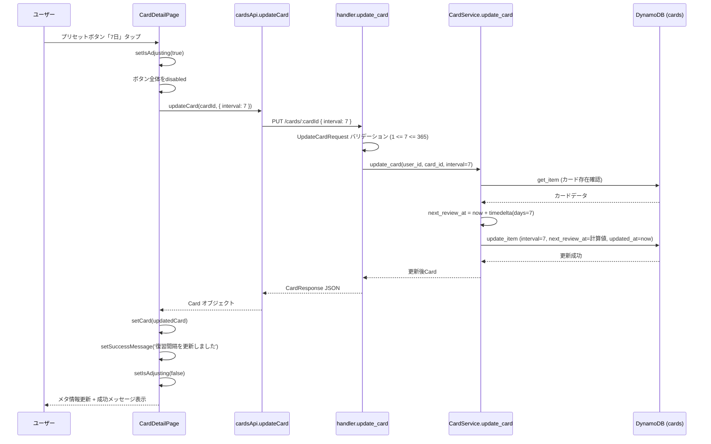
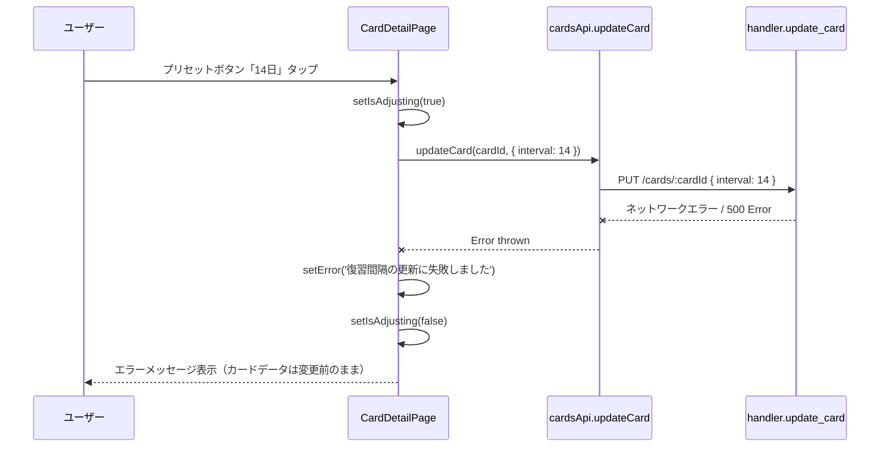
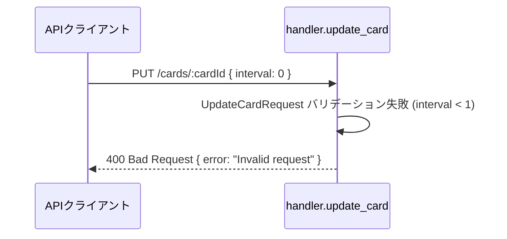
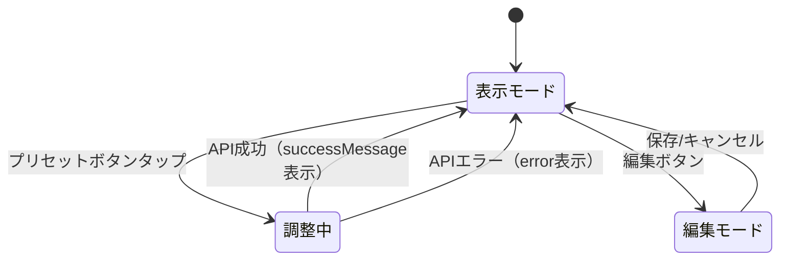

# interval-adjust データフロー図

**作成日**: 2026-02-28
**関連アーキテクチャ**: [architecture.md](architecture.md)
**関連要件定義**: [requirements.md](../../spec/interval-adjust/requirements.md)

**【信頼性レベル凡例】**:
- 🔵 **青信号**: EARS要件定義書・設計文書・ユーザヒアリングを参考にした確実なフロー
- 🟡 **黄信号**: EARS要件定義書・設計文書・ユーザヒアリングから妥当な推測によるフロー
- 🔴 **赤信号**: EARS要件定義書・設計文書・ユーザヒアリングにない推測によるフロー

---

## 1. 間隔調整の正常フロー 🔵

**信頼性**: 🔵 *要件定義 REQ-001〜004・ユーザストーリー1.1より*

**関連要件**: REQ-001, REQ-002, REQ-003, REQ-004, REQ-201, REQ-203



**詳細ステップ**:
1. ユーザーがプリセットボタン（例:「7日」）をタップ
2. CardDetailPageが `isAdjusting=true` に設定し、全ボタンを無効化
3. `cardsApi.updateCard(cardId, { interval: 7 })` でAPIを呼び出し
4. バックエンドで `UpdateCardRequest` のバリデーション（`1 <= interval <= 365`）
5. `CardService.update_card` でカード存在確認後、interval と next_review_at を更新
6. **重要**: ease_factor と repetitions は DynamoDB更新式に含めない（不変）
7. review_history にも記録しない（復習操作ではないため）
8. 更新後のカードデータをレスポンスとして返却
9. フロントエンドでカード状態を更新し、成功メッセージを表示

## 2. 間隔調整のエラーフロー 🟡

**信頼性**: 🟡 *既存エラーハンドリングパターン・REQ-103から妥当な推測*

**関連要件**: REQ-103, EDGE-001



**詳細ステップ**:
1. ユーザーがプリセットボタンをタップ
2. API呼び出しが失敗（ネットワークエラー、サーバーエラー等）
3. catch ブロックでエラーメッセージを設定
4. `setCard()` を呼ばないため、表示データは変更前のまま
5. `isAdjusting=false` に戻し、ボタンを再度有効化

## 3. バリデーションエラーフロー 🔵

**信頼性**: 🔵 *REQ-101, REQ-102より*

**関連要件**: REQ-101, REQ-102



**備考**: プリセットボタン経由では無効な値（0, 366等）は送信されないため、このフローは主にAPI直接呼び出し時のガードとして機能する。

## 4. DynamoDB更新式の詳細 🔵

**信頼性**: 🔵 *既存 CardService.update_card の実装パターンより*

interval が指定された場合の DynamoDB UpdateExpression:

```
SET #interval = :interval,
    next_review_at = :next_review_at,
    updated_at = :updated_at
```

**変更対象フィールド**:
| フィールド | 変更 | 値 |
|-----------|------|-----|
| interval | ✅ | ユーザー指定値（1〜365） |
| next_review_at | ✅ | `datetime.now(UTC) + timedelta(days=interval)` |
| updated_at | ✅ | `datetime.now(UTC)` |
| ease_factor | ❌ | 変更しない |
| repetitions | ❌ | 変更しない |
| review_history | ❌ | 変更しない |

**注意**: interval と front/back を同時に指定することも可能。その場合は全フィールドを1つの UpdateExpression でまとめて更新する（既存パターンと同様）。

## 5. フロントエンド状態管理 🟡

**信頼性**: 🟡 *既存 CardDetailPage の状態管理パターンから妥当な推測*



**状態一覧**:
- `isAdjusting: boolean` - 間隔調整API呼び出し中（新規追加）
- `card: Card | null` - 現在のカードデータ（既存、更新後に差し替え）
- `error: string | null` - エラーメッセージ（既存、再利用）
- `successMessage: string | null` - 成功メッセージ（既存、再利用）

## 関連文書

- **アーキテクチャ**: [architecture.md](architecture.md)
- **要件定義**: [requirements.md](../../spec/interval-adjust/requirements.md)

## 信頼性レベルサマリー

- 🔵 青信号: 4件 (80%)
- 🟡 黄信号: 1件 (20%)
- 🔴 赤信号: 0件 (0%)

**品質評価**: ✅ 高品質
