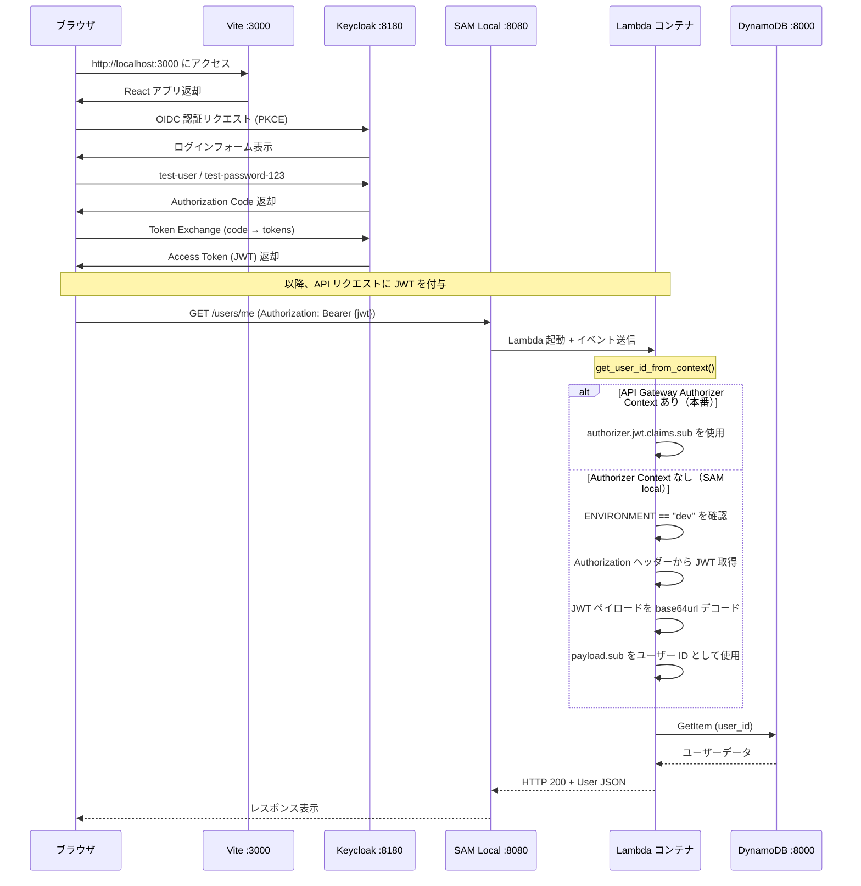
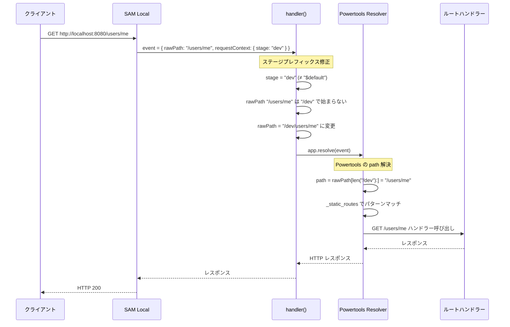
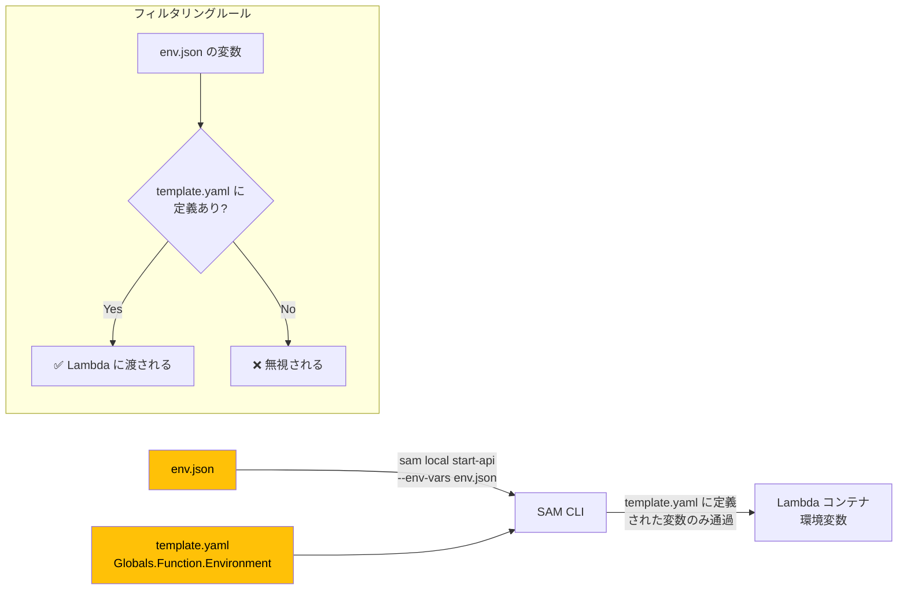
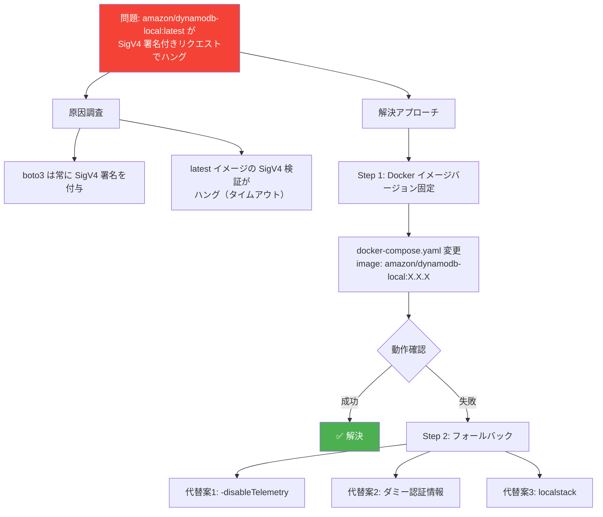
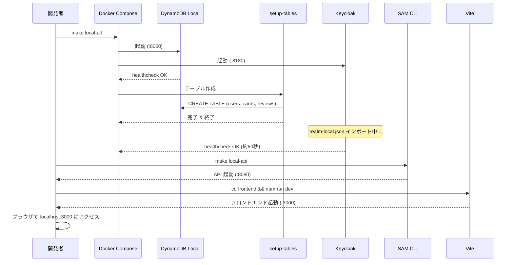
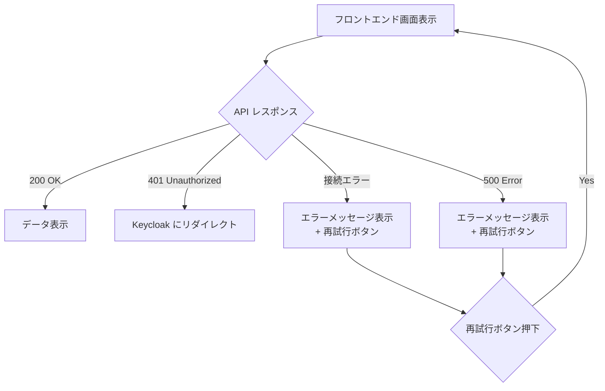

# ローカル開発環境構築 データフロー図

**作成日**: 2026-02-23
**関連アーキテクチャ**: [architecture.md](architecture.md)
**関連要件定義**: [requirements.md](../../spec/local-dev-environment/requirements.md)

**【信頼性レベル凡例】**:
- 🔵 **青信号**: 計画ファイル・ユーザヒアリングから確実なフロー
- 🟡 **黄信号**: 技術仕様・実装経験から妥当な推測によるフロー
- 🔴 **赤信号**: 推測によるフロー

---

## 認証フロー（Keycloak OIDC + JWT フォールバック） 🔵

**信頼性**: 🔵 *計画ファイル・realm-local.json・ユーザヒアリングより*
**関連要件**: REQ-LD-033, REQ-LD-034, REQ-LD-061〜064



---

## SAM Local ルーティングフロー（ステージプレフィックス修正） 🔵

**信頼性**: 🔵 *計画ファイルより*
**関連要件**: REQ-LD-011, REQ-LD-012



**比較: 修正前の動作（バグ）**:
```
rawPath: "/users/me" → Powertools: rawPath[len("/dev"):] = "/rs/me" → 404 Not Found
```

---

## DynamoDB 接続フロー 🔵

**信頼性**: 🔵 *計画ファイルより・ユーザヒアリングより*
**関連要件**: REQ-LD-021, REQ-LD-022, REQ-LD-071〜073

```mermaid
flowchart TD
    A[サービスクラス初期化] --> B{DYNAMODB_ENDPOINT_URL<br/>が設定されている?}
    B -->|Yes| C[endpoint_url = DYNAMODB_ENDPOINT_URL]
    B -->|No| D{AWS_ENDPOINT_URL<br/>が設定されている?}
    D -->|Yes| E[endpoint_url = AWS_ENDPOINT_URL]
    D -->|No| F[デフォルト AWS エンドポイント<br/>（本番動作）]

    C --> G[boto3.resource&#40;dynamodb, endpoint_url&#41;]
    E --> G
    F --> H[boto3.resource&#40;dynamodb&#41;]

    G --> I[DynamoDB Local :8000]
    H --> J[AWS DynamoDB 本番]

    style I fill:#4CAF50,color:#fff
    style J fill:#2196F3,color:#fff
```



### Docker Network 経由の接続 🔵

```
Lambda コンテナ → memoru-network → dynamodb-local:8000
  (endpoint_url = "http://dynamodb-local:8000")

ホストマシン → localhost:8000 (ポートフォワード)
  (endpoint_url = "http://localhost:8000")
```

---

## env.json → Lambda 環境変数フロー 🔵

**信頼性**: 🔵 *計画ファイルより*
**関連要件**: REQ-LD-022



**解決策（計画ファイルより）**:
```yaml
# template.yaml Globals に追加
Globals:
  Function:
    Environment:
      Variables:
        DYNAMODB_ENDPOINT_URL: ""  # 空文字で定義 → env.json の値で上書き
        AWS_ENDPOINT_URL: ""       # 同上
```

---

## DynamoDB Local SigV4 問題と解決フロー 🔵

**信頼性**: 🔵 *ユーザヒアリング（Docker イメージ変更方針決定）*
**関連要件**: REQ-LD-071, REQ-LD-103



---

## ローカル環境起動シーケンス 🔵

**信頼性**: 🔵 *計画ファイルより*



---

## エラーハンドリングフロー 🔵

**信頼性**: 🔵 *計画ファイルより*



**計画ファイルよりの画面**:
| 画面 | エラー時の表示 |
|------|--------------|
| カード一覧 | 「カードの取得に失敗しました」+ 再試行 |
| 設定 | 「設定の取得に失敗しました」+ 再試行 |
| LINE連携 | 「LINE連携状態の取得に失敗しました」+ 再試行 |

---

## 関連文書

- **アーキテクチャ**: [architecture.md](architecture.md)
- **要件定義**: [requirements.md](../../spec/local-dev-environment/requirements.md)
- **受け入れ基準**: [acceptance-criteria.md](../../spec/local-dev-environment/acceptance-criteria.md)

## 信頼性レベルサマリー

| レベル | 件数 | 割合 |
|--------|------|------|
| 🔵 青信号 | 8件 | 100% |
| 🟡 黄信号 | 0件 | 0% |
| 🔴 赤信号 | 0件 | 0% |

**品質評価**: ✅ 高品質（全フローが計画ファイル・要件定義・ユーザヒアリングに基づく）
