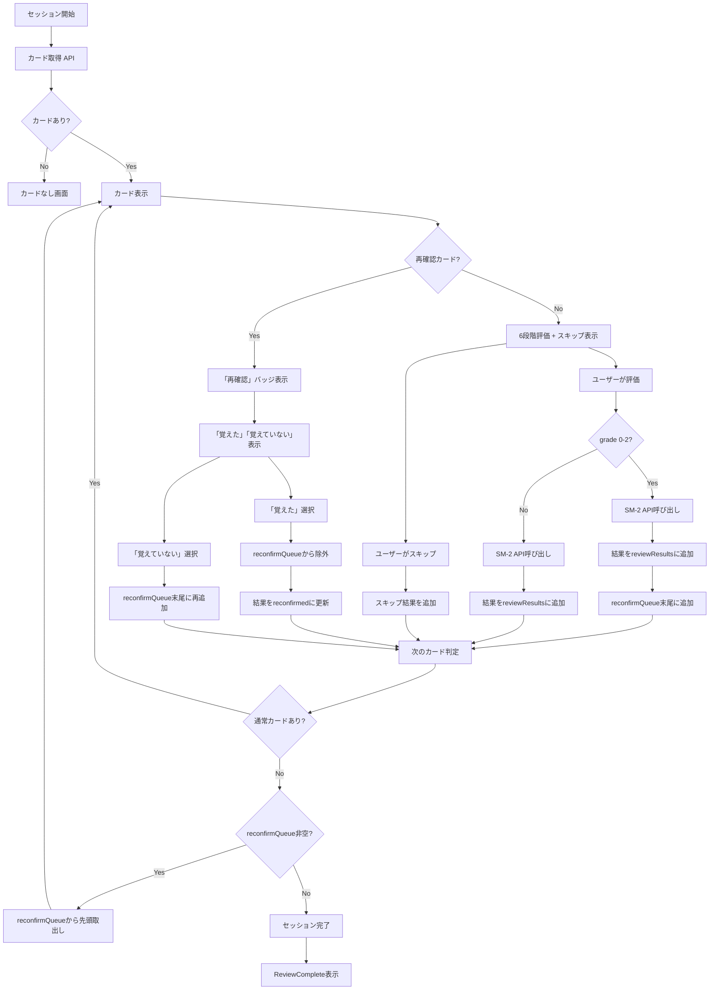
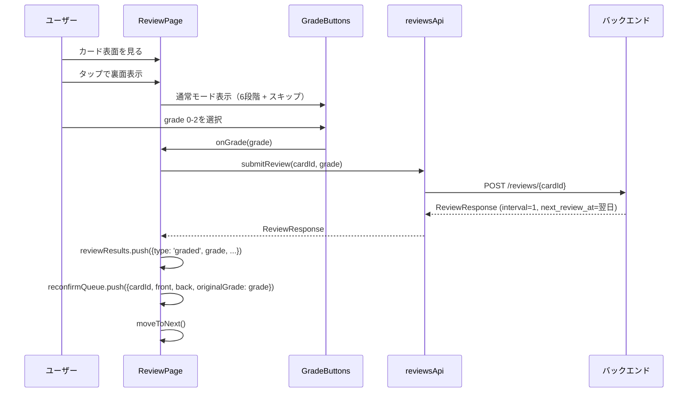
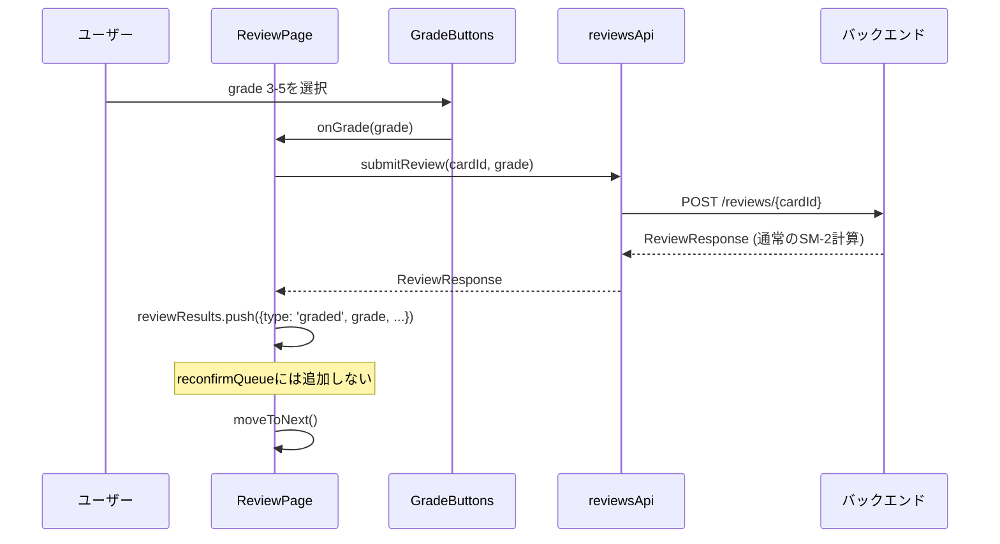
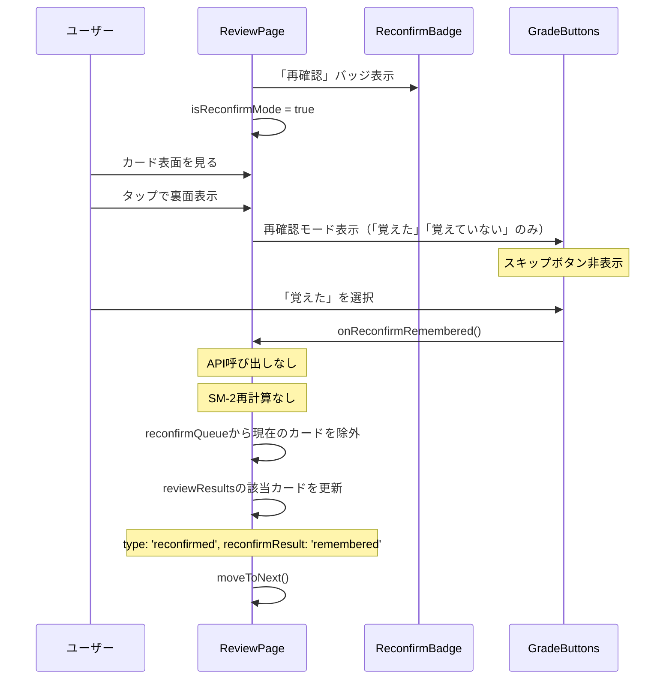
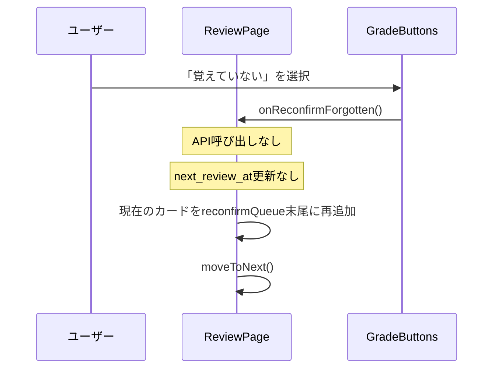
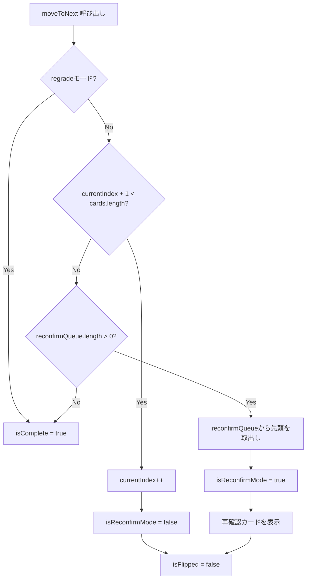
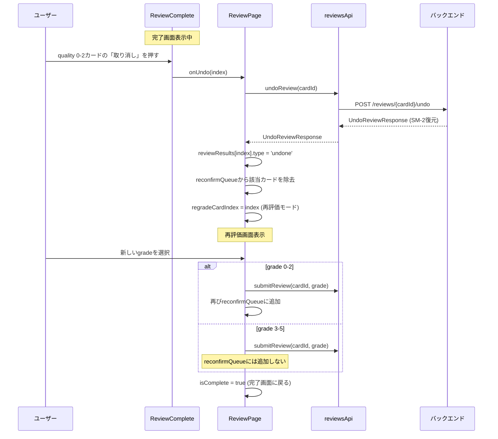
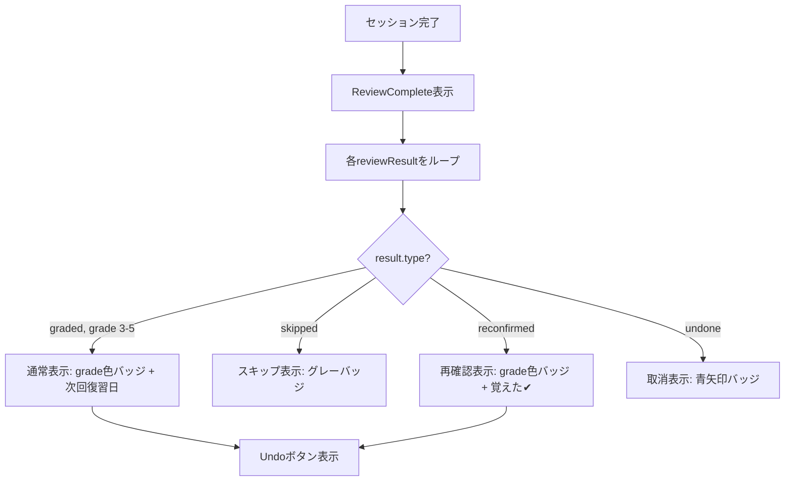
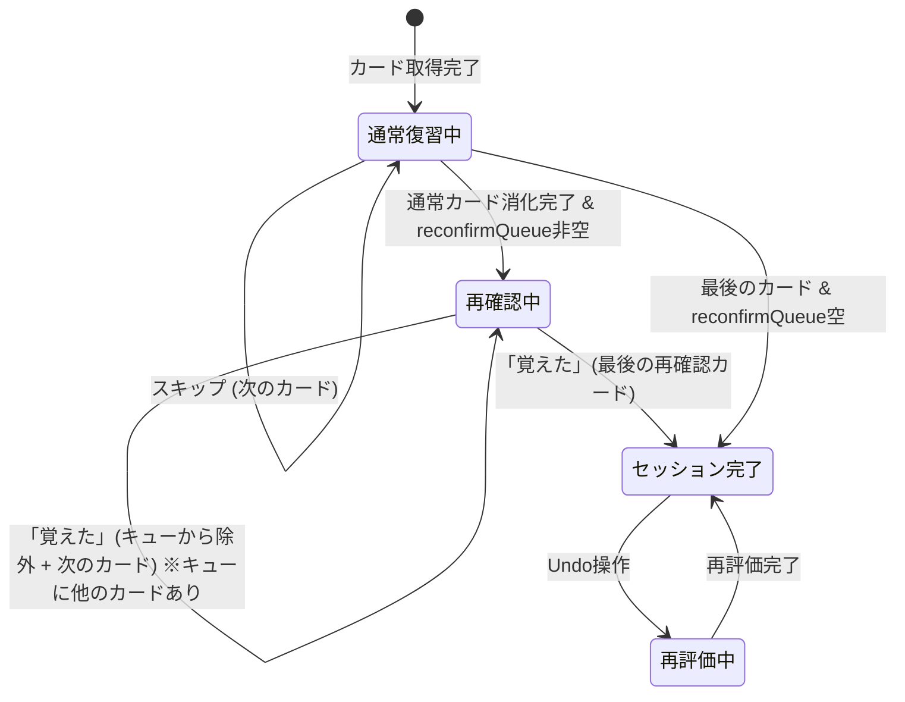
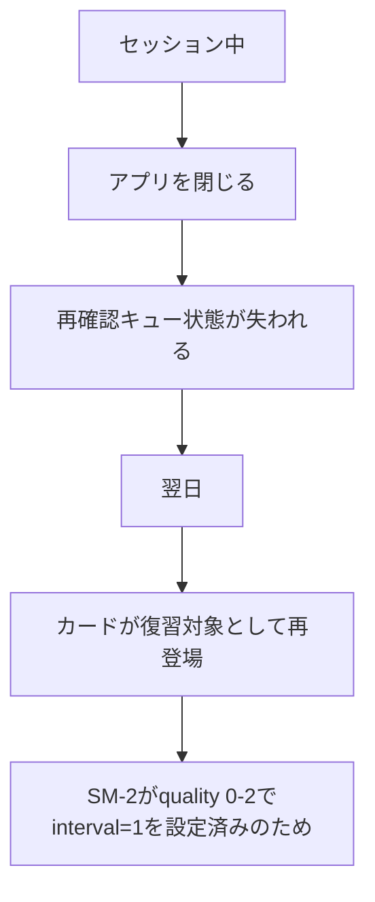

# review-reconfirm データフロー図

**作成日**: 2026-02-28
**関連アーキテクチャ**: [architecture.md](architecture.md)
**関連要件定義**: [requirements.md](../../spec/review-reconfirm/requirements.md)

**【信頼性レベル凡例】**:
- 🔵 **青信号**: EARS要件定義書・設計文書・ユーザヒアリングを参考にした確実なフロー
- 🟡 **黄信号**: EARS要件定義書・設計文書・ユーザヒアリングから妥当な推測によるフロー
- 🔴 **赤信号**: EARS要件定義書・設計文書・ユーザヒアリングにない推測によるフロー

---

## 全体フロー概要 🔵

**信頼性**: 🔵 *要件定義書 REQ-001~005, REQ-502より*

## 通常評価フロー（grade 0-2） 🔵

**信頼性**: 🔵 *要件定義書 REQ-001, ユーザーストーリー1.1より*

**関連要件**: REQ-001, REQ-005

**詳細ステップ**:
1. ユーザーがカードの表面を見る
2. タップで裏面を確認する
3. 6段階評価（0-5）とスキップボタンが表示される
4. quality 0, 1, または 2 を選択する
5. SM-2 API が呼び出される（interval=1, next_review_at=翌日 に設定）
6. 結果が `reviewResults` に追加される
7. カードが `reconfirmQueue` の末尾に追加される
8. 次のカードに進む

## 通常評価フロー（grade 3-5） 🔵

**信頼性**: 🔵 *要件定義書 REQ-103より*

**関連要件**: REQ-103

## 再確認フロー（「覚えた」） 🔵

**信頼性**: 🔵 *要件定義書 REQ-003, REQ-005, REQ-101, REQ-102より*

**関連要件**: REQ-003, REQ-005, REQ-101, REQ-102

**詳細ステップ**:
1. 再確認キューからカードが取り出される
2. 「再確認」バッジが表示される
3. カード表面 → 裏面確認 の通常フロー
4. 「覚えた」「覚えていない」の2択が表示される（スキップなし）
5. 「覚えた」を選択
6. API呼び出しなし、SM-2再計算なし
7. 再確認キューからカードを除外
8. `reviewResults`の該当カードを `type: 'reconfirmed'` に更新
9. 次のカードに進む

## 再確認フロー（「覚えていない」） 🔵

**信頼性**: 🔵 *要件定義書 REQ-004より*

**関連要件**: REQ-004

**詳細ステップ**:
1. 「覚えていない」を選択
2. API呼び出しなし、復習日更新なし
3. 現在のカードが再確認キューの末尾に再追加される
4. 次のカードに進む（別のカードがあれば先にそちらを表示）

## カード進行判定フロー（moveToNext拡張） 🔵

**信頼性**: 🔵 *要件定義書 REQ-502・ヒアリングQ5回答より*

**関連要件**: REQ-502

## Undo連携フロー 🔵

**信頼性**: 🔵 *要件定義書 REQ-404・ヒアリングQ4回答より*

**関連要件**: REQ-404

## 完了画面表示フロー 🔵

**信頼性**: 🔵 *要件定義書 REQ-501・ヒアリングQ3回答より*

**関連要件**: REQ-501

**再確認カードの完了画面表示**:
- 元の評価（例: quality 2）のバッジを色付きで表示
- 「覚えた✔」のサブラベルを追加表示
- Undoボタンを表示（取り消し可能）

## 状態遷移図 🔵

**信頼性**: 🔵 *要件定義書 REQ-001~004より*

## セッション中断時の動作 🔵

**信頼性**: 🔵 *要件定義書 REQ-201, EDGE-001より*

再確認ループの状態はセッション内のフロントエンド状態のみで管理し、セッション終了時にリセットされる。SM-2が最初のquality 0-2評価時にinterval=1（翌日）を設定済みのため、翌日に通常の復習対象として再登場する。

## 関連文書

- **アーキテクチャ**: [architecture.md](architecture.md)
- **要件定義**: [requirements.md](../../spec/review-reconfirm/requirements.md)
- **ユーザストーリー**: [user-stories.md](../../spec/review-reconfirm/user-stories.md)
- **受け入れ基準**: [acceptance-criteria.md](../../spec/review-reconfirm/acceptance-criteria.md)

## 信頼性レベルサマリー

- 🔵 青信号: 10件 (100%)
- 🟡 黄信号: 0件 (0%)
- 🔴 赤信号: 0件 (0%)

**品質評価**: ✅ 高品質
