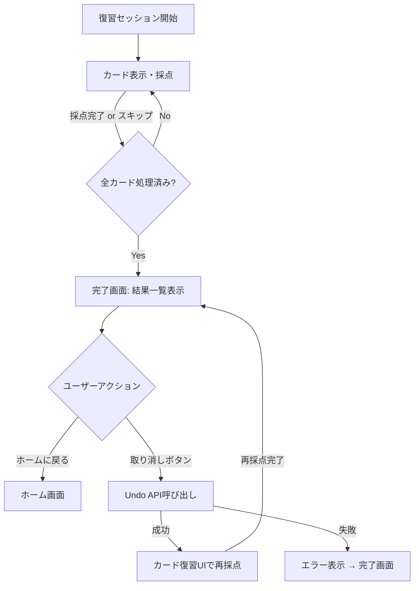
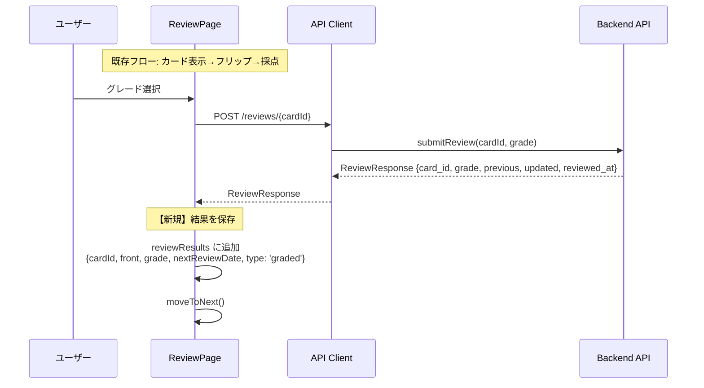
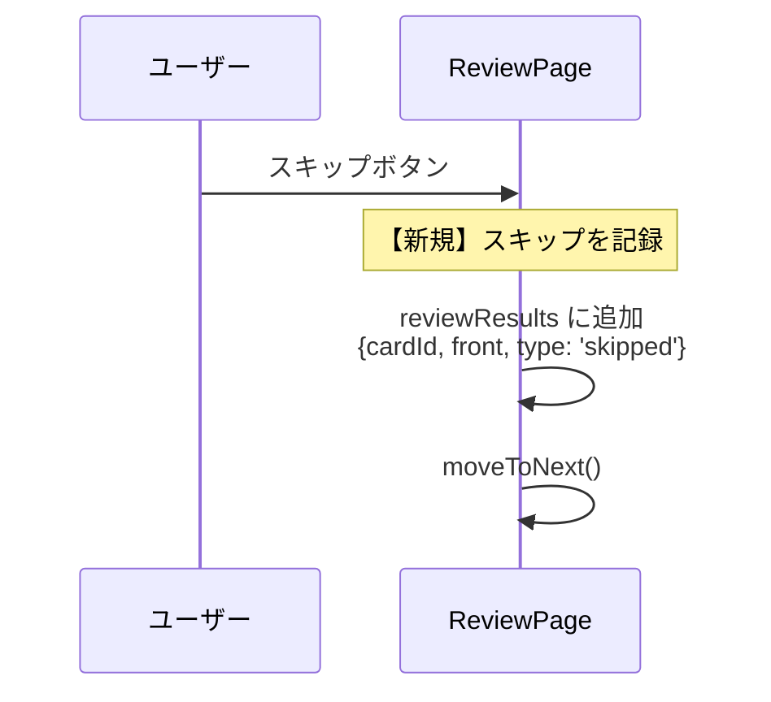
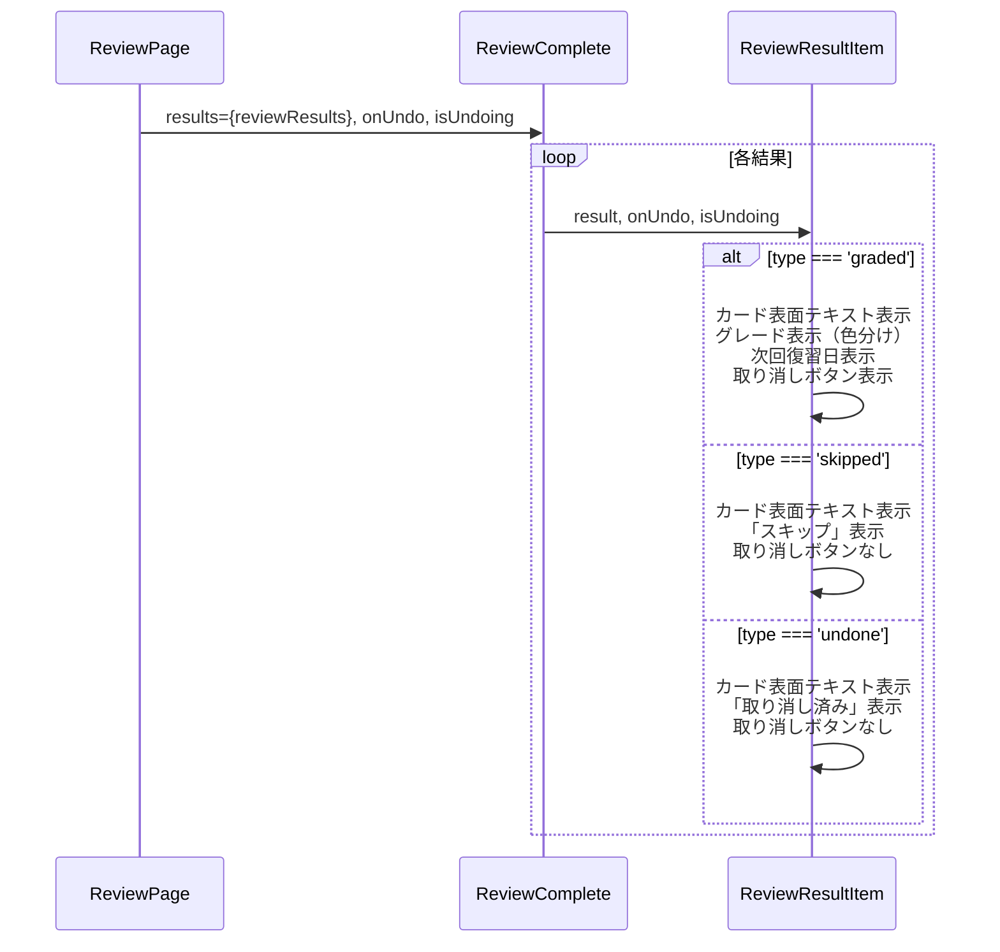
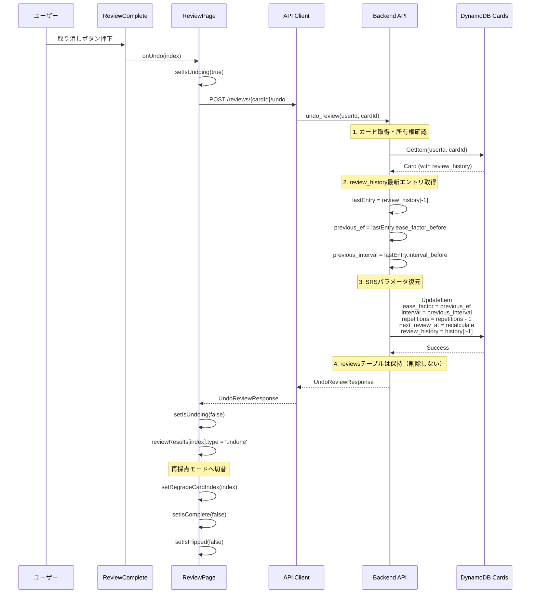
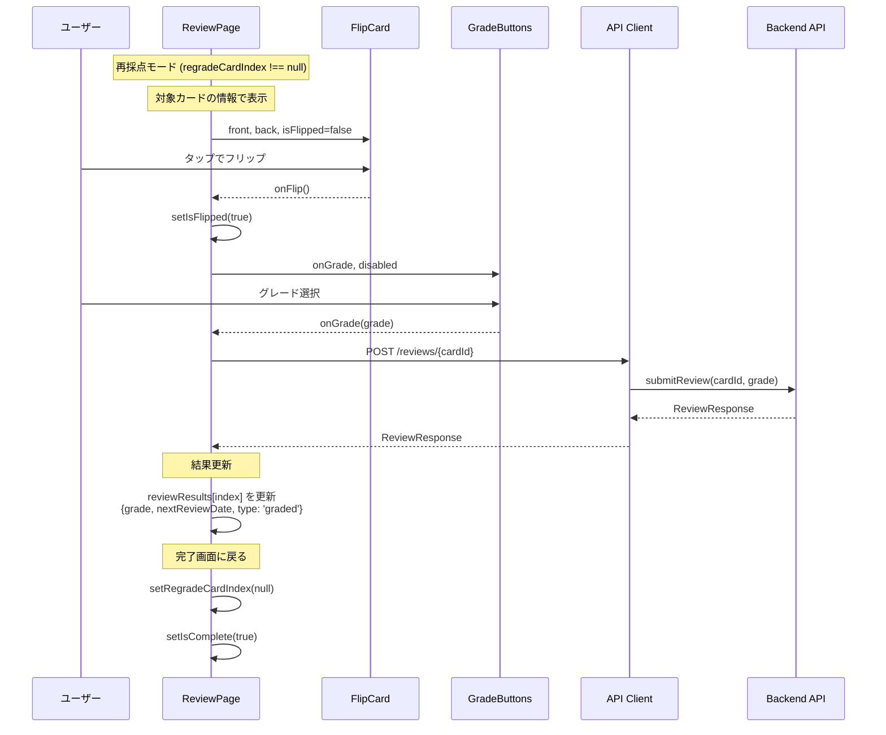
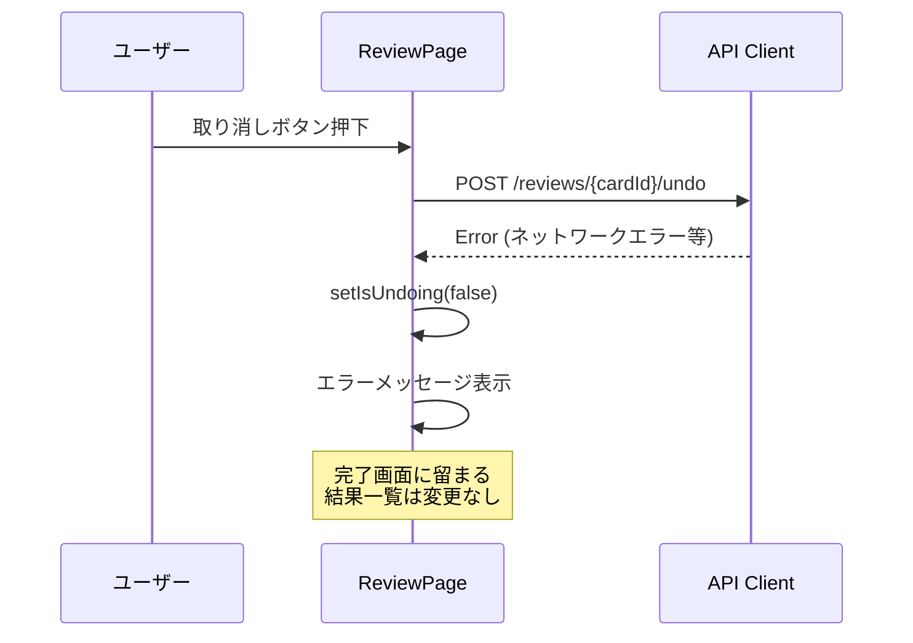
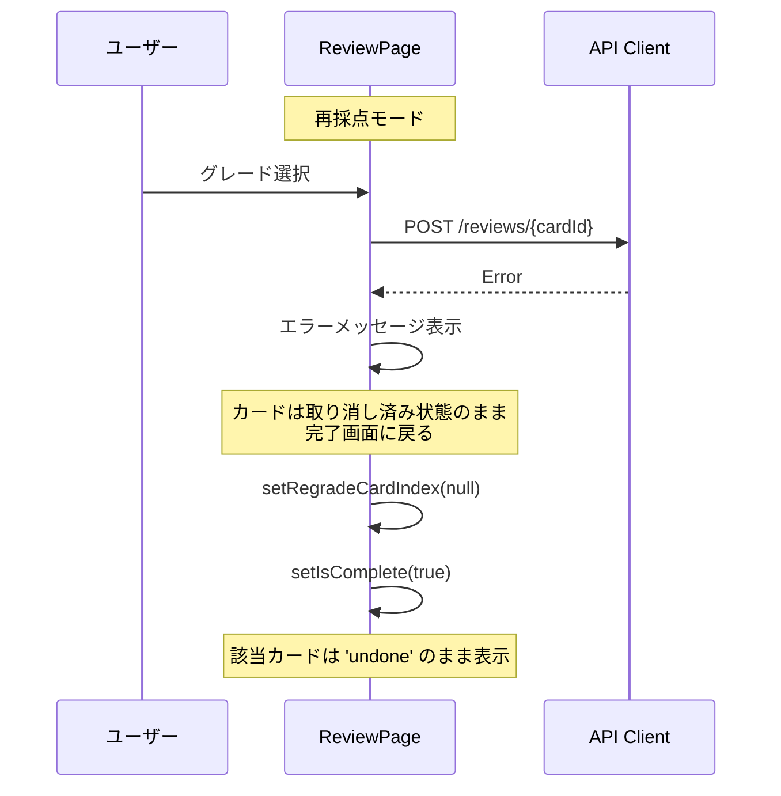
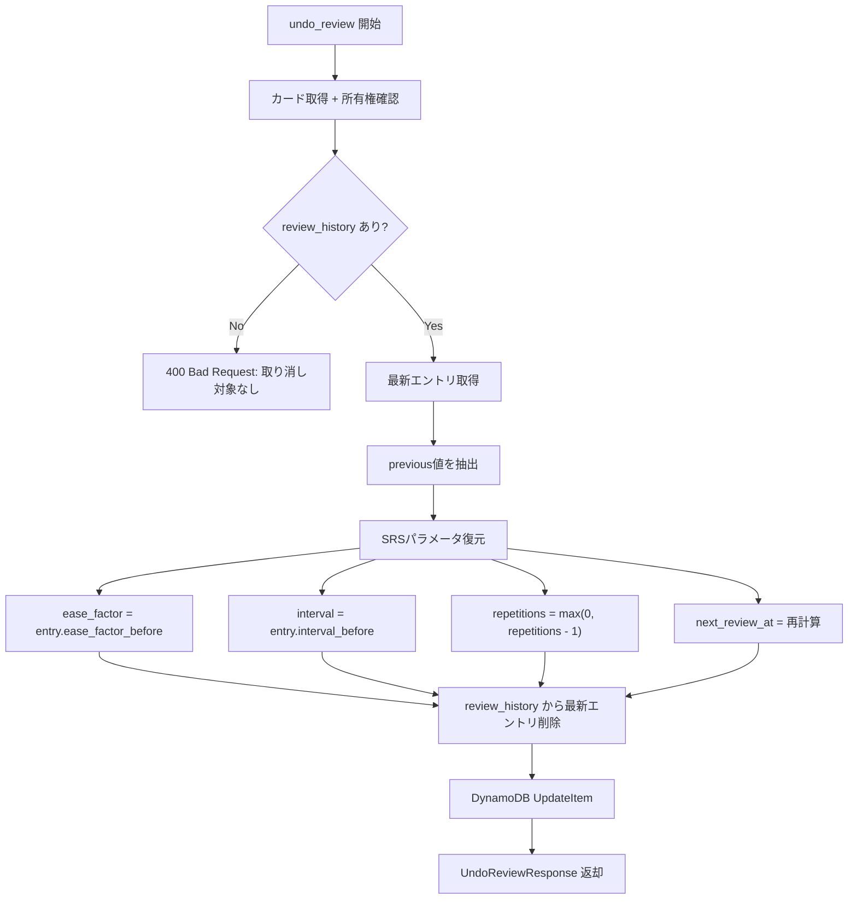
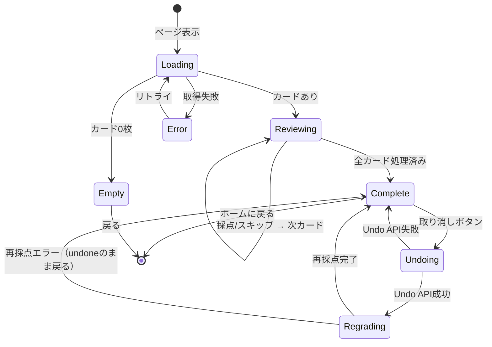

# review-undo データフロー図

**作成日**: 2026-02-28
**関連アーキテクチャ**: [architecture.md](architecture.md)
**関連要件定義**: [requirements.md](../../spec/review-undo/requirements.md)

**【信頼性レベル凡例】**:
- 🔵 **青信号**: EARS要件定義書・設計文書・ユーザヒアリングを参考にした確実なフロー
- 🟡 **黄信号**: EARS要件定義書・設計文書・ユーザヒアリングから妥当な推測によるフロー
- 🔴 **赤信号**: EARS要件定義書・設計文書・ユーザヒアリングにない推測によるフロー

---

## 全体フロー概要 🔵

**信頼性**: 🔵 *要件定義・ユーザヒアリングより*

## 1. 復習セッション（採点結果保持フロー） 🔵

**信頼性**: 🔵 *既存review-flow dataflow.md・要件定義REQ-013より*

**関連要件**: REQ-013

既存の復習フローに「採点結果の保持」を追加。

**スキップ時**:

## 2. 完了画面表示フロー 🔵

**信頼性**: 🔵 *要件定義REQ-001〜004・ユーザヒアリングより*

**関連要件**: REQ-001, REQ-002, REQ-003, REQ-004

## 3. 取り消し（Undo）フロー 🔵

**信頼性**: 🔵 *要件定義REQ-005〜008・設計ヒアリングより*

**関連要件**: REQ-005, REQ-006, REQ-007, REQ-008, REQ-101

## 4. 再採点フロー 🔵

**信頼性**: 🔵 *要件定義REQ-007, REQ-008, REQ-203・ユーザヒアリングより*

**関連要件**: REQ-007, REQ-008, REQ-103, REQ-203

## 5. エラーハンドリングフロー 🟡

**信頼性**: 🟡 *一般的なエラーハンドリングから妥当な推測*

**関連要件**: REQ-102, EDGE-001, EDGE-002

### Undo APIエラー

### 再採点APIエラー

## 6. バックエンドUndo処理詳細 🔵

**信頼性**: 🔵 *既存review_service.py・srs.py実装より*

### SRSパラメータ復元ロジック

### repetitions の復元 🟡

**信頼性**: 🟡 *SM-2アルゴリズムの動作から妥当な推測*

review_historyにはrepetitions_beforeが保存されていないため、以下のロジックで復元する:
- グレード0-2の場合（repetitions=0にリセット）: 元のrepetitionsを正確に復元できない
- グレード3-5の場合（repetitions+1）: `repetitions - 1` で復元

**対策**: review_historyエントリに `repetitions_before` と `repetitions_after` を追加保存する。

### next_review_at の復元 🟡

**信頼性**: 🟡 *SM-2アルゴリズムの動作から妥当な推測*

review_historyにはnext_review_at_beforeが保存されていないため:
- 復元したintervalから `now + timedelta(days=interval)` で再計算する
- 完全な復元ではないが、実用上問題ない（undoの直後に再採点するため）

**対策**: review_historyエントリに `next_review_at_before` を追加保存する。

## 7. 状態遷移図 🔵

**信頼性**: 🔵 *要件定義・ユーザヒアリングより*

## 8. データテーブル 🔵

**信頼性**: 🔵 *既存実装・要件定義より*

### フロントエンド状態

| 状態 | 型 | 初期値 | 説明 |
|------|-----|--------|------|
| reviewResults | SessionCardResult[] | [] | セッション中の全結果 |
| regradeCardIndex | number \| null | null | 再採点中のカードindex |
| isUndoing | boolean | false | undo API呼び出し中 |
| undoingIndex | number \| null | null | undo中のカードindex |

### SessionCardResult

| フィールド | 型 | 説明 |
|-----------|-----|------|
| cardId | string | カードID |
| front | string | カード表面テキスト |
| grade | number \| null | 採点グレード（スキップ時はnull） |
| nextReviewDate | string \| null | 次回復習日（ISO日付） |
| type | 'graded' \| 'skipped' \| 'undone' | 結果タイプ |

### API入出力

| エンドポイント | メソッド | 入力 | 出力 | 説明 |
|---------------|---------|------|------|------|
| /reviews/{cardId}/undo | POST | なし | UndoReviewResponse | SRSパラメータ復元 |
| /reviews/{cardId} | POST | {grade} | ReviewResponse | 採点（既存） |

## 関連文書

- **アーキテクチャ**: [architecture.md](architecture.md)
- **型定義**: [interfaces.ts](interfaces.ts)
- **API仕様**: [api-endpoints.md](api-endpoints.md)
- **要件定義**: [requirements.md](../../spec/review-undo/requirements.md)

## 信頼性レベルサマリー

- 🔵 青信号: 9件 (75%)
- 🟡 黄信号: 3件 (25%)
- 🔴 赤信号: 0件 (0%)

**品質評価**: ✅ 高品質
