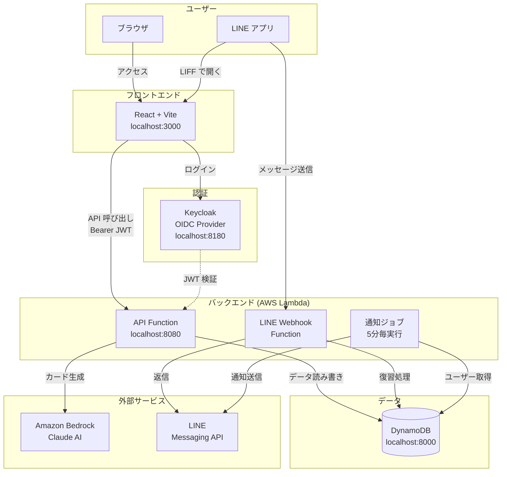
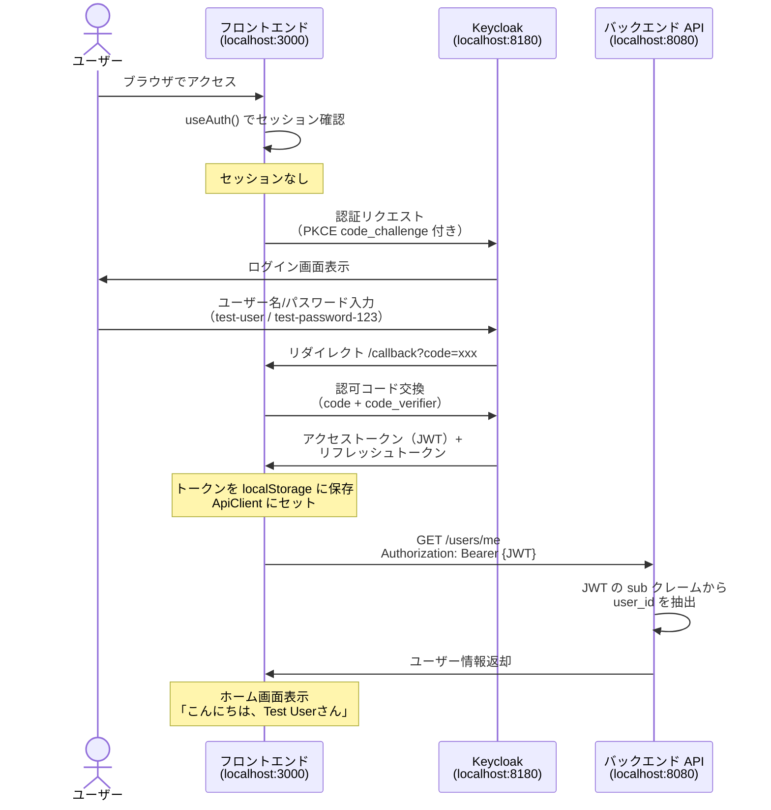
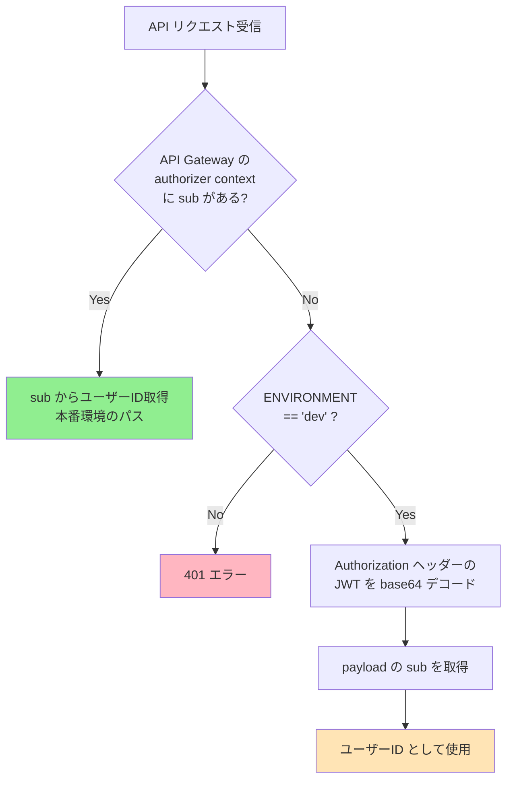
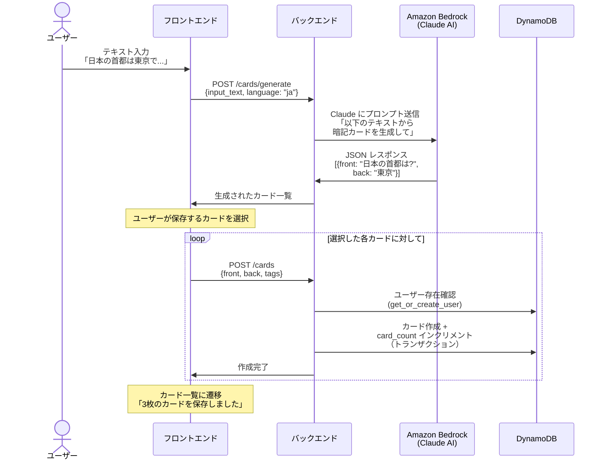
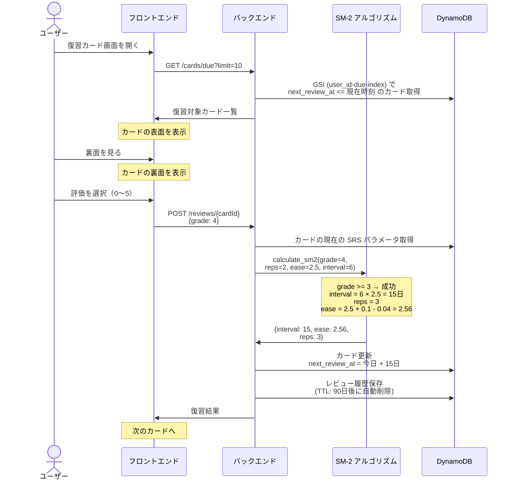
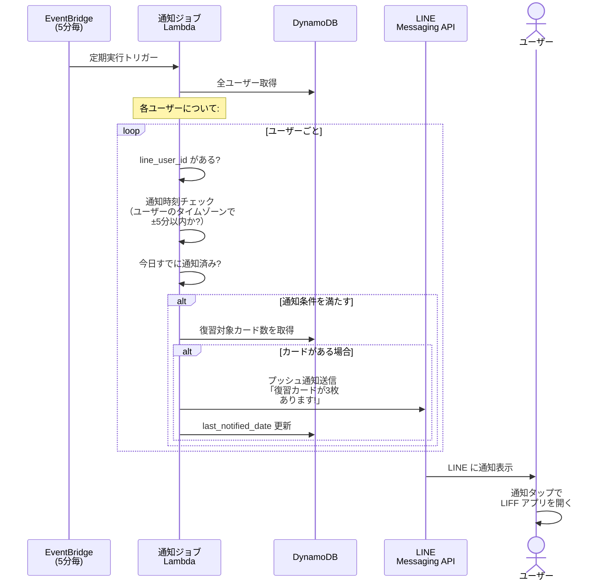
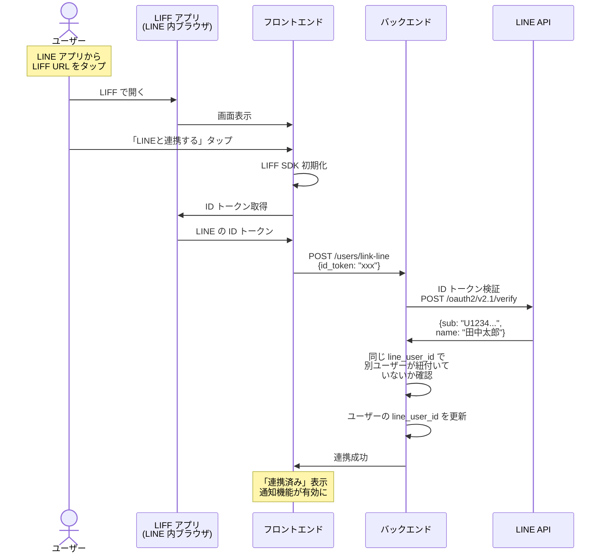
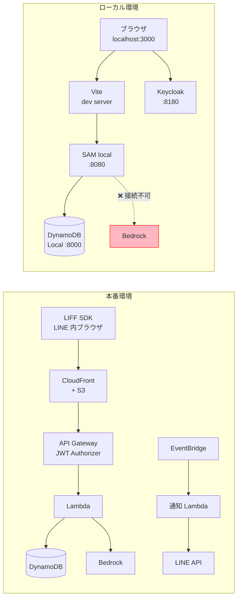

# Memoru システム全体像

## このドキュメントについて

Memoru は LINE ベースの暗記カードアプリです。AI がテキストからフラッシュカードを自動生成し、SM-2 アルゴリズムによる間隔反復学習（SRS）で効率的な暗記を支援します。

---

## 1. システム全体構成



---

## 2. ポート一覧（ローカル環境）

| ポート | サービス | 用途 |
|--------|---------|------|
| 3000 | Vite dev server | フロントエンド |
| 8080 | SAM local API | バックエンド API |
| 8180 | Keycloak | 認証サーバー |
| 8000 | DynamoDB Local | データベース |
| 8001 | DynamoDB Admin | DB 管理 UI |

---

## 3. 認証フロー

### 3.1 ログイン（OIDC + PKCE）



### 3.2 JWT フォールバック（ローカル開発専用）

SAM local では API Gateway の JWT Authorizer が動作しないため、バックエンドに dev 環境限定のフォールバックがあります。



> **安全性**: 本番では API Gateway が JWT 検証済みの sub を渡すので、フォールバックには到達しません。

---

## 4. 画面遷移

```mermaid
flowchart TD
    Login[ログイン画面<br/>Keycloak] --> Callback[/callback<br/>トークン交換]
    Callback --> Home

    subgraph アプリ画面
        Home[🏠 ホーム<br/>復習カード数表示]
        Generate[✨ カード作成<br/>AI テキスト→カード生成]
        Cards[📚 カード一覧<br/>全カード表示]
        CardDetail[📝 カード詳細<br/>編集・復習]
        Settings[⚙️ 設定<br/>通知時刻・アカウント]
        LinkLine[🔗 LINE 連携<br/>LINE アカウント紐付け]
    end

    Home -->|ナビ: 作成| Generate
    Home -->|ナビ: カード| Cards
    Home -->|ナビ: 設定| Settings
    Home -->|クイックアクション| Generate
    Home -->|クイックアクション| Cards

    Cards -->|カードタップ| CardDetail
    Cards -->|カードを作成する| Generate

    Settings -->|LINE連携設定| LinkLine
    LinkLine -->|戻る| Settings

    Generate -->|保存後| Cards
```

### 各画面の役割

| 画面 | パス | 主な機能 |
|------|------|----------|
| ホーム | `/` | 今日の復習カード数、クイックアクション |
| カード作成 | `/generate` | テキスト入力 → AI でカード自動生成 → 選択して保存 |
| カード一覧 | `/cards` | 全カード表示（フィルター・検索） |
| カード詳細 | `/cards/:id` | カード内容の確認・編集・削除 |
| 設定 | `/settings` | 通知時刻変更、アカウント情報、ログアウト |
| LINE 連携 | `/link-line` | LINE アカウントとの紐付け（LIFF 環境でのみ動作） |

---

## 5. データフロー

### 5.1 カード生成フロー



> **ローカル環境の制限**: Bedrock はローカルでは利用できないため、カード生成は `BedrockServiceError` で失敗します。

### 5.2 復習（SRS）フロー



### SM-2 アルゴリズム概要

| 評価 | 意味 | 動作 |
|------|------|------|
| 0 | 全く覚えていない | リセット: interval=1, reps=0 |
| 1 | ほぼ覚えていない | リセット: interval=1, reps=0 |
| 2 | 間違えた | リセット: interval=1, reps=0 |
| 3 | 思い出すのに苦労した | 成功: 次回間隔を計算 |
| 4 | 少し迷ったが思い出せた | 成功: 次回間隔を計算 |
| 5 | 完璧に覚えていた | 成功: 次回間隔を計算 |

```
次回間隔の計算:
  1回目の成功 → 1日後
  2回目の成功 → 6日後
  3回目以降   → 前回間隔 × ease_factor
```

### 5.3 LINE 通知フロー



### 5.4 LINE アカウント連携フロー



---

## 6. データベース構造

### テーブル一覧

```mermaid
erDiagram
    USERS {
        string user_id PK "Keycloak の sub"
        string line_user_id "LINE ユーザーID (nullable)"
        string display_name "表示名"
        string picture_url "プロフィール画像"
        map settings "通知設定 JSON"
        string last_notified_date "最終通知日"
        string created_at "作成日時"
        string updated_at "更新日時"
    }

    CARDS {
        string user_id PK "ユーザーID"
        string card_id SK "カードID (UUID)"
        string front "表面（質問）"
        string back "裏面（答え）"
        list tags "タグ一覧"
        string next_review_at "次回復習日時"
        int interval "復習間隔（日）"
        float ease_factor "容易さ係数"
        int repetitions "成功回数"
        string created_at "作成日時"
    }

    REVIEWS {
        string card_id PK "カードID"
        string reviewed_at SK "復習日時"
        string user_id "ユーザーID"
        int grade "評価 (0-5)"
        int expires_at "TTL (90日後)"
    }

    USERS ||--o{ CARDS : "所有"
    CARDS ||--o{ REVIEWS : "復習履歴"
```

### GSI（グローバルセカンダリインデックス）

| テーブル | インデックス名 | PK | SK | 用途 |
|---------|--------------|----|----|------|
| Users | `line_user_id-index` | line_user_id | - | LINE ID → ユーザー逆引き |
| Cards | `user_id-due-index` | user_id | next_review_at | 復習対象カード取得 |
| Reviews | `user_id-reviewed_at-index` | user_id | reviewed_at | ユーザー別復習履歴 |

### settings フィールドの構造

```json
{
  "notification_time": "09:00",
  "timezone": "Asia/Tokyo"
}
```

---

## 7. バックエンド API 一覧

### ユーザー API

| メソッド | パス | 説明 |
|---------|------|------|
| GET | `/users/me` | 現在のユーザー情報取得 |
| PUT | `/users/me/settings` | 通知時刻・タイムゾーン更新 |
| POST | `/users/link-line` | LINE アカウント連携 |
| POST | `/users/me/unlink-line` | LINE 連携解除 |

### カード API

| メソッド | パス | 説明 |
|---------|------|------|
| GET | `/cards` | カード一覧（ページネーション対応） |
| POST | `/cards` | カード作成（上限 2000枚） |
| GET | `/cards/{cardId}` | カード詳細取得 |
| PUT | `/cards/{cardId}` | カード更新 |
| DELETE | `/cards/{cardId}` | カード削除（レビュー履歴も削除） |
| GET | `/cards/due` | 復習対象カード取得 |
| POST | `/cards/generate` | AI でカード生成（Bedrock） |

### レビュー API

| メソッド | パス | 説明 |
|---------|------|------|
| POST | `/reviews/{cardId}` | 復習結果送信（grade 0-5） |

---

## 8. ディレクトリ構造（主要ファイル）

```
memoru-liff/
├── frontend/                          # React フロントエンド
│   ├── src/
│   │   ├── App.tsx                    # ルーティング定義
│   │   ├── config/oidc.ts             # OIDC 設定（Keycloak 接続先）
│   │   ├── services/
│   │   │   ├── auth.ts                # 認証サービス（oidc-client-ts）
│   │   │   ├── api.ts                 # API クライアント（fetch + 401 リトライ）
│   │   │   └── liff.ts                # LIFF SDK 操作
│   │   ├── contexts/
│   │   │   ├── AuthContext.tsx         # 認証状態管理
│   │   │   └── CardsContext.tsx        # カード状態管理
│   │   ├── hooks/useAuth.ts           # 認証フック
│   │   ├── pages/
│   │   │   ├── HomePage.tsx           # ホーム画面
│   │   │   ├── GeneratePage.tsx       # AI カード生成
│   │   │   ├── CardsPage.tsx          # カード一覧
│   │   │   ├── CardDetailPage.tsx     # カード詳細
│   │   │   ├── SettingsPage.tsx       # 設定
│   │   │   ├── LinkLinePage.tsx       # LINE 連携
│   │   │   └── CallbackPage.tsx       # OIDC コールバック
│   │   └── types/                     # TypeScript 型定義
│   ├── .env.development               # ローカル開発環境変数
│   └── vite.config.ts                 # Vite 設定（プロキシ含む）
│
├── backend/                           # Python バックエンド
│   ├── src/
│   │   ├── api/handler.py             # API エンドポイント（全ルート定義）
│   │   ├── models/
│   │   │   ├── user.py                # ユーザーモデル
│   │   │   ├── card.py                # カードモデル（SRS パラメータ含む）
│   │   │   ├── review.py              # レビューモデル
│   │   │   └── generate.py            # AI 生成リクエスト/レスポンス
│   │   ├── services/
│   │   │   ├── user_service.py        # ユーザー CRUD
│   │   │   ├── card_service.py        # カード CRUD（上限管理）
│   │   │   ├── review_service.py      # レビュー処理 + SRS 更新
│   │   │   ├── srs.py                 # SM-2 アルゴリズム
│   │   │   ├── bedrock.py             # Amazon Bedrock (Claude) 呼び出し
│   │   │   ├── line_service.py        # LINE API 通信
│   │   │   ├── notification_service.py # 通知判定ロジック
│   │   │   └── prompts.py             # AI プロンプトテンプレート
│   │   ├── webhook/line_handler.py    # LINE Webhook 処理
│   │   └── jobs/due_push_handler.py   # 定期通知ジョブ
│   ├── tests/                         # テスト（260件）
│   ├── template.yaml                  # SAM テンプレート（Lambda + API Gateway）
│   ├── docker-compose.yaml            # ローカルサービス定義
│   ├── env.json                       # SAM local 環境変数
│   └── Makefile                       # 開発コマンド
│
└── infrastructure/
    ├── keycloak/
    │   ├── realm-local.json           # ローカル用 Keycloak 設定
    │   └── test-users.json            # テストユーザー定義
    └── liff-hosting/                  # CloudFront + S3 (本番用)
```

---

## 9. 本番環境 vs ローカル環境の違い



| 項目 | 本番 | ローカル |
|------|------|---------|
| 認証 | LINE Login → Keycloak (AWS) | ユーザー名/パスワード → Keycloak (Docker) |
| JWT 検証 | API Gateway JWT Authorizer | JWT フォールバック（base64 デコード） |
| データベース | DynamoDB (AWS) | DynamoDB Local (Docker) |
| AI カード生成 | Amazon Bedrock (Claude) | **利用不可**（エラーになる） |
| LINE 通知 | EventBridge → Lambda → LINE API | 未対応 |
| LINE 連携 | LIFF SDK で ID トークン取得 | **利用不可**（LIFF 環境外） |

---

## 10. ローカル開発でできること/できないこと

### できること

- ログイン/ログアウト（Keycloak テストユーザー）
- ホーム画面表示（復習カード数）
- カード一覧の閲覧
- カードの手動作成・編集・削除（API 直接）
- 設定画面の表示・通知時刻変更
- 全 260 件のテスト実行

### できないこと（外部サービス依存）

- **AI カード生成**: Bedrock に接続できないため失敗する
- **LINE 連携**: LIFF SDK は LINE アプリ内でのみ動作
- **LINE 通知**: LINE Messaging API のトークンが必要
- **LINE Bot 復習**: Webhook が外部から到達不可
