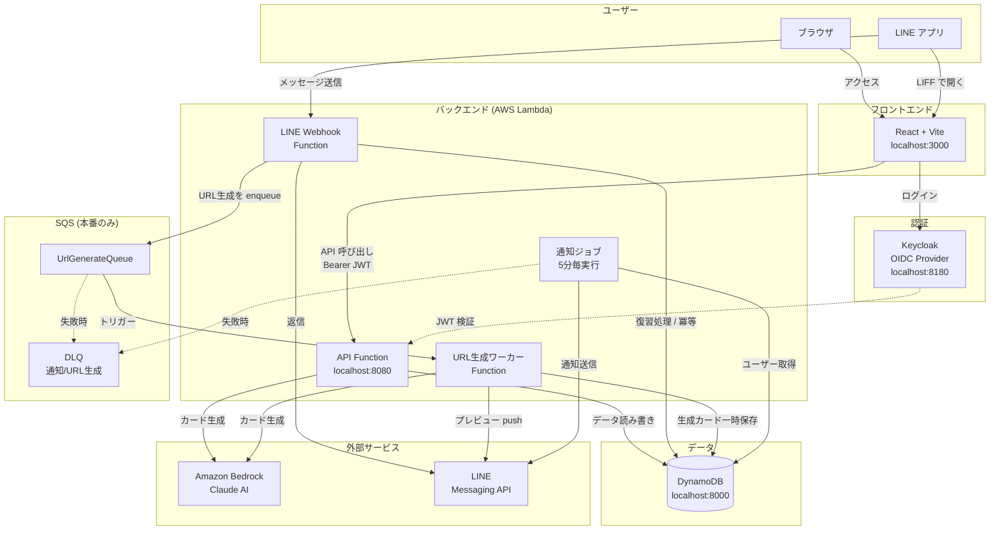
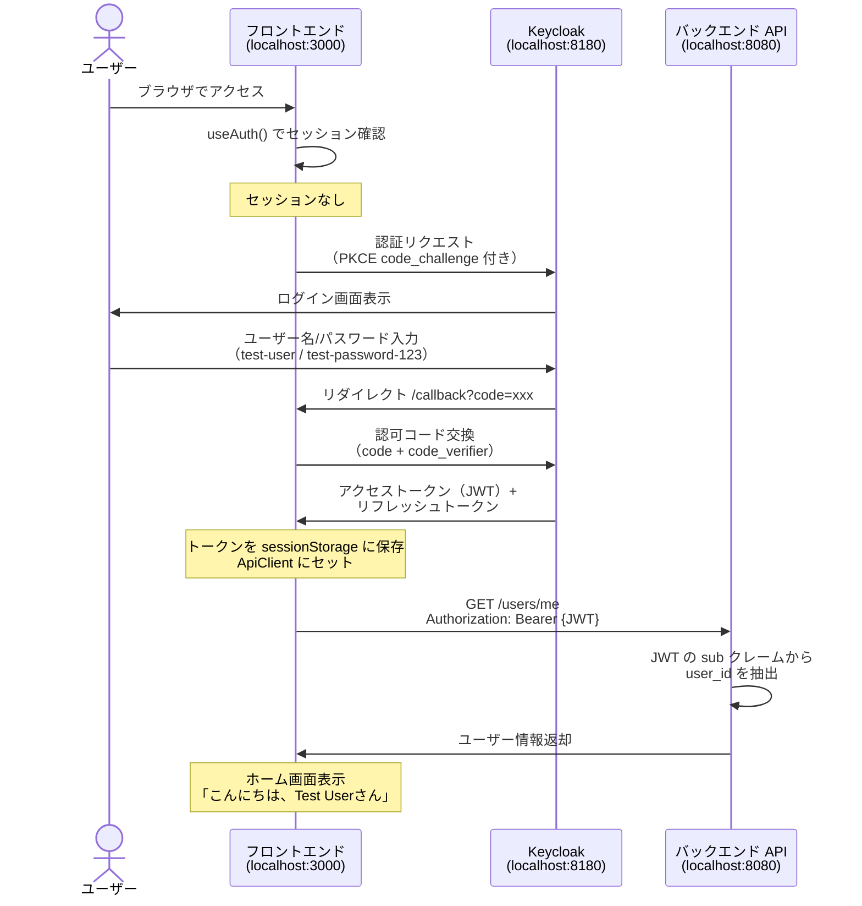
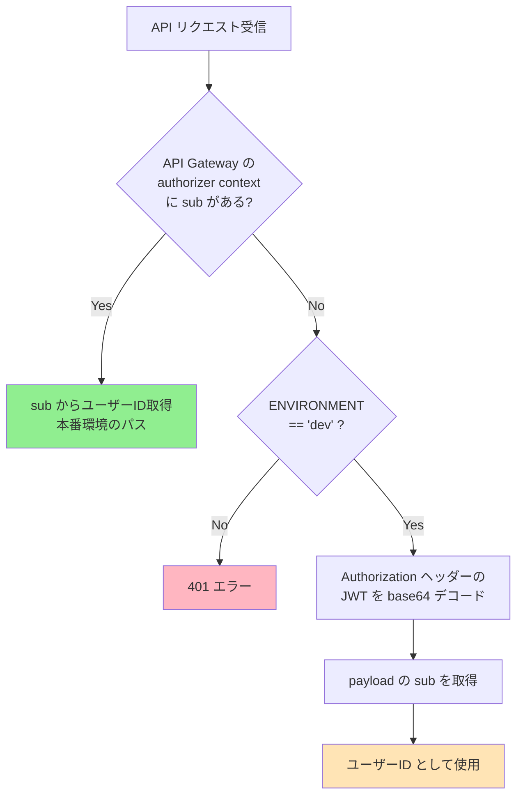
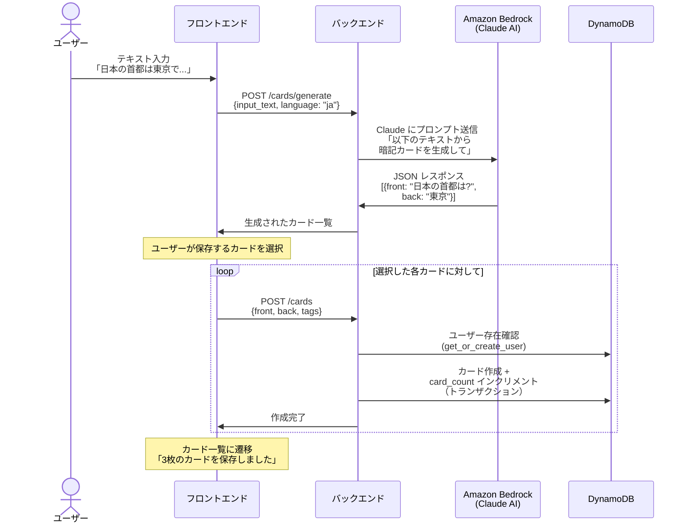
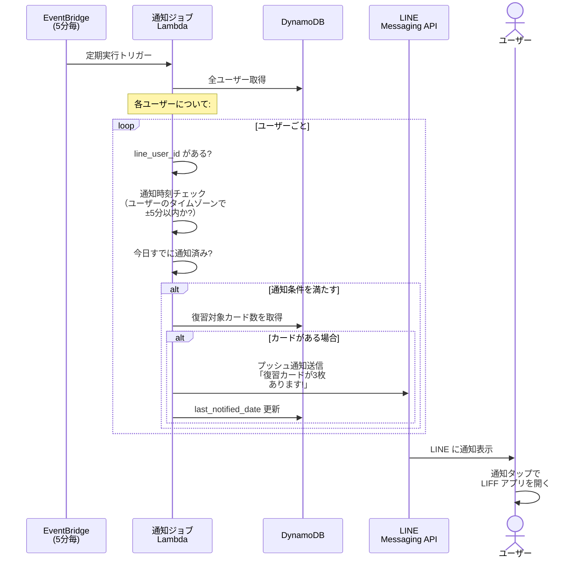
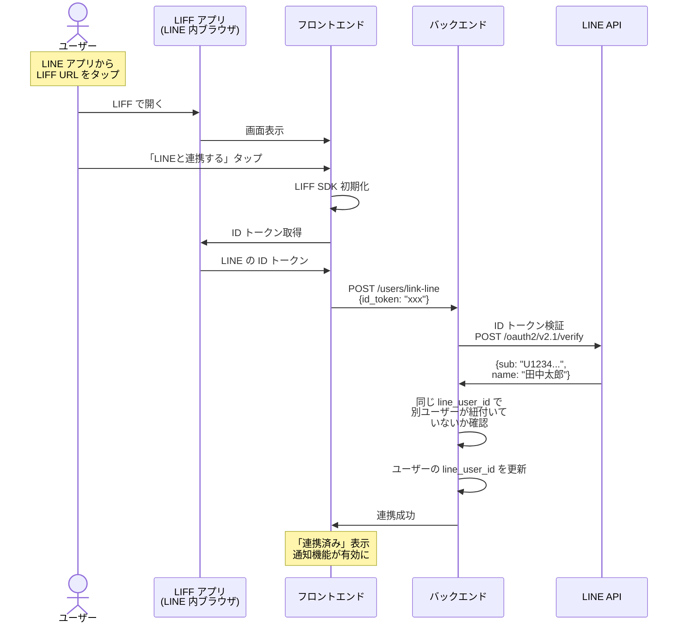
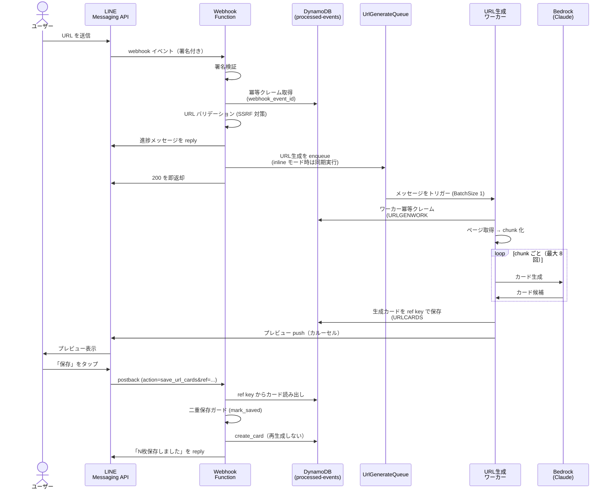
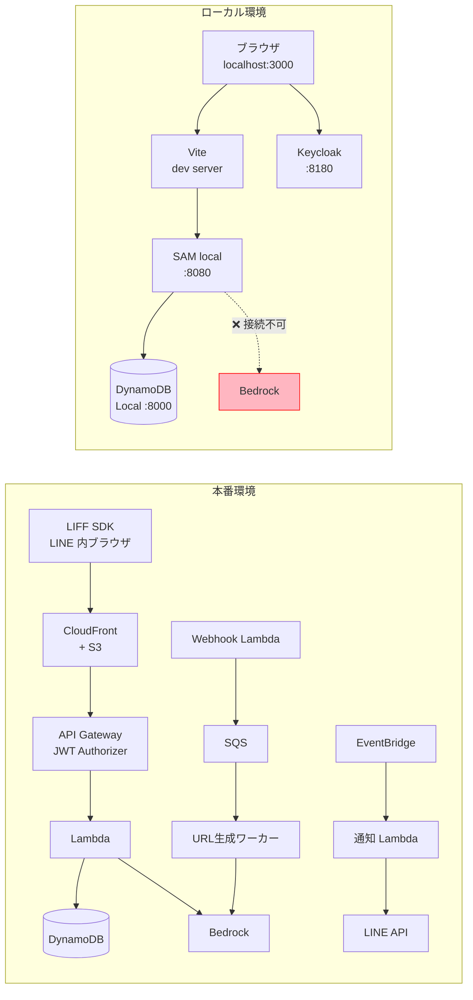

# Memoru システム全体像

## このドキュメントについて

Memoru は LINE ベースの暗記カードアプリです。AI がテキストからフラッシュカードを自動生成し、SM-2 アルゴリズムによる間隔反復学習（SRS）で効率的な暗記を支援します。

---

## 1. システム全体構成



> **ローカル環境の注記**: SQS（`UrlGenerateQueue` / DLQ）と URL 生成ワーカーは本番のみのリソースです。ローカルでは `URL_WORKER_MODE=inline` により Webhook が URL カード生成をその場で同期実行します（[§9](#9-本番環境-vs-ローカル環境の違い) 参照）。

---

## 2. ポート一覧（ローカル環境）

| ポート | サービス | 用途 |
|--------|---------|------|
| 3000 | Vite dev server | フロントエンド |
| 8080 | SAM local API | バックエンド API |
| 8180 | Keycloak | 認証サーバー |
| 8000 | DynamoDB Local | データベース |
| 8001 | DynamoDB Admin | DB 管理 UI |
| 11434 | Ollama | ローカル AI（Strands 経由のカード生成・チューター用） |

---

## 3. 認証フロー

### 3.1 ログイン（OIDC + PKCE）



### 3.2 JWT フォールバック（ローカル開発専用）

SAM local では API Gateway の JWT Authorizer が動作しないため、バックエンドに dev 環境限定のフォールバックがあります。



> **安全性**: 本番では API Gateway が JWT 検証済みの sub を渡すので、フォールバックには到達しません。

### 3.3 トークン保存と自動更新

トークンは **`sessionStorage`** に保存します（`frontend/src/config/oidc.ts` の `userStore` で明示固定）。`localStorage` は XSS 時の永続的なトークン窃取を避けるため使用せず、タブ単位・セッション単位の `sessionStorage` に留めます。

トークン更新の起点は次の 2 経路に集約しています（`frontend/src/services/auth.ts` のコメント A-2）。

1. **自動サイレント更新**: `oidcConfig.automaticSilentRenew: true` により、有効期限が近づくと oidc-client-ts が自動で `signinSilent()` を実行します。iframe フォールバック用に `/silent-renew` ルート（`SilentRenewPage`）を用意しています。更新された `User` は `onUserChanged`（`addUserLoaded`）イベントで `AuthContext` に伝播し、`apiClient.setAccessToken()` で新トークンを ApiClient へ反映します。
2. **API 401 リトライ**: `apiClient`（`frontend/src/services/api.ts`）は API レスポンスが 401 のとき `refreshToken()` でトークンを更新し、元のリクエストを 1 回だけ再実行します。リトライ後も 401 の場合はログイン画面へ誘導します。

---

## 4. 画面遷移

```mermaid
flowchart TD
    Login[ログイン画面<br/>Keycloak] --> Callback[/callback<br/>トークン交換]
    Callback --> Home

    subgraph アプリ画面
        Home[🏠 ホーム<br/>復習カード数・デッキ集計]
        Review[🔁 復習<br/>SRS 復習セッション]
        Generate[✨ カード作成<br/>AI テキスト/URL→カード生成]
        Cards[📚 カード一覧<br/>全カード表示]
        CardDetail[📝 カード詳細<br/>編集・復習]
        Decks[🗂️ デッキ<br/>デッキ管理]
        Stats[📊 統計<br/>学習統計・予測]
        Tutor[🎓 AI チューター<br/>対話学習]
        Settings[⚙️ 設定<br/>通知時刻・アカウント]
        LinkLine[🔗 LINE 連携<br/>LINE アカウント紐付け]
    end

    Home -->|クイックアクション| Review
    Home -->|クイックアクション| Generate
    Home -->|ナビ: カード| Cards
    Home -->|ナビ: 設定| Settings
    Home -->|デッキ集計| Decks

    Cards -->|カードタップ| CardDetail
    Cards -->|カードを作成する| Generate

    Settings -->|LINE連携設定| LinkLine
    LinkLine -->|戻る| Settings

    Generate -->|保存後| Cards
```

> **補足**: 統計 (`/stats`)・AI チューター (`/tutor`) も認証済みルートとして用意されています（`frontend/src/App.tsx`）。

### 各画面の役割

| 画面 | パス | 主な機能 |
|------|------|----------|
| ホーム | `/` | 今日の復習カード数、デッキ集計、クイックアクション |
| 復習 | `/review` | SRS 復習セッション（表面→裏面→評価） |
| カード作成 | `/generate` | テキスト/URL 入力 → AI でカード自動生成 → 選択して保存 |
| カード一覧 | `/cards` | 全カード表示（フィルター・検索） |
| カード詳細 | `/cards/:id` | カード内容の確認・編集・削除 |
| デッキ | `/decks` | デッキの作成・編集・削除 |
| 統計 | `/stats` | 学習統計サマリー、苦手カード、復習予測 |
| AI チューター | `/tutor` | AI との対話形式の学習 |
| 設定 | `/settings` | 通知時刻変更、アカウント情報、ログアウト |
| LINE 連携 | `/link-line` | LINE アカウントとの紐付け（LIFF 環境でのみ動作） |
| OIDC コールバック | `/callback` | 認可コード交換 |
| サイレント更新 | `/silent-renew` | トークン自動更新用 iframe コールバック（不可視） |

---

## 5. データフロー

### 5.1 カード生成フロー



> **ローカル環境の制限**: Bedrock はローカルでは利用できないため、Bedrock 経路のカード生成は失敗します。`USE_STRANDS=true` + ローカル Ollama（:11434）を使うとローカル AI で代替できます。

### 5.2 復習（SRS）フロー


### SM-2 アルゴリズム概要

| 評価 | 意味 | 動作 |
|------|------|------|
| 0 | 全く覚えていない | リセット: interval=1, reps=0 |
| 1 | ほぼ覚えていない | リセット: interval=1, reps=0 |
| 2 | 間違えた | リセット: interval=1, reps=0 |
| 3 | 思い出すのに苦労した | 成功: 次回間隔を計算 |
| 4 | 少し迷ったが思い出せた | 成功: 次回間隔を計算 |
| 5 | 完璧に覚えていた | 成功: 次回間隔を計算 |

```
次回間隔の計算:
  1回目の成功 → 1日後
  2回目の成功 → 6日後
  3回目以降   → 前回間隔 × ease_factor
```

### 5.3 LINE 通知フロー



### 5.4 LINE アカウント連携フロー



### 5.5 URL カード生成フロー（LINE チャット）

LINE トークに URL を送ると、AI がページ内容から暗記カードを生成し、プレビューを返します。LINE Webhook は API Gateway の 30 秒上限内に 200 を返す必要があるため、重い生成処理は SQS ワーカーへ非同期化しています（N-5）。



> **設計のポイント**:
> - 保存時は ref key からプレビュー済みカードを読み出してそのまま保存し、URL の再取得・Bedrock の再実行は行いません（プレビューと保存内容の一致 + AI 二重課金の回避）。
> - ワーカーは失敗を再試行可否で分類します。恒久エラー（テキスト抽出不可等）は即ユーザーへ通知して成功確定、一時エラーは SQS リトライ（最大 3 回）に委ね、最終試行で失敗したら DLQ へ送ります。
> - 冪等は単一の `memoru-processed-events-{env}` テーブルを名前空間で共用します（受付側 = `webhook_event_id`、ワーカー = `URLGENWORK#`、カード一時保存 = `URLCARDS#`）。
>
> 実装: `backend/src/webhook/line_handler.py` / `services/url_generation_service.py` / `jobs/url_generate_worker_handler.py` / `services/url_cards_store.py`。
>
> **ローカル環境**: `URL_WORKER_MODE=inline` のとき Webhook が SQS を介さず生成本体をその場で同期実行します（sam local が SQS → Lambda トリガーを再現できないため）。

> **補足**: フロントエンドの `POST /cards/generate-from-url`（[§7](#7-バックエンド-api-一覧)）は、上記の LINE 経由とは別系統で、LIFF 画面から同期的に URL カードを生成する専用 Lambda（`UrlGenerateFunction`）です。

---

## 6. データベース構造

### テーブル一覧

```mermaid
erDiagram
    USERS {
        string user_id PK "Keycloak の sub"
        string line_user_id "LINE ユーザーID (nullable)"
        string display_name "表示名"
        string picture_url "プロフィール画像"
        map settings "通知設定 JSON"
        string last_notified_date "最終通知日"
        string created_at "作成日時"
        string updated_at "更新日時"
    }

    CARDS {
        string user_id PK "ユーザーID"
        string card_id SK "カードID (UUID)"
        string front "表面（質問）"
        string back "裏面（答え）"
        list tags "タグ一覧"
        string next_review_at "次回復習日時"
        int interval "復習間隔（日）"
        float ease_factor "容易さ係数"
        int repetitions "成功回数"
        string created_at "作成日時"
    }

    REVIEWS {
        string card_id PK "カードID"
        string reviewed_at SK "復習日時"
        string user_id "ユーザーID"
        int grade "評価 (0-5)"
    }

    USERS ||--o{ CARDS : "所有"
    CARDS ||--o{ REVIEWS : "復習履歴"
```

> **Reviews の TTL は無効化済み**（I-7）: `review_service` は `expires_at` を書き込まないため、`template.yaml` でも `TimeToLiveSpecification` を設定していません。レビュー履歴は統計用に永久保持されます。

### 全テーブル一覧

| テーブル名 | キー | 用途・備考 |
|-----------|------|-----------|
| `memoru-users-{env}` | PK: user_id | ユーザー。`LINELINK#<line_user_id>` をキーとするロックアイテムで `link_line` の排他制御を行う |
| `memoru-cards-{env}` | PK: user_id / SK: card_id | カード（SRS パラメータ含む） |
| `memoru-reviews-{env}` | PK: card_id / SK: reviewed_at | レビュー履歴（TTL 無効・永久保持） |
| `memoru-decks-{env}` | PK: user_id / SK: deck_id | デッキ |
| `memoru-tutor-sessions-{env}` | PK: user_id / SK: session_id | AI チューターのセッション（TTL: `ttl`） |
| `memoru-browser-profiles-{env}` | PK: user_id / SK: profile_id | 認証付きページ取得用プロファイル（準備中） |
| `memoru-processed-events-{env}` | PK: webhook_event_id | Webhook 冪等 + URL カード一時保存（TTL: `expires_at`） |

### GSI（グローバルセカンダリインデックス）

| テーブル | インデックス名 | PK | SK | Projection | 用途 |
|---------|--------------|----|----|-----------|------|
| Users | `line_user_id-index` | line_user_id | - | ALL | LINE ID → ユーザー逆引き |
| Cards | `user_id-due-index` | user_id | next_review_at | ALL | 復習対象カード取得 |
| Cards | `deck-cards-index` | deck_index_key | next_review_at | KEYS_ONLY | デッキ別カード集計（`<user_id>#<deck_id>` をキーに COUNT クエリで件数/due 件数を算出。deck_id を持たないカードは投影されないスパースインデックス） |
| Reviews | `user_id-reviewed_at-index` | user_id | reviewed_at | ALL | ユーザー別復習履歴 |
| Tutor Sessions | `user_id-status-index` | user_id | status | ALL | ユーザー別セッション状態 |

### settings フィールドの構造

```json
{
  "notification_time": "09:00",
  "timezone": "Asia/Tokyo"
}
```

---

## 7. バックエンド API 一覧

### ユーザー API

| メソッド | パス | 説明 |
|---------|------|------|
| GET | `/users/me` | 現在のユーザー情報取得 |
| PUT | `/users/me/settings` | 通知時刻・タイムゾーン更新 |
| POST | `/users/link-line` | LINE アカウント連携 |
| POST | `/users/me/unlink-line` | LINE 連携解除 |

### カード API

| メソッド | パス | 説明 |
|---------|------|------|
| GET | `/cards` | カード一覧（ページネーション対応） |
| POST | `/cards` | カード作成（上限 2000枚） |
| GET | `/cards/{cardId}` | カード詳細取得 |
| PUT | `/cards/{cardId}` | カード更新 |
| DELETE | `/cards/{cardId}` | カード削除（レビュー履歴も削除） |
| GET | `/cards/due` | 復習対象カード取得 |
| POST | `/cards/generate` | AI でカード生成（Bedrock） |
| POST | `/cards/generate-from-url` | URL からの AI カード生成（専用 Lambda `UrlGenerateFunction`） |
| POST | `/cards/refine` | カード内容の AI 補足（表面・裏面の改善） |

### デッキ API

| メソッド | パス | 説明 |
|---------|------|------|
| POST | `/decks` | デッキ作成 |
| GET | `/decks` | デッキ一覧取得 |
| PUT | `/decks/{deckId}` | デッキ更新 |
| DELETE | `/decks/{deckId}` | デッキ削除 |

### レビュー API

| メソッド | パス | 説明 |
|---------|------|------|
| POST | `/reviews/{cardId}` | 復習結果送信（grade 0-5） |
| POST | `/reviews/{cardId}/undo` | 復習取り消し |
| POST | `/reviews/{cardId}/grade-ai` | AI による回答採点（専用 Lambda `ReviewsGradeAiFunction`） |

### 統計 API

| メソッド | パス | 説明 |
|---------|------|------|
| GET | `/stats` | 基本統計サマリー取得 |
| GET | `/stats/weak-cards` | 苦手カード一覧取得 |
| GET | `/stats/forecast` | 復習予測取得 |

### AI チューター API

| メソッド | パス | 説明 |
|---------|------|------|
| POST | `/tutor/sessions` | チューターセッション開始 |
| GET | `/tutor/sessions` | セッション一覧取得 |
| GET | `/tutor/sessions/{sessionId}` | セッション詳細取得 |
| POST | `/tutor/sessions/{sessionId}/messages` | メッセージ送信 |
| DELETE | `/tutor/sessions/{sessionId}` | セッション終了 |

> **注**: チューターは SessionManager 経由のマルチターン会話のため `USE_STRANDS=true` が必須です。`false` の場合、各エンドポイントは 503（`tutor_unavailable`）を返します。

### AI・学習 API

| メソッド | パス | 説明 |
|---------|------|------|
| GET | `/advice` | 学習アドバイス取得（専用 Lambda `AdviceFunction`） |

### ブラウザプロファイル API（準備中）

認証付きページ取得（AgentCore Browser 連携）用のプロファイル管理 API。バックエンドのブラウザ連携は現在無効化されています。

| メソッド | パス | 説明 |
|---------|------|------|
| GET | `/browser-profiles` | プロファイル一覧取得 |
| POST | `/browser-profiles` | プロファイル作成 |
| DELETE | `/browser-profiles/{profileId}` | プロファイル削除 |

### Webhook

| メソッド | パス | 説明 |
|---------|------|------|
| POST | `/webhook/line` | LINE Webhook（認証なし・署名検証で保護） |

---

## 8. ディレクトリ構造（主要ファイル）

```
memoru-liff/
├── frontend/                          # React フロントエンド
│   ├── src/
│   │   ├── App.tsx                    # ルーティング定義
│   │   ├── config/oidc.ts             # OIDC 設定（Keycloak 接続先）
│   │   ├── services/
│   │   │   ├── auth.ts                # 認証サービス（oidc-client-ts）
│   │   │   ├── api.ts                 # API クライアント（fetch + 401 リトライ）
│   │   │   └── liff.ts                # LIFF SDK 操作
│   │   ├── contexts/
│   │   │   ├── AuthContext.tsx         # 認証状態管理
│   │   │   └── CardsContext.tsx        # カード状態管理
│   │   ├── hooks/useAuth.ts           # 認証フック
│   │   ├── pages/
│   │   │   ├── HomePage.tsx           # ホーム画面
│   │   │   ├── ReviewPage.tsx         # SRS 復習セッション
│   │   │   ├── GeneratePage.tsx       # AI カード生成（テキスト/URL）
│   │   │   ├── CardsPage.tsx          # カード一覧
│   │   │   ├── CardDetailPage.tsx     # カード詳細
│   │   │   ├── DecksPage.tsx          # デッキ管理
│   │   │   ├── StatsPage.tsx          # 学習統計
│   │   │   ├── TutorPage.tsx          # AI チューター
│   │   │   ├── SettingsPage.tsx       # 設定
│   │   │   ├── LinkLinePage.tsx       # LINE 連携
│   │   │   ├── CallbackPage.tsx       # OIDC コールバック
│   │   │   └── SilentRenewPage.tsx    # トークン自動更新 iframe コールバック
│   │   └── types/                     # TypeScript 型定義
│   ├── .env.development               # ローカル開発環境変数
│   └── vite.config.ts                 # Vite 設定（プロキシ含む）
│
├── backend/                           # Python バックエンド
│   ├── src/
│   │   ├── api/
│   │   │   ├── handler.py             # ルーター + 独立ハンドラ (grade_ai / advice / url_generate)
│   │   │   └── handlers/              # 機能別ルート定義 (cards/decks/stats/tutor/...)
│   │   ├── models/                    # Pydantic モデル (card/deck/stats/tutor/url_generate 等)
│   │   ├── services/
│   │   │   ├── user_service.py        # ユーザー CRUD（LINELINK# ロックで連携排他）
│   │   │   ├── card_service.py        # カード CRUD（上限管理）
│   │   │   ├── review_service.py      # レビュー処理 + SRS 更新
│   │   │   ├── srs.py                 # SM-2 アルゴリズム
│   │   │   ├── bedrock.py / ai_service.py / strands_service.py  # AI 呼び出し抽象
│   │   │   ├── deck_service.py / stats_service.py / tutor_*.py  # デッキ/統計/チューター
│   │   │   ├── url_content_service.py / content_chunker.py      # URL 取得・chunk 化
│   │   │   ├── url_generation_service.py # URL カード生成コア（型付き例外で分類）
│   │   │   ├── url_cards_store.py     # 生成カードの ref key 一時保存 (URLCARDS#)
│   │   │   ├── webhook_idempotency.py # Webhook 冪等クレーム
│   │   │   ├── line_service.py / flex_messages.py # LINE API 通信・メッセージ生成
│   │   │   ├── notification_service.py # 通知判定ロジック
│   │   │   └── prompts/               # AI プロンプトテンプレート
│   │   ├── webhook/line_handler.py    # LINE Webhook 処理（受付 → enqueue）
│   │   └── jobs/
│   │       ├── due_push_handler.py    # 定期通知ジョブ
│   │       └── url_generate_worker_handler.py # URL 生成 SQS ワーカー
│   ├── tests/                         # pytest テスト一式（カバレッジ 80% 以上を目標）
│   ├── template.yaml                  # SAM テンプレート（Lambda + API Gateway）
│   ├── docker-compose.yaml            # ローカルサービス定義
│   ├── env.json                       # SAM local 環境変数
│   └── Makefile                       # 開発コマンド
│
└── infrastructure/
    ├── cdk/                          # AWS CDK プロジェクト（本番インフラ定義）
    │   ├── bin/app.ts                # CDK App エントリポイント
    │   ├── lib/
    │   │   ├── cognito-stack.ts      # Cognito UserPool スタック
    │   │   ├── keycloak-stack.ts     # Keycloak (VPC + ECS + RDS) スタック
    │   │   └── liff-hosting-stack.ts # LIFF Hosting (S3 + CloudFront) スタック
    │   ├── cdk.json                  # CDK 設定
    │   ├── package.json
    │   └── tsconfig.json
    └── keycloak/
        ├── realm-local.json           # ローカル用 Keycloak 設定
        └── test-users.json            # テストユーザー定義
```

---

## 9. 本番環境 vs ローカル環境の違い



| 項目 | 本番 | ローカル |
|------|------|---------|
| 認証 | LINE Login → Keycloak (AWS) | ユーザー名/パスワード → Keycloak (Docker) |
| JWT 検証 | API Gateway JWT Authorizer | JWT フォールバック（base64 デコード） |
| データベース | DynamoDB (AWS) | DynamoDB Local (Docker) |
| AI カード生成 | Amazon Bedrock (Claude) | **利用不可**（Bedrock 接続不可。`USE_STRANDS=true` + Ollama でローカル AI は可） |
| URL カード生成（LINE） | SQS 非同期（Webhook → Queue → ワーカー） | `URL_WORKER_MODE=inline` で Webhook 内同期実行（sam local が SQS トリガー非対応のため） |
| LINE 通知 | EventBridge → Lambda → LINE API | 未対応 |
| LINE 連携 | LIFF SDK で ID トークン取得 | **利用不可**（LIFF 環境外） |

---

## 10. ローカル開発でできること/できないこと

### できること

- ログイン/ログアウト（Keycloak テストユーザー）
- ホーム画面表示（復習カード数）
- カード一覧の閲覧
- カードの手動作成・編集・削除（API 直接）
- 設定画面の表示・通知時刻変更
- pytest テスト一式の実行（`make test`）

### できないこと（外部サービス依存）

- **AI カード生成（Bedrock）**: Bedrock に接続できないため失敗する（`USE_STRANDS=true` + ローカル Ollama では代替動作可）
- **LINE 連携**: LIFF SDK は LINE アプリ内でのみ動作
- **LINE 通知**: LINE Messaging API のトークンが必要
- **LINE Bot 復習 / URL カード生成**: Webhook が外部から到達不可（URL 生成自体は届けば `URL_WORKER_MODE=inline` で同期実行される）

---

## 11. 本番インフラ（AWS CDK）

### 11.1 CDK スタック構成

本番インフラは AWS CDK (TypeScript) で管理しています。

| スタック名 | 主要リソース | 説明 |
|-----------|-------------|------|
| MemoruCognito{Env} | Cognito UserPool, UserPoolClient, UserPoolDomain | OIDC 認証（Cognito プロバイダ） |
| MemoruKeycloak{Env} | VPC, ECS/Fargate, RDS PostgreSQL 17, ALB, SecretsManager | Keycloak 認証サーバー |
| MemoruLiffHosting{Env} | S3, CloudFront (OAC), ResponseHeadersPolicy | LIFF フロントエンドホスティング |

### 11.2 CDK Bootstrap 手順

CDK を初めて使うアカウント/リージョンでは Bootstrap が必要です:

```bash
cd infrastructure/cdk

# アカウント/リージョンの Bootstrap
npx cdk bootstrap aws://<ACCOUNT_ID>/ap-northeast-1

# LIFF Hosting の CloudFront 証明書用 (us-east-1 も必要)
npx cdk bootstrap aws://<ACCOUNT_ID>/us-east-1
```

### 11.3 デプロイ手順

推奨デプロイ順序:

```bash
cd infrastructure/cdk

# 1. Cognito（他のサービスが OIDC Issuer URL を参照）
npx cdk deploy MemoruCognito<Env>

# 2. Keycloak（VPC + ECS + RDS の構築に時間がかかる）
npx cdk deploy MemoruKeycloak<Env>

# 3. LIFF Hosting（フロントエンドのホスティング基盤）
npx cdk deploy MemoruLiffHosting<Env>
```

### 11.4 スタック一覧の確認

```bash
cd infrastructure/cdk
npx cdk ls
# MemoruCognitoDev
# MemoruKeycloakDev
# MemoruLiffHostingDev
# MemoruCognitoProd
# MemoruKeycloakProd
# MemoruLiffHostingProd
```

### 11.5 環境別設定

dev 環境の Props（ドメイン名、証明書 ARN 等）は `infrastructure/cdk/bin/app.ts` で管理しています（localhost ベースの既定値あり）。

**prod 環境の実環境値は Git にコミットしません**。ドメイン・証明書 ARN・HostedZone・Cognito ドメイン等は `MEMORU_PROD_*` 環境変数として外部注入し、`infrastructure/cdk/lib/prod-config.ts` の `resolveProdConfig()` が必須値の不足やプレースホルダ混入を検知して `synth` を明確なエラーで中断します（プレースホルダ値による誤デプロイ防止）。`stage` 未指定時は dev スタックのみが合成されます。

主な環境変数: `MEMORU_PROD_HOSTED_ZONE_NAME` / `MEMORU_PROD_HOSTED_ZONE_ID` / `MEMORU_PROD_KEYCLOAK_DOMAIN` / `MEMORU_PROD_KEYCLOAK_CERT_ARN` / `MEMORU_PROD_LIFF_DOMAIN` / `MEMORU_PROD_LIFF_CERT_ARN` / `MEMORU_PROD_COGNITO_DOMAIN_PREFIX` / `MEMORU_PROD_CALLBACK_URLS` / `MEMORU_PROD_LOGOUT_URLS`。

> 具体的な手順は [`docs/deployment-guide-prod.md`](./deployment-guide-prod.md) を参照してください。
