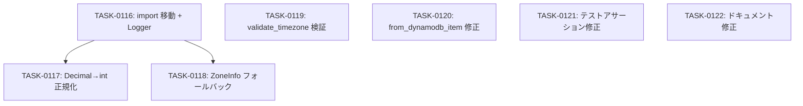

# day-boundary-fix タスク一覧

## 概要

**分析日時**: 2026-03-01
**対象ブランチ**: `feature/day-boundary-spec`
**関連要件定義**: [requirements.md](../../spec/day-boundary-fix/requirements.md)
**関連設計文書**: [architecture.md](../../design/day-boundary-fix/architecture.md)
**発見タスク数**: 7
**推定総工数**: 3.5 時間

## フェーズ: Phase 1（day-boundary-fix）

コードレビュー（Claude + Codex）で発見された指摘事項の修正。DynamoDB Decimal 問題、TZ バリデーション強化、テスト品質改善、ドキュメント整合性修正。

## タスク一覧

| タスク | 名称 | タイプ | 状態 | 工数 | 依存 |
|--------|------|--------|------|------|------|
| TASK-0116 | srs.py import 移動と Logger 追加 | DIRECT | [x] 完了 | 0.25h | なし |
| TASK-0117 | Decimal→int 正規化の実装 | TDD | [x] 完了 | 0.5h | TASK-0116 |
| TASK-0118 | ZoneInfo フォールバック実装 | TDD | [x] 完了 | 0.5h | TASK-0116 |
| TASK-0119 | validate_timezone ZoneInfo 検証 | TDD | [x] 完了 | 0.5h | なし |
| TASK-0120 | from_dynamodb_item デフォルト修正 | DIRECT | [x] 完了 | 0.25h | なし |
| TASK-0121 | test_review_service アサーション修正 | TDD | [ ] 未着手 | 0.5h | なし |
| TASK-0122 | interview-record.md ドキュメント修正 | DIRECT | [ ] 未着手 | 0.25h | なし |

## 依存関係マップ



## 実装順序（推奨）

1. **並列可能グループ A**: TASK-0116 → TASK-0117 → TASK-0118（srs.py 系、順序依存）
2. **並列可能グループ B**: TASK-0119, TASK-0120（user.py 系、独立）
3. **並列可能グループ C**: TASK-0121, TASK-0122（テスト/ドキュメント、独立）

グループ A・B・C は互いに独立して実行可能。グループ A 内は順序依存。

## 変更対象ファイルマップ

```
backend/src/services/srs.py          ← TASK-0116, TASK-0117, TASK-0118
backend/src/models/user.py           ← TASK-0119, TASK-0120
backend/tests/unit/test_srs.py       ← TASK-0117, TASK-0118
backend/tests/unit/test_review_service.py ← TASK-0121
backend/tests/unit/test_user_models.py    ← TASK-0119
docs/spec/day-boundary/interview-record.md ← TASK-0122
```
